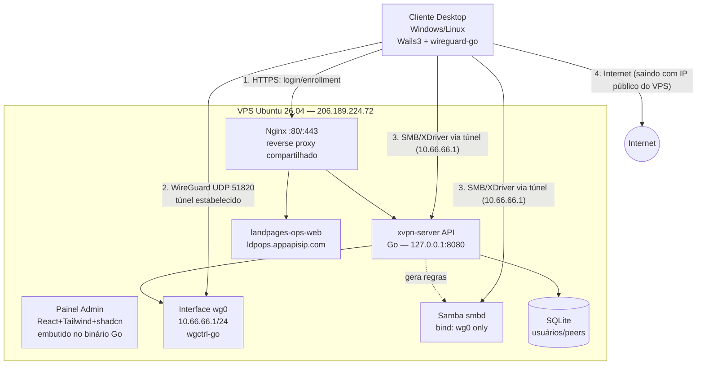
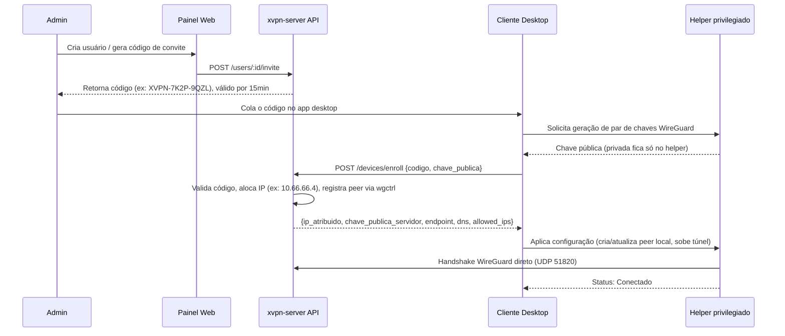
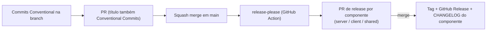

# XVPN — Plano Técnico Completo

> Rede privada própria (estilo "VPN pessoal com exit node"), painel web de administração e cliente desktop (Windows/Linux) construído em Go + Wails3 + React/Tailwind/shadcn, hospedado no seu VPS Ubuntu.
>
> **Estado atual (v0.7+):** portal/enroll em `https://xvpn.ihuull.com`. **xadmin** (Fases 35+) é o gerenciador geral **só na intranet** (`xadmin.corp.ihuull.com`); `/admin` público deixa de servir o painel. Landing `www.ihuull.com` / `ihuu.com`; Marketplace em `marketplace.ihuull.com` (schema em [`docs/marketplace.md`](./docs/marketplace.md)); Drive só em `xdriver.corp.ihuull.com`. XGROUP: perfil `xgroup.ihuull.com/<user>`, feed no corp. Apps desktop na intranet `*.corp.ihuull.com`. Auth **só JWE**. Mongo do control-plane em `127.0.0.1:27017` quando `XVPN_MONGO_URI` está set; senão SQLite (testes/CI). `ldpops.appapisip.com` não muda. Runbook DNS: [`docs/runbooks/cloudflare-dns.md`](./docs/runbooks/cloudflare-dns.md). API: [`docs/api.md`](./docs/api.md). Alvo: §6.14–§6.19.

---

## 1. Diagnóstico do ambiente real (levantado via SSH em `206.189.224.72`)

Antes de desenhar qualquer arquitetura, inspecionei o servidor para não propor nada genérico ou que colida com o que já existe. Fatos relevantes:

| Item | Valor real observado | Impacto no plano |
|---|---|---|
| SO | **Ubuntu 26.04 LTS** (kernel `7.0.0-27-generic`) | Você mencionou 24.04 — o servidor na verdade está em 26.04. Não é problema (é mais novo), só registro o fato. Todo o plano abaixo é compatível com 26.04. |
| CPU/RAM/Disco | 4 vCPU, 7.8 GB RAM, 155 GB disco (2,6 GB usados) | Muito folgado para o volume de uso (uso pessoal, 1–3 dispositivos). Não há necessidade de dimensionar para escala agora. |
| WireGuard | Módulo de kernel **já presente** (`wireguard.ko.zst`, v1.0.0), só não carregado | Não precisamos compilar nada — é suporte nativo do kernel. |
| Redes já em uso | `eth0`: IP público `206.189.224.72/20` **+ `10.10.0.10/16`**; `eth1`: `10.136.0.14/16` (rede privada DigitalOcean/VPC) | **Não posso usar `10.10.0.0/24` para a VPN** (colide com rota já existente no `eth0`). Vou usar `10.66.66.0/24`, que está livre. |
| `ip_forward` | `0` (desativado) | Precisa ser habilitado para o servidor rotear/NAT o tráfego dos clientes. |
| Firewall (`ufw`) | Instalado, mas **inativo** | Precisamos configurar regras e ativar como parte do hardening. |
| SSH | `PermitRootLogin yes`; `PasswordAuthentication` **conflitante** entre `50-cloud-init.conf` (yes) e `60-cloudimg-settings.conf` (no) | Como o OpenSSH usa o *primeiro* valor encontrado e `50-*` é lido antes de `60-*`, na prática **login por senha pode ainda estar habilitado**, mesmo você achando que só a chave funciona. Vamos fechar isso explicitamente (ver §9). |
| Nginx / Docker / Samba / Go / Node | Nenhum instalado ainda | Ambiente limpo — vamos instalar tudo do zero, com controle total sobre versões. |
| **Outra aplicação em preparação** | `/opt/landpages-ops/landpages-ops-web` (binário Go, usuário de sistema dedicado `landpages-ops`), vai usar **Nginx** e domínio próprio `ldpops.appapisip.com` | **Decisão de arquitetura:** o Nginx será um **reverse proxy compartilhado** no servidor, com um *server block* por aplicação/domínio. O XVPN não pode assumir que é o único serviço HTTP da máquina. |
| **Domínios confirmados (DNS já verificado)** | Públicos: `xvpn.ihuull.com`, `marketplace.ihuull.com`, `www.ihuull.com` / `ihuull.com`, `ihuu.com` / `www.ihuu.com`, `xchat.ihuull.com` (marketing), `xgroup.ihuull.com` (marketing). `xdriver.ihuull.com` não é produto (Nginx 444). Intranet: `*.corp.ihuull.com` só no dnsmasq (`10.66.66.1`). `ldpops.appapisip.com` → landpages-ops. A públicos → `206.189.224.72`. | Server blocks Nginx + Certbot nos hostnames ihuull. Sem A público para `corp`. Arquivos só em `xdriver.corp` (API nativa, sem FileBrowser). |

Essa última linha muda uma decisão importante: eu ia sugerir **Caddy** (TLS automático, config mais simples) para o painel — mas como já vai existir Nginx no servidor para outra app, **vamos padronizar tudo em Nginx + Certbot**, para não ter dois reverse proxies brigando pelas portas 80/443. É a decisão tecnicamente mais correta dado o contexto real do servidor, mesmo custando um pouco mais de configuração manual de TLS.

---

## 2. Objetivo real por trás do pedido

Traduzindo o pedido em requisitos concretos:

**Funcionais**
1. Você (e futuramente outras pessoas) deve conseguir "entrar" numa rede privada cujo nó central é o VPS, e sair para a internet com o IP público do VPS (full-tunnel, não apenas split-tunnel de LAN).
2. Acesso a diretórios do VPS como unidade de rede nativa (Samba) **e** também via navegador (painel tipo "meus arquivos").
3. Cliente desktop (Windows e Linux) que instala, configura e conecta/desconecta a VPN com um clique.
4. Painel web no VPS para administração: adicionar/remover usuários e dispositivos, e espaço para funcionalidades futuras.

**Não funcionais (o que você descreveu como "rápido, estável e seguro")**
- **Rápido**: implica WireGuard (não OpenVPN/IPSec — ver comparação em §3.1), rodando em kernel space quando possível.
- **Estável**: reconexão automática, keepalive para NAT, serviço gerenciado por `systemd`, não depender de sessões de terminal.
- **Seguro**: chave privada nunca sai do dispositivo do cliente, Samba/compartilhamento **nunca exposto na internet pública** (só dentro do túnel), firewall padrão-nega, hardening de SSH, TLS no painel.

**Premissas confirmadas com você:**
- Escala: uso pessoal, 1–3 dispositivos (mas o desenho já deixa margem para crescer sem retrabalho).
- Você tem domínio próprio para apontar ao VPS (TLS via Let's Encrypt).
- Prioridade: ir direto para a arquitetura "produto completo" no cliente (engine WireGuard embarcada + helper privilegiado + kill switch), não uma versão descartável.
- Compartilhamento: **ambos** — unidade de rede (Samba) e painel web de arquivos.
- Convivência com outra aplicação Go (`landpages-ops`) atrás do mesmo Nginx, em domínio separado.

---

## 3. Decisões de arquitetura (com análise comparativa)

### 3.1 Protocolo de VPN: WireGuard vs. alternativas

| Critério | **WireGuard** | OpenVPN | IPSec/IKEv2 | Tailscale/Netbird (mesh gerenciado) |
|---|---|---|---|---|
| Performance | Excelente (kernel-space, criptografia moderna Curve25519/ChaCha20) | Média (TLS overhead, geralmente userspace) | Boa, mas complexa | Boa (usa WireGuard por baixo) |
| Estabilidade em redes móveis/NAT | Muito boa (roaming nativo, UDP simples) | Razoável | Complicada (negociação IKE pesada) | Muito boa |
| Simplicidade de implementação em Go | Alta (`wgctrl-go`, `wireguard-go` mantidos pelo próprio projeto WireGuard) | Baixa (sem lib Go nativa boa, geralmente shell-out) | Muito baixa | N/A (é outro produto, não uma lib) |
| Superfície de ataque | Pequena (código enxuto, auditado) | Maior (OpenSSL, muitas opções) | Grande (histórico de CVEs) | Herda do WireGuard |
| Controle total / white-label | Total | Total | Total | **Não** — você usaria a infra deles |

**Decisão: WireGuard**, controlado via `wgctrl-go` (para o control-plane no servidor) e `wireguard-go` + `wintun` (para o motor embarcado no cliente desktop). É a escolha alinhada com "rápido, estável, seguro" e com o pedido explícito de construir seu próprio produto.

> **Nota honesta de especialista:** se seu objetivo fosse apenas "ter uma VPN funcionando o mais rápido possível", ferramentas prontas como **Headscale + Tailscale**, **Netbird** ou até **wg-easy** resolveriam 80% disso em horas, sem escrever uma linha de Go. Você está optando conscientemente por construir do zero — o que faz sentido se o objetivo inclui aprendizado, controle total do stack, ou transformar isso num produto próprio no futuro (o pedido de cliente com marca própria em Wails3 sugere isso). Só reforço essa alternativa aqui para que a escolha seja informada, não por desconhecimento.

### 3.2 Arquitetura do cliente desktop: onde fica o "motor" WireGuard?

| Abordagem | Prós | Contras |
|---|---|---|
| **A. Shell-out para `wg-quick`/WireGuard instalado no SO** | Rápido de implementar; usa binário oficial e testado | Depende de instalação externa (usuário precisa instalar WireGuard antes); no Linux exige `sudo` a cada comando (ruim para UX); no Windows exige o app oficial instalado |
| **B. Engine embarcada (`wireguard-go` + `wintun`) com processo GUI sem privilégio + helper privilegiado via IPC** | Zero dependência externa — um instalador só, self-contained; UX de um clique (usuário só faz elevação **uma vez**, na instalação do serviço); é o padrão usado por produtos reais (Tailscale, NordVPN, Mullvad, e o projeto de referência `wireguide`, que usa exatamente Go + Wails3 + `wireguard-go`) | Mais trabalho de engenharia inicial; precisa lidar com assinatura de driver/instalador no Windows (SmartScreen) |

**Decisão: Opção B**, conforme sua preferência por já construir a versão "produto completo". Arquitetura de separação de privilégios:

```mermaid
graph LR
    subgraph GUI["Processo GUI (sem privilégio) — Wails3 + React"]
        A1[Tela Conectar/Desconectar]
        A2[Login / Enrollment]
        A3[System tray]
        A4[Configurações]
    end
    subgraph Helper["Serviço Helper (privilegiado) — systemd (Linux) / Windows Service"]
        B1[wireguard-go + wgctrl-go]
        B2[TUN device: wintun (Win) / kernel wg (Linux)]
        B3[Rotas, DNS, Kill Switch nftables/WFP]
        B4[Monitor de reconexão]
    end
    GUI <-->|"IPC: JSON-RPC/gRPC via Unix Socket (Linux) ou Named Pipe (Windows)"| Helper
    Helper -->|"UDP 51820"| Server[(VPS xvpn-server)]
```

Isso resolve o maior problema de UX de VPNs "amadoras": o usuário não digita senha de admin toda vez que conecta — só uma vez, quando o instalador registra o serviço privilegiado.

### 3.3 Reverse proxy e TLS: Nginx (não Caddy)

Como definido em §1, o Nginx será compartilhado entre o XVPN e o `landpages-ops`. Cada aplicação recebe:
- Seu próprio *server block* (`/etc/nginx/sites-available/xvpn.conf` para `xvpn.ihuull.com`, landing em `ihuull-landing.conf`, intranet em `xvpn-corp.conf`; `ldpops.appapisip.com` é do landpages-ops);
- Seu próprio certificado (via **Certbot**: HTTP-01 nos hostnames públicos, DNS-01 para `*.corp.ihuull.com`);
- Seu próprio backend em `127.0.0.1:<porta>` — **nunca exposto diretamente na internet**, só via proxy.

### 3.4 Compartilhamento de arquivos: Samba + XDriver nativo, ambos **restritos à VPN**

| Solução | Experiência | Segurança se mal configurado | Uso recomendado |
|---|---|---|---|
| **Samba (SMB3)** | Nativa — "mapear unidade de rede" no Windows, integra com Nautilus/Dolphin no Linux via GVFS | Historicamente alvo de exploits **se exposto à internet** | Diretórios de trabalho, edição de arquivos grandes, uso do dia a dia |
| **XDriver** (API + SPA no `xvpn-server`) | Interface web tipo Google Drive, upload/download pelo navegador, sem montar unidade | Baixo — só aceita `Host: xdriver.corp.ihuull.com` e o Nginx corp só escuta em `wg0` | Acesso rápido/pontual já dentro do túnel |

**Decisão crítica de segurança:** diferente do painel de administração (que **precisa** ser público, senão você não consegue nem se cadastrar/enrolar um dispositivo antes de ter VPN), o compartilhamento de arquivos **não tem esse problema de ovo-e-galinha** — então ele fica **inacessível pela internet pública**, só respondendo na interface `wg0` (IP `10.66.66.1`):

- Samba: `smb.conf` com `bind interfaces only = yes` + `interfaces = 10.66.66.1/24 127.0.0.1/8` — mesmo que o firewall falhe, o serviço fisicamente não aceita conexão vinda do `eth0`. Especificado por IP/CIDR, não pelo nome da interface (`wg0`): o Samba detecta interfaces automaticamente supondo broadcast/netmask convencionais, e `wg0` é ponto-a-ponto (sem broadcast) — com `interfaces = wg0 lo` o `smbd` sobe normal mas só fica escutando em `127.0.0.1`, achado ao validar a Fase 5 via túnel real (ver `ROADMAP.md`). Tunings de WAN (sem xattr DOS/EA, `strict sync = no`, SMB encrypt só se o cliente exigir): o tráfego já vai cifrado no WireGuard; o GVFS/COSMIC Files faz um GETINFO por arquivo e o RTT do túnel (~130 ms) é o que deixa a listagem lenta — ver `server/deploy/samba/smb.conf`.
- XDriver / **xdriver**: mesmo processo `xvpn-server` (`127.0.0.1:8080`). Hostname de intranet `https://xdriver.corp.ihuull.com` (cert `*.corp`, só `wg0`). `xdriver.ihuull.com` **não** serve o Drive (Nginx 444). A API `/api/driver/*` recusa qualquer outro `Host`. Sem FileBrowser. Samba continua em `wg0:445`.

Isso é defesa em profundidade: mesmo um erro de firewall não expõe seus arquivos ao mundo.

### 3.5 Geração de chaves: onde nasce a chave privada?

Ponto que muita implementação amadora erra: **a chave privada do WireGuard do cliente é gerada localmente, no próprio dispositivo, pelo helper privilegiado — nunca no servidor.** O cliente envia ao servidor apenas a **chave pública** durante o *enrollment*. Isso significa que, mesmo que o servidor seja comprometido, um invasor não consegue se passar por um cliente existente (só consegue ver quem tem acesso, não personificar).

### 3.6 Runtime do XCODESPACES: container isolado (não shell no host)

A Fase 49 entregou o equivalente ao **github.dev**: Monaco no browser sobre um *worktree* do forge, sem runtime. Isso não é o Codespaces do GitHub. Lá o Create provisiona um ambiente, **clona** o repositório, sobe o VS Code remoto e o terminal roda **dentro** desse ambiente — dá para `go test`, instalar toolchain, usar LSP e o Git do próprio VS Code.

Reabrir a decisão “sem VM/Docker/shell” da Fase 49 é consciente: o bloqueio certo era **bash no host de produção** (Fase 13 / §6.9), não “nunca haver um interpretador em lugar nenhum”. O VPS tem 4 vCPU / ~8 GB RAM e já divide a máquina com Nginx, Mongo, Samba e `landpages-ops` — KVM por codespace é inviável. O análogo honesto do Codespaces neste hardware é **um container Docker por workspace**, com teto de concorrência e cgroup.

| Abordagem | Prós | Contras | Decisão |
|---|---|---|---|
| Monaco + worktree no host (Fase 49) | Sem Docker; superfície pequena; abre em segundos | Sem terminal, sem LSP real, sem `go test`/`npm`; Git só pela API | **Mantido** como editor rápido (tipo github.dev) |
| Shell/SSH no VPS (`bash` na 22 ou `docker exec` no host) | Simples | Viola §6.9; um `rm -rf` acerta produção | **Rejeitado** — invariante |
| VM KVM/QEMU por codespace | Isolamento forte | 8 GB RAM, 4 vCPU, disco compartilhado — inviável | **Rejeitado** |
| vscode.dev / tunnel Microsoft | Zero runtime nosso | Sai da intranet; depende de terceiro; tira o clone do `xgit.corp` | **Rejeitado** |
| Preview / Ports na internet (túnel Microsoft) | Familiar | Sai da intranet; não é `*.corp` | **Rejeitado** (Fase 56) |
| VIP `10.66.66.254` + DNAT `:*` para o IP docker0 | `demo-<nome>.corp:porta` na VPN | App precisa bind `0.0.0.0` | **Escolhido** (Fase 56) |
| DNAT em `10.66.66.1:*` | Um IP só | Rouba 53/443/445/8080 | **Rejeitado** |
| Fork GitHub / fork no forge | Cópia extra; PRs cruzados | Não é o fluxo ihuull; codespace não é contribuição a repo alheio | **Rejeitado** |
| Checkout direto do GitHub no VPS | Já existe o clone de CI | Mistura produção/GitHub com workspace do agente | **Rejeitado** |

**IDE remoto:** **openvscode-server** (VS Code OSS no browser — o mesmo motor do github.dev / Codespaces web) atrás do Nginx com JWE. **code-server** (Coder) é o fallback se o proxy WebSocket/path exigir. Não é o tunnel da Microsoft.

**O que o container pode e não pode:**

- Create = `git clone` do slug (smart HTTP em `xgit.corp`) **para um volume do container**. Não é worktree do bare; o bare em `/opt/xvpn/data/git/` continua intocado. **Nunca** abre o checkout do GitHub nem um fork — o origin é só `https://xgit.corp.ihuull.com/<slug>`. Fork duplicaria o repo; o fluxo é GitHub Flow no **mesmo** slug (branch + PR).
- Terminal = PTY do VS Code **dentro** do container (usuário sem root). Não é SSH no VPS. Não é o console xterm do Compute (§6.16).
- Sem `--privileged`, sem `/var/run/docker.sock`, sem `--network=host`. Publish só `127.0.0.1:<porta>` (faixa em §5.3).
- O `xvpn-server` **não** fala com o Docker: helper privilegiado no padrão do `xvpn-user-provision` (`cs-create` / `cs-start` / `cs-stop` / `cs-rm`, JSON no stdin). Socket Unix do daemon, nunca TCP.
- Rede do container: **não** alcança Mongo `127.0.0.1:27017` (bind só loopback do host). Egress para clone/push = `10.66.66.1:443` (`xgit.corp`). Sem porta pública nova no ufw.
- Teto no VPS atual: **1 codespace em execução** (2 no máximo se a RAM livre permitir), ~1,5–2 GiB e 1 vCPU por container, disco do clone com quota, idle-stop (container para; volume fica).
- Token de clone: credencial de curta duração injetada no container (não a senha da conta; não JWE de humano em variável de ambiente logável).
- Guest/reporter: não criam codespace; read-only no editor rápido (Fase 49).

**DX do codespace (Fase 51).** A imagem nua do openvscode não é ambiente de desenvolvimento. O Docker **configura** o ambiente ao *buildar* `ihuull/codespace` e no `postCreate` — **não** montando `docker.sock` no container (isso continua proibido).

| Abordagem | Prós | Contras | Decisão |
|---|---|---|---|
| Imagem nua `gitpod/openvscode-server` | Menor | Sem Go/Node/LSP; tema default | **FROM** da `ihuull/codespace` |
| DinD / `docker.sock` no codespace | Compose “igual produção” | Viola §3.6; o container vira root no host | **Rejeitado** |
| `ihuull/codespace` + `.devcontainer` | Toolchain + extensões + settings no Create | Imagem maior; rebuild no VPS | **Escolhido** |
| GitHub Copilot oficial (VSIX Microsoft) | Familiar | Marketplace MS (openvscode usa Open VSX); login GitHub sai da intranet; token no volume | **Rejeitado** |
| Continue.dev / Cline no container | Rápido | Chrome de terceiro; chave no volume; não é produto ihuull | **Rejeitado** |
| Chat nativo OpenVSCode (CHAT / COPILOT EDITS) | Já vem no 1.98 | Chrome Microsoft; vazio sem Copilot; não lê skills/AGENTS.md | **Rejeitado** (Fase 52) |
| Extensão `ihuull.codespace` + proxy LLM no monólito | Chat nosso; GLM e outros; chave só no VPS; JWE `aud=xcodespaces` | Mais trabalho | **Escolhido** |
| Agente ihuull (skills, rules, tools no container) | Igual Cursor no codespace; tools só no clone | Loop e confirmação na extensão | **Escolhido** (Fase 52) |
| Composer `@` `#` `/` + terminal background + `xcs-analyze` | Contexto e jobs como no Cursor; mapa Go no clone | Analyzer extra na imagem | **Escolhido** (Fase 53) |
| Review/Stop + logs em `.cursor/agent` (ou `/tmp`) + `$term` | Chat leve; diffs do turno; Stop aborta o loop | Logs no volume do clone | **Escolhido** (Fase 54) |
| `python3` + `env` + wait no `run_terminal` | Scripts/JSON sem bash; o LLM vê o stdout | Timeout 120s | **Escolhido** (Fase 55) |
| MCP stdio no container (`think`/`memory`/`docs`) | Raciocínio, notas, docs allowlisted | Sem Mongo MCP; extra só `python3` + `.cursor/mcp/*.py` | **Escolhido** (Fase 55) |
| MCP remoto arbitrário / Mongo MCP | Paridade Cursor desktop | Mongo só `127.0.0.1` no host; stdio não allowlisted vira RCE | **Rejeitado** |
| Executar `.cursor/hooks.json` (`command` bash) no container | Paridade total com Cursor hooks | Viola §3.6 (bash arbitrário no agente) | **Rejeitado** — só inspect + allowlist |
| Assistente no Settings do **xadmin** | Uma key para a org; write-only | Repo não escolhe provedor | **Escolhido** |
| ENVs no Settings do repo (XGIT) | App/testes no Create | Não carrega key de LLM | **Escolhido** (só app) |

Tema do workbench = tokens `$dark` de `shared/ui/scss/_color-system.scss` (não copiar cores à mão). O clone monta em `/home/workspace/project`; HOME do openvscode (`/home/workspace`) fica fora do Git — settings em Machine, não em `.vscode/` do repo. Extensões só Open VSX, bakeadas na imagem (Go, ESLint, Prettier, Markdown, YAML + as ihuull). O composer do agente aceita `@arquivo`, `#git`/`#docs`/`#pasta` e `/comando`. `run_terminal` faz **spawn** no PTY **XCODESPACES** (stdout ao vivo, `PYTHONUNBUFFERED=1`) — não espera o processo morrer para pintar o terminal. Flask/`app.py` não bloqueiam 120s. Sem `# agent:` nem argv cru no bash. `xcs-analyze` (Go, stdlib) mapeia módulos/packages/símbolos no clone e entra no context — o servidor **não** lê o workspace. O painel nativo CHAT/COPILOT EDITS **não** entra: a extensão desinstala Copilot/Continue/Cline se o usuário instalar e abre o chat ihuull à **direita** (container `workbench.panel.chat` — o 1.98 ignora `secondarySidebar`). O agente lê `AGENTS.md`, `.cursor/skills` e `.cursor/rules`; modos Agent/Ask/Debug/Plan e modelo vêm do proxy (`GET /models`, override por request na allowlist). O loop de tools roda no Node do container (path só no clone; write/term com confirmação). *Generate commit* e completions passam pelo proxy (GLM / OpenAI-compatível / Anthropic). Provedor e key no Settings do xadmin; ENVs de app entram no container; key de LLM **não**. Stdout longo de `run_terminal`/`grep` vai para `.cursor/agent/` no clone (fallback `/tmp/xcs-agent`); o card mostra preview + path. O turno acumula um painel Review (ficheiros tocados, +/−) com **Stop** (`AbortController` + jobs). `$term` anexa stdout dos jobs. `.cursor/hooks.json` é listado no chrome — o `command` **não** corre (beforeShell = allowlist em `sandbox.js`). O `run_terminal` **espera** o comando (até 120s; `wait:false` só com background). `python3` na imagem; `env:{KEY:valor}` — `VAR=valor` no argv é recusado (não é shell). MCP stdio bakeados: think, memory, docs (`list_mcp` / `call_mcp`). Extra no clone: `.cursor/mcp.json` só `python3` + `.cursor/mcp/*.py`. Sem Mongo MCP. Detalhe no `ROADMAP.md` Fases 51–55.

---

## 4. Arquitetura geral



---

## 5. Alocação de rede, portas e domínios (registro para não colidir com `landpages-ops`)

Fonte da verdade de portas, hostnames e bind. Qualquer serviço novo no VPS **entra nesta tabela antes** de ser configurado. Runbook Cloudflare (o que criar / o que **não** criar): [`docs/runbooks/cloudflare-dns.md`](./docs/runbooks/cloudflare-dns.md). Skill: `port-domain-registry-check`.

**Dois planos de DNS, de propósito.** Hostnames públicos resolvem para `206.189.224.72` e saem da VPN (rota `/32` do cliente — §6.9). Comunicação de app no desktop resolve para `10.66.66.1` via DNS interno (`*.corp.ihuull.com`). Sem isso, HTTPS/WSS do chat “pelo domínio público” nunca entra no túnel.

`ldpops.appapisip.com` **não muda**. Hostnames de produto são só ihuull / ihuu / `*.corp`.

### 5.1 Hostnames públicos (internet)

| Recurso | Valor | Observação |
|---|---|---|
| Landing ihuull | `www.ihuull.com`, `ihuull.com` | A → `206.189.224.72`. Proxy Cloudflare: DNS only (ou laranja só se for HTML estático, sem API/WS) |
| Landing curta | `www.ihuu.com`, `ihuu.com` | Mesmo root Nginx da landing. Sem este A o hostname não existe |
| Portal / enroll / JWE | `xvpn.ihuull.com` | **DNS only** (laranja quebra WS longo). Backend `127.0.0.1:8080`. Home = portal de produto (status VPN, download, atalhos). `/admin` **não** é o painel (Fase 35: redirect para `xadmin.corp`). `/my` redireciona para `/` |
| Marketplace (Play Store) | `marketplace.ihuull.com` | **DNS only**. Mesmo backend `127.0.0.1:8080`. UI própria (vitrine + detalhe + instalar). JWE — download nunca anônimo. `/my/marketplace` redireciona para cá. Catálogo e ACL no **xadmin** (telas separadas). Schema: [`docs/marketplace.md`](./docs/marketplace.md) |
| XDriver | `xdriver.corp.ihuull.com` | Só VPN. Sem landing pública. `xdriver.ihuull.com` fecha a conexão (444). `/my/files` aponta para o corp |
| Marketing xchat | `xchat.ihuull.com` | Landing “conecte a VPN / abra o app”. **Não** é o WebSocket nem a API do messenger |
| Marketing xgroup | `xgroup.ihuull.com` | Landing + perfil amigável `/:username` (JWE). **Sem WS.** Feed/explorar/grupos continuam em `xgroup.corp` / `/social`. Nginx: `server/deploy/nginx/xgroup.conf` |
| SSO | `xauth.ihuull.com` | **DNS only**. A → `206.189.224.72`. Backend `127.0.0.1:8080`. Login único; cookie `Domain=.ihuull.com` (Secure, HttpOnly, SameSite=Lax). Sem WS. Nginx: `server/deploy/nginx/xauth.conf`. Enroll continua em `xvpn.ihuull.com` |
| landpages-ops | `ldpops.appapisip.com` | **Não muda.** Outra app Go no mesmo Nginx |

**Não criar** A/AAAA públicos para `corp.ihuull.com`, `*.corp.ihuull.com`, `xchat.corp`, `xgroup.corp`, `xdriver.corp`, `xgit.corp`, `xcodespaces.corp`, `cs-*.corp`, `demo-*.corp`. Wildcard `*.ihuull.com` casa `corp.ihuull.com` (um rótulo) — se o wildcard A existir, crie `corp` **sem** A (TXT `intranet-only`) para o nome não resolver fora do túnel. Wildcard **não** cobre `xchat.corp.ihuull.com` (dois rótulos). `cs-<id>.corp.ihuull.com` casa o cert `*.corp.ihuull.com`; **não** usar `<id>.xcodespaces.corp.ihuull.com` (dois rótulos — o wildcard `*.corp` não cobre).

### 5.2 Hostnames de intranet (`*.corp` — só com VPN)

Resolvem **somente** no DNS interno (`10.66.66.1:53`). Nginx: `listen 10.66.66.1:443 ssl` + `allow 10.66.66.0/24; deny all;`. Cert `*.corp.ihuull.com` via **DNS-01** (não precisa de A público).

| Recurso | Hostname | Backend | Observação |
|---|---|---|---|
| Apex corp | `corp.ihuull.com` | `10.66.66.1:443` | Índice da intranet. `/admin` → `xadmin.corp` |
| xadmin (console) | `xadmin.corp.ihuull.com` | `127.0.0.1:8080` (`/admin/*`) | Gerenciador geral. **Só VPN.** JWE `aud=xadmin`. Sem A público. §6.14 |
| xgit (forge) | `xgit.corp.ihuull.com` | `127.0.0.1:8080` (smart HTTP git) | Repos do forge. **Só VPN.** Sem A público. Fase 40 |
| xcodespaces (IDE) | `xcodespaces.corp.ihuull.com` | `127.0.0.1:8080` (`/api/xcodespaces/*` + SPA) | Catálogo + editor rápido (Monaco, Fase 49). **Só VPN.** Sem A público. Sem landing pública |
| codespace VS Code | `cs-<id>.corp.ihuull.com` | `127.0.0.1:19000–19007` (openvscode-server no container) | Um host por codespace em execução. Catch-all `*.corp` + cert `*.corp.ihuull.com`. **Só VPN.** Sem A público. Fase 50 |
| codespace demo / ports | `demo-<nome>.corp.ihuull.com` | VIP `10.66.66.254` no `wg0` → DNAT para o IP docker0 do container (`:*` TCP/UDP) | Um rótulo (cert `*.corp`). **Não** `demo.cs-<id>.corp` (dois rótulos). Só origem `10.66.66.0/24`. Sem A público. Sem ufw. O botão Ports da Microsoft **não** entra (túnel internet). Fase 56 |
| xchat (API + WS) | `xchat.corp.ihuull.com` | `127.0.0.1:8080` (`/api/ws`, `/api/social/*`) | Messenger em `/` e `/social/messages`. **Sem `/admin`.** DNS canônico: dnsmasq `10.66.66.1:53`. Client: split-horizon + `/etc/hosts` |
| xgroup (rede social) | `xgroup.corp.ihuull.com` | `127.0.0.1:8080` (`/social`, `/api/social/*`) | Feed/grupos. Mensagens → `xchat.corp`. **Sem `/admin`.** |
| xdriver (arquivos) | `xdriver.corp.ihuull.com` | `127.0.0.1:8080` (`/api/driver/*`) | Drive nativo; `Host` obrigatório. **Sem `/admin`.** Samba continua `wg0:445` |

### 5.3 Portas, binds e disco

| Recurso | Valor | Observação |
|---|---|---|
| Sub-rede WireGuard | `10.66.66.0/24` | Servidor = `10.66.66.1`; clientes a partir de `10.66.66.2`; **`.254` reservado** ao preview do codespace (não peer) |
| ~~`10.10.0.0/24`~~ | **Evitar** | Já roteada no `eth0` |
| ~~`10.136.0.0/16`~~ | **Evitar** | Já usada pelo `eth1` (VPC DigitalOcean) |
| Porta WireGuard | `51820/udp` | Público — único ponto de entrada da VPN |
| Painel/API (loopback) | `127.0.0.1:8080` → `https://xvpn.ihuull.com` | Nunca exposto direto |
| API no túnel (Fase 14) | `10.66.66.1:8080` | Mesma porta, outra interface. Bind só `wg0`. Só `/api/me` e `/api/me/ssh-key` com `RemoteIP()` na subnet |
| `landpages-ops-web` | ex. `127.0.0.1:3000` → `https://ldpops.appapisip.com` | **Não usar** `8080`/`8081`/`51820`/`27017`/`53` nem `10.66.66.0/24` |
| Samba (SMB) | `10.66.66.1:445` | Bind **somente** `wg0`. `nmbd`/139 desabilitado |
| ~~FileBrowser / :8081~~ | **retirado** | XDriver nativo no `xvpn-server`. Porta 8081 livre — não reusar sem linha nova |
| Marketplace (blobs) | Disco `/opt/xvpn/data/marketplace/` · download via `127.0.0.1:8080` em `marketplace.ihuull.com` (e xadmin) | Sem porta nova. JWE. Nunca anônimo na internet |
| Forge (git bare) | Disco `/opt/xvpn/data/git/` · smart HTTP em `xgit.corp` | Só VPN. Sem `git://` público. Fase 40 |
| XCODESPACES (editor rápido) | Disco `/opt/xvpn/data/codespaces/<user>/<slug>/<id>/` | Worktree do forge. Só VPN. Fora do bare. Sem shell no host. Fase 49 |
| XCODESPACES (runtime) | Docker + volume `/opt/xvpn/data/codespaces/<user>/<slug>/<id>/workspace` → `/home/workspace/project` · openvscode-server `127.0.0.1:19000–19007` | Clone ≠ HOME do IDE. Shell **só** no container. Sem `docker.sock` no container. Sem `--network=host`. Sem porta no ufw. Egress git/LLM: `--add-host` `*.corp`→`10.66.66.1`; Nginx `xgit`/`xcodespaces`/`cs-*` também `allow 172.17.0.0/16` (docker0). Sem allow em xadmin/xchat. Fases 50–51 |
| XCODESPACES (demo ports) | VIP `10.66.66.254/32` em `wg0` · dnsmasq `demo-<nome>.corp` → `.254` · iptables DNAT `10.66.66.0/24`→IP do container | `:*` no VIP, não em `10.66.66.1`. Processo no container precisa escutar `0.0.0.0` (não só `127.0.0.1`). Helper `cs-apply`. Fase 56 |
| Forge (arquivos de projeto) | Disco `/opt/xvpn/data/projects/<slug>` · XDRIVER `root=project:<slug>` | Só VPN. Sem FileBrowser. Samba `[project-*]` fica para depois. Fase 37 |
| Serviços gerenciados | Mongo/Redis/Rabbit/LB no host alvo · bind **só `wg0`** (ou `127.0.0.1` se local-only) | xadmin orquestra (§6.18). **Não** é o Mongo `127.0.0.1:27017` do control-plane. Sem 6379/5672/27017 na `eth0` |
| WebSocket xchat | `wss://xchat.corp.ihuull.com/api/ws` → `127.0.0.1:8080` | Upgrade **só** neste path. Auth no primeiro frame. App desktop não abre listener |
| Mídia do chat | Disco `/opt/xvpn/data/social/` · `POST /api/social/attachments` | Location Nginx `40m`. WebRTC P2P; sem TURN/porta |
| SFTP por usuário | `22/tcp` (`Match User`) | Sem porta nova. `internal-sftp` + chroot. §6.9 |
| SSH | `22/tcp` | Hardening §9 |
| DNS interno | `10.66.66.1:53` (dnsmasq) | **Só `wg0`.** Nunca `:53` em `eth0`/`0.0.0.0`. Fonte da verdade: xadmin → DNS intranet (A em `10.66.66.0/24`). Forwarders públicos. Catch-all `*.corp` → `10.66.66.1`. Apply via `xvpn-user-provision dns-apply` |
| MongoDB | `127.0.0.1:27017` | Auth + user `xvpn`. **Sem** porta no ufw. Substitui SQLite (`/opt/xvpn/data/xvpn.db`) na Fase 28 |
| ufw público | `22/tcp`, `80/tcp`, `443/tcp`, `51820/udp` | Padrão-nega. Sem 27017, sem 53, sem 445 na `eth0` |

### 5.4 DNS da intranet (forma correta)

Não é o app desktop quem “inventa” o IP do `*.corp`. A zona vive no **dnsmasq da `wg0`**. Três camadas, nesta ordem:

1. **Autoridade** — xadmin → DNS intranet persiste A records (`corp.ihuull.com` / um rótulo `*.corp.ihuull.com` → IPv4 em `10.66.66.0/24`) e forwarders. Apply grava `/etc/dnsmasq.d/xvpn-corp.conf` + `xvpn-records.hosts` e dá `systemctl reload dnsmasq`. Bind fixo `10.66.66.1`. Sem A público para `corp`. Zona **pública** do stack (§6.17): Cloudflare + NS no registrador; visão interna (`intranet_ipv4`) também entra no hosts. Sem `:53` na `eth0`.
2. **Cliente** — no connect: `resolvectl dns xvpn0 10.66.66.1`, `domain ~corp.ihuull.com` **sem** `~.` / `default-route yes`. Helper grava `/etc/hosts` (`CAP_DAC_OVERRIDE` + drop-in, porque unit antiga em `/etc/systemd/system` deixava o arquivo read-only). Polkit libera só `set-dns-servers` / `set-domains` / `set-default-route` / `set-dns-over-tls` / `set-dnssec` / `revert` para `xvpn-client-helper` na `xvpn0` (sem isso `Current Scopes: none`). O `.deb` instala política Chrome `BuiltInDnsClientEnabled=false` — DoH do Chrome pergunta à Cloudflare, que **deve** devolver NXDOMAIN para `*.corp`.
3. **Defesa em profundidade** — xchat ainda disca `10.66.66.1` com SNI `*.corp` se o DNS do processo falhar.

Hardcode de IP no app **não** substitui (1)+(2). `/etc/hosts` sozinho também não — é fallback para o browser.

> Quem for configurar o `landpages-ops` (ou um app novo do marketplace) checa esta tabela **e** o runbook Cloudflare antes de escolher porta ou hostname. App de intranet novo: skill `new-intranet-app`. Registro corp novo: xadmin → DNS intranet + apply. Seed: incluir `xadmin`, `xgit` e `xcodespaces` → `10.66.66.1`.

---

## 6. Especificação do Servidor (`xvpn-server`)

### 6.1 Control-plane (Go)
- Framework HTTP: **Gin** (`v1.10.1`, fixado deliberadamente — a `v1.12.x` exige Go ≥1.25 e traz um grafo de dependências bem mais pesado por causa de suporte a HTTP/3, desnecessário para uma API administrativa pequena).
- ORM/DB: **MongoDB** em produção (`127.0.0.1:27017`, user `xvpn`, `XVPN_MONGO_URI`) com cache GORM em memória para os handlers; **SQLite** permanece em testes/CI quando a URI está vazia. Blobs de arquivo continuam no disco. Backup: `mongodump` (`server/deploy/backup.sh`).
- Autenticação: **só JWE** (`go-jose`, `dir` + `A256GCM`) com issuer `https://xvpn.ihuull.com` e `aud` por app (`xvpn`, `xchat`, `xgroup`, `xdriver`). JWT HMAC é rejeitado. Senha: Argon2id (OWASP 2024: 64 MB, t=3, p=2). Desktop: token só em memória. xbot usa `XVPN_XBOT_TOKEN`, nunca JWE de humano.
- Integração WireGuard: **`golang.zx2c4.com/wireguard/wgctrl`** cuida só da parte "WireGuard" (chave privada, porta, peers) — ela **não** cria a interface de rede nem atribui IP. Para isso (equivalente a `ip link add wg0 type wireguard` + `ip addr add`), o control-plane usa `github.com/vishvananda/netlink` diretamente, mantendo o princípio de "nunca faça shell-out" (`go-backend.mdc`) também nessa parte. `EnsureInterface` é idempotente: cria a interface só se ela ainda não existir (ex.: primeira vez) e sempre reconfigura chave/porta/endereço, sem depender de estado prévio. Peers são adicionados/removidos **dinamicamente em memória**, sem reiniciar a interface nem escrever/reler arquivos `.conf`. No boot do serviço, `ReconcilePeers` sincroniza o conjunto de peers do kernel com o que está no banco (`ReplacePeers: true`), garantindo consistência mesmo após um restart do serviço. O pacote `wireguard-tools` (comando `wg`, usado só para operação manual/depuração via as skills do Cursor) precisa ser instalado à parte — o módulo de kernel por si só não traz o CLI.
- Capacidades: o binário roda como usuário de sistema dedicado `xvpn` (mesmo padrão do `landpages-ops`), mas com `AmbientCapabilities=CAP_NET_ADMIN` no `systemd` — **não precisa rodar como root completo** para manipular a interface WireGuard. A unit usa `ProtectSystem=true` + `PrivateTmp`; após a Fase 13, `NoNewPrivileges=false` e `ProtectHome=false` são **obrigatórios** para o caminho `sudo → xvpn-user-provision` (`ProtectSystem=strict` quebra o lock do `useradd` em `/etc/.pwd.lock`) — ver `SECURITY.md` e `server/deploy/systemd/xvpn-server.service`.
- NAT/roteamento: `sysctl net.ipv4.ip_forward=1` (persistente via `/etc/sysctl.d/`); MASQUERADE de `10.66.66.0/24` saindo por `eth0` implementado via a seção `*nat`/`POSTROUTING` nativa do `/etc/ufw/before.rules` (evita duas ferramentas de firewall concorrentes). **Importante**: a chain `FORWARD` do `ufw` é `deny` por padrão — além do NAT, é preciso uma regra explícita `ufw route allow in on wg0 out on eth0` (least-privilege: só libera encaminhamento partindo de `wg0`, não um `DEFAULT_FORWARD_POLICY=ACCEPT` genérico) para o tráfego não ser descartado antes de chegar ao NAT.
- Bootstrap do primeiro admin: se a tabela de usuários estiver vazia no boot, um usuário `admin` é criado automaticamente — com `XVPN_ADMIN_USERNAME`/`XVPN_ADMIN_PASSWORD` se definidos no ambiente, ou com uma senha aleatória gerada e logada **uma única vez** no journal (`journalctl -u xvpn-server`). Evita ter que semear o banco manualmente ou hardcodar uma senha padrão conhecida.

### 6.2 API — principais endpoints

| Endpoint | Descrição |
|---|---|
| `POST /api/auth/login` | Login do admin no painel |
| `GET /api/users` / `POST /api/users` / `DELETE /api/users/:id` | CRUD de usuários |
| `POST /api/users/:id/invite` | Gera token de convite/enrollment de curta duração (usado pelo cliente desktop para se cadastrar sem precisar de senha do admin) |
| `POST /api/devices/enroll` | Cliente envia sua **chave pública** + token de convite → servidor responde com IP alocado, chave pública do servidor, endpoint, DNS |
| `GET /api/devices` | Lista peers com estatísticas ao vivo (via `wgctrl`: último handshake, bytes rx/tx, endpoint atual) |
| `DELETE /api/devices/:id` | Revoga um dispositivo (remove peer da interface imediatamente) |
| `GET /api/status` | Saúde do servidor, uso de CPU/rede, nº de peers conectados |
| `GET /api/dns` | Estado do dnsmasq intranet + records (viewer+) |
| `PATCH /api/dns` / `POST /api/dns/records` / `POST /api/dns/apply` | Admin+ com escopo `core` (Fase 35+: `dns`). Apply recarrega dnsmasq via provisioner. Zona pública (§6.17) é outra API |

### 6.3 Painel Web (React + Tailwind + shadcn/ui)
Páginas (Fase 35+ no host `xadmin.corp`): **Login**, **Dashboard**, **Usuários**, **Dispositivos**, **Compartilhamentos**, **Gerais**, **DNS** (intranet + público), **Marketplace** (Catálogo ≠ ACL), **XGIT** (repositórios + settings), **Compute**, **Serviços**, **Backups**, **Auditoria**. O `AdminShell` vive só em `xadmin.corp`; `xvpn.ihuull.com/admin` redireciona. Telas de forge/compute/serviços/backups entram nas Fases 36–44; Issues/PRs/editor/XCODESPACES nas 46–51.

**Visual:** o mesmo design system dos apps desktop (`shared/ui`, SASS) — inclusive a landing `/`. Preto profundo, `watch-face`, cards `watch-complication`, `icon-well`, `field-glass`, Outfit, acento `--safe` / `power-safe`. Não há paleta navy/Workspace nem marketing paralela. Ver [§6.12](#612-design-system-e-color-system).

Build: `vite build` → arquivos estáticos embutidos no binário Go via `embed.FS`. Resultado: **um único binário** `xvpn-server` sobe API + painel + lógica WireGuard. Simplifica deploy/systemd a um único serviço.

**Implementado na Fase 3** (ver `ROADMAP.md` para o checklist e achados completos): `go:embed` não aceita `..` no caminho do diretório embutido, então o Vite builda direto dentro da árvore do pacote Go que faz o embed (`server/internal/webui/dist/`, não `server/web/dist/`) — ver `server/internal/webui/webui.go` e `server/web/vite.config.ts`. Dois endpoints de leitura foram adicionados além do previsto originalmente na Fase 2, só para alimentar as telas do painel: `GET /api/config` (config de rede não sensível) e `GET /api/audit` (últimas entradas de auditoria).

### 6.4 Compartilhamento de arquivos
- Samba: pacote `samba`, config em `/etc/samba/smb.conf`, um share por usuário/propósito (ex.: `[shared]`, `[home-<usuario>]`), autenticação própria do Samba (`smbpasswd`) — **pode ser sincronizada pelo painel** (ao criar usuário no XVPN, opcionalmente cria também o usuário Samba).
- XDriver / **xdriver**: handlers `/api/driver/*` no `xvpn-server`, hostname `xdriver.corp.ihuull.com`. Pastas: `/home/<user>/files` e `/srv/xvpn/shared`. Sem processo FileBrowser.

### 6.5 Hardening do servidor (checklist)
- [x] Corrigir ambiguidade de `PasswordAuthentication` (`/etc/ssh/sshd_config.d/00-xvpn-hardening.conf` — ver §9 para o porquê do nome `00-`, não `99-`).
- [x] Ativar `ufw`: negar tudo por padrão, permitir `22/tcp`, `80/tcp`, `443/tcp`, `51820/udp`.
- [x] Instalar `fail2ban` para SSH.
- [x] `unattended-upgrades` para patches de segurança automáticos (já vinha habilitado por padrão na imagem).
- [x] Samba/XDriver **nunca** nas regras do `ufw` para `eth0` — Samba só em `wg0:445`; Drive só via Nginx corp (`10.66.66.1:443`). *(Fase 5 usou FileBrowser em `:8081`; Fase 32 retirou o processo e a regra `8081`)*
- [x] Backup local: `mongodump` quando `XVPN_MONGO_URI` está set; senão `sqlite3 .backup`. Rotação 7 dias (`server/deploy/backup.sh`). Off-site (restic + rclone) é Fase 44 / §6.19 — o backup no mesmo disco **não** substitui destino externo.

### 6.6 Landing pública e lista de espera (feature adicional, fora das 9 fases originais)

Landing pública em `www.ihuull.com` / `ihuull.com` / `ihuu.com` (e marketing `xchat.ihuull.com` / `xgroup.ihuull.com`). O portal de produto e o enroll vivem em `xvpn.ihuull.com` (`/` = chrome tipo loja; `/admin` redireciona ao xadmin; `/my` redireciona para `/`). Formulário de lista de espera (nome + e-mail + mensagem opcional) no mesmo binário, só nos hosts de marca — não na home do produto. Visual = o mesmo design system (`watch-face`, `watch-complication`, `btn-glow`, `field-glass`) — ver [§6.12](#612-design-system-e-color-system).

**Decisão de design — aprovação não provisiona acesso automaticamente**: `POST /api/waitlist` (único endpoint de escrita da API **sem autenticação**) só grava um `WaitlistEntry` com status `pending`. Uma tela nova no painel (`/waitlist`, autenticada) lista os cadastros e permite marcá-los como `approved`/`rejected` — mas isso é só um sinalizador de "pode liberar". Aprovar **não** cria `User`/`InviteToken` automaticamente: o admin ainda cria o usuário e gera o convite manualmente na tela Usuários já existente (Fase 2/3), usando nome/e-mail do cadastro como referência. Justificativa: evita criar um segundo caminho de provisionamento de acesso (com sua própria superfície de bugs/segurança) só para essa conveniência — o único caminho que cria acesso real (`POST /api/users` → `POST /api/users/:id/invite`) continua sendo o mesmo já testado desde a Fase 2, sem mudanças. Mesmo padrão de decisão já usado para usuários Samba (§6.4/`ROADMAP.md` Fase 5): privilegiar manter operações sensíveis manuais em vez de automatizar via um caminho novo e menos escrutinado.

**Superfície pública nova, mitigação**: como é o único endpoint de escrita sem login de toda a API, `POST /api/waitlist` tem rate limit por IP em memória (5 tentativas / 10 min, `server/internal/api/ratelimit.go`) e validação estrita (nome não vazio, e-mail via `net/mail.ParseAddress`, mensagem truncada em 2000 caracteres). Reenviar o mesmo e-mail não cria duplicata (idempotente) e não expõe erro diferenciado — evita enumeração de quem já está na lista sem, ao mesmo tempo, sujar o banco com repetições.

Nenhuma porta/domínio novo: tudo dentro do mesmo binário/processo `xvpn-server` e do mesmo server block Nginx já registrado em §5.

### 6.7 Admin geral (RBAC)

**Problema:** no MVP todo registro em `users` autentica no painel com os mesmos poderes (JWT sem `role`). Não dá para ter operador só-leitura, membro que só usa a VPN, ou um “admin geral” distinto.

**Papéis (Fase 10 do `ROADMAP.md`):**

| Role | Painel | VPN (enrollment/devices) | Marketplace |
|---|---|---|---|
| `super_admin` | Tudo, inclusive alterar roles e apagar outros admins | Sim | Admin + download |
| `admin` | Users/devices/waitlist/audit/marketplace (sem promover a `super_admin`). Pode ser limitado por `products: [...]` (Fase 33) | Sim | Admin + download se o escopo incluir `marketplace` (lista vazia = irrestrito) |
| `viewer` | Só leitura (dashboard, listas, audit) | Não cria convites | Download se ACL permitir |
| `member` | Sem telas de admin (portal mínimo opcional) | Sim (próprios devices) | Download se ACL permitir |

- Claim `role` no JWT; middleware por rota (403 se insuficiente).
- Bootstrap do primeiro usuário continua sendo `super_admin`.
- “Aprovar waitlist e provisionar” orquestra `POST /users` + invite — não inventa segundo caminho de credencial.
- **Escopo de produto (Fase 33 + 35):** `User.Products` (`core` / `marketplace` / `xgroup` / `xdriver` / `forge` / `compute` / `dns` / `managed`). `super_admin` ignora a lista. `admin` com lista vazia permanece irrestrito (matriz da Fase 10). Com lista explícita, `RequireProduct` bloqueia a escrita da seção ausente — um admin da loja não revoga peers. IAM (criar/convidar/listar) não é produto; `DELETE /users` exige `core` (chama `RemovePeer`); reset/edição de conta com escopo maior que o do ator é 403 (`CoversAccount`). Fonte única do console: **`xadmin.corp.ihuull.com`** (Fase 35). Sem `admin.marketplace` público.

**Três produtos de UI (SPA único, chrome de sistema compartilhado) — Fase 19 (layout) + Fase 30 (visual ihuull):**

Sidebar, header e status bar são **do sistema** (fixos no viewport). O `main` só tem conteúdo da página. O header carrega o **menu da conta logada** (avatar → perfil social, conta, sair) e o seletor de produto (waffle).

| | Meu espaço | XVPN Social | Administração |
|---|---|---|---|
| Prefixo | `/my/*` | `/social/*` | `/admin/*` |
| Login | `/my/login` | mesmo JWE; entra autenticado | `/admin/login` |
| Shell | `UserShell` / MyShell | `SocialShell` | `AdminShell` |
| Destino pós-login | `member` → `/` (portal) | atalho no waffle | `viewer+` → `xadmin.corp` `/admin` |
| Conteúdo | dispositivos, Marketplace, conta (senha/SSH). XDriver só no waffle se Samba/SFTP ativo | **rede social:** perfis, follow, grupos (páginas). Chat não é o produto — ver §6.11 | **Core VPN** · **Marketplace** (Catálogo ≠ ACL) · **XGIT** · **Compute** · **DNS** · **Serviços** · **XGroup** · **XDriver** · **IAM**. Navegação filtrada pelo escopo `products` |
| Autosserviço | `GET/DELETE /api/me/devices`, `PUT /api/me/ssh-public-key`, `PATCH /api/me/password` | perfil social próprio | reset de senha de *outros* via `POST /api/users/:id/reset-password` |

Páginas do membro (`/my`): em `xvpn.ihuull.com` o índice `/my` redireciona para o portal `/`; dispositivos ficam em `/my/devices`. Marketplace (catálogo — o cliente VPN também vive aqui; `/my/download` redireciona), conta (senha + chave SSH). XDriver (`/my/files`) não fica no nav — só no waffle de apps, e só se Samba ou SFTP estiver ligado. XGIT no waffle **Seus apps** só se o usuário participa de um projeto ou tem ACL do app `xgit`; a UI do membro é `xgit.corp`, não o xadmin. Perfil **social** editável vive em `https://xgroup.ihuull.com/<username>` (produto **xgroup**); `/social/u/:username` redireciona. Não mistura com SSH/cota. Chat autenticado: **contatos** no rail direito (lista RTL), **conversas abertas** em janelas no rodapé (estilo Facebook, sem overlay), gatilho na status bar do `SystemChrome` (Fase 20).

Página admin de papéis: `/admin/rbac`. Usuários: lista paginada `/admin/users` + ficha `/admin/users/:id` (abas), não tabela com cinco ícones por linha.

Sem alias e sem rota antiga: `/app`, `/portal`, `/dashboard`, `/login`, `/download` (raiz) e os demais `Navigate` da Fase 17 são **apagados** na 19.1 — o ambiente ainda é dev/homologação, não há bookmark de produção a preservar. A API RBAC não muda com o rename de URL.

Listas (users, devices, waitlist, audit, social) são **paginadas no servidor** (`page`/`per_page`/`q`, default 25, máx. 100) e renderizadas pelo kit compartilhado (`DataTable` / `Pagination`). Ver `ROADMAP.md` Fase 19.1–19.2.

Social e o app `xvpn-chat`: [§6.11](#611-xvpn-social-e-xvpn-chat). Design system: [§6.12](#612-design-system-e-color-system).

### 6.8 Marketplace de software

**Objetivo:** catálogo de **projetos** internos. A loja pública (`marketplace.ihuull.com`) continua distribuindo programas (`.deb` / AppImage / `.exe`·`.msi` / `.apk`) a usuários autorizados. O xadmin trata cada slug como projeto (regras, membros, forge) — schema completo em [`docs/marketplace.md`](./docs/marketplace.md).

**Catálogo ≠ ACL.** Publicação é o sync do manifesto (Git/CI). Quem vê um item `restricted` é `PUT /marketplace/apps/:id/access` no xadmin — ritmo operacional, não de PR. Telas separadas (Fase 36).

**Decisões:**

| Tema | Escolha | Por quê |
|---|---|---|
| Superfície de rede | Mesmo `xvpn-server` + Nginx (`marketplace.ihuull.com` + ACL no xadmin); blobs em `/opt/xvpn/data/marketplace/` | Sem porta nova (§5); não misturar com Samba/xdriver |
| Autenticação do download | JWE (usuário do painel) obrigatório | Evita dump público de binários; rate limit + audit |
| Modelo | `App` → `AppVersion` → `AppAsset` (platform, arch, sha256, size, path) | Versionamento claro; um app, N builds |
| ACL | Global (todos `member`+) ou lista de user IDs | Suficiente para 1–15 usuários sem inventar IdP |
| Cliente XVPN vs catálogo | `/download` = só o cliente XVPN (GitHub Releases); marketplace = **outros** programas | Não sobrecarregar a página de instalação do produto |
| Android | Distribuição de APK via download autenticado / página `/apps` | Sem Play Store no escopo; VPN ou sessão web no telefone |
| Antivírus / assinatura de código | Fora do MVP do marketplace; checksum SHA-256 obrigatório na UI | Transparência sem dependência de serviço externo |

**Não fazer:** servir blobs em `0.0.0.0` sem auth; reutilizar share Samba como “loja” (ACL e UX ruins para versionamento); commitar binários no Git.

**Implementado na Fase 11** (ver `ROADMAP.md` para o checklist e achados completos):

- **Storage content-addressed** (`server/internal/marketplace/storage.go`): cada asset é salvo em `<XVPN_MARKETPLACE_DIR>/blobs/<2 primeiros chars do sha256>/<sha256 completo>` — o hash é calculado no servidor a partir do próprio upload (`io.TeeReader` + `sha256`), nunca informado pelo cliente. Dois assets idênticos (mesmo conteúdo, nomes/versões diferentes) apontam pro mesmo arquivo em disco (deduplicação automática); remover uma versão/app só apaga o blob físico se nenhuma outra `AppAsset` ainda referenciar aquele hash (`removeOrphanBlobs`).
- **Limite de tamanho por arquivo**: `MaxAssetSize` = 2 GiB (`server/internal/marketplace/storage.go`), aplicado em duas camadas — `http.MaxBytesReader` na request inteira (rejeita cedo, antes de gravar em disco) e `io.LimitReader`+contagem no `Put` (defesa em profundidade caso o `Content-Length` minta). VPS de produção tem ~150 GB livres (ago/2026) — folga confortável para o catálogo atual, mas sem quota por usuário/app nesta fase (ver Fase 12).
- **Configuração**: `XVPN_MARKETPLACE_DIR` (`internal/config/config.go`), obrigatória em produção com caminho absoluto dentro de `ReadWritePaths` do systemd (mesmo motivo do `XVPN_DB_PATH`, ver achado da Fase 2) — produção usa `/opt/xvpn/data/marketplace` (`server/deploy/xvpn-server.env.example`).
- **Backup dos blobs**: como o conteúdo nunca muda depois de escrito (só é criado ou apagado), `server/deploy/backup.sh` passou a espelhar `XVPN_MARKETPLACE_DIR` para `$XVPN_BACKUP_DIR/marketplace/` via `rsync -a --delete` (incremental, sem gzip — os assets já costumam ser binários compactados) na mesma rotina diária que já fazia o `.backup` do `xvpn.db`. Mesma limitação de sempre: é uma cópia no mesmo disco da VPS, protege contra bug/exclusão acidental na aplicação, não contra falha física do disco (backup off-site fica fora do escopo desta fase).
- **API**: na Fase 11 havia CRUD de app/versão/asset em `adminOnly`; a **Fase 16 removeu a publicação manual** — permanece `PUT /marketplace/apps/:id/access` (ACL operacional), `GET /marketplace/apps`, `GET /marketplace/assets/:id/download` e `POST /marketplace/sync` (token de CI / `super_admin`, ver §6.10). Modelo: `App` (com `Slug`/`Source`/`SourcePath`/`ArchivedAt`/`Network`) → `AppVersion` → `AppAsset`; `AppAccess` só para apps `restricted`. `visibility` (quem) ≠ `network` (onde): `network: vpn` só lista/baixa de `*.corp` ou com peer na VPN; a loja pública (`marketplace.ihuull.com`) sem túnel omite esses apps.
- **UI**: loja em `https://marketplace.ihuull.com` (clone Play Store: busca, destaques, grade, ficha `/app/:slug`, instalar). `/my/marketplace` e `/my/download` redirecionam para esse host. Gestão no xadmin: **Catálogo** (leitura + origem) e **ACL** (escrita operacional). O cliente XVPN e o `xvpn-chat` figuram no catálogo. Sem alias `/app` nem `/download` na raiz do painel.
- **`kind` (Fase 36):** `desktop` \| `web` \| `service` \| `library` \| `infra` \| `docs` \| `container`. A loja pública lista só `desktop`/`web` com `network: public`. O resto é intranet / xadmin. Sem inventário de pastas do laptop no PLAN — projeto nasce no xadmin quando existir.

### 6.9 Contas Unix reais por usuário (SFTP + Samba integrados)

**Objetivo (Fase 13):** cada `User` do painel pode opcionalmente ganhar uma conta Unix real na VPS (`/home/<username>`), com acesso a arquivos via **SFTP** e/ou **Samba** — os dois protocolos apontando para o **mesmo diretório físico**, evitando duplicar dados. Isso **reverte parcialmente** a decisão original da Fase 5/skill `samba-user-ops` de manter usuários Samba fora de sincronia com o painel — decisão consciente, com mitigação de privilégio abaixo.

**Por que reabrir essa decisão:** o ganho de UX (o próprio admin provisiona tudo pela tela Usuários, sem depender de rodar uma skill manual por SSH) foi considerado maior que o custo, desde que a superfície de privilégio nova seja estritamente limitada — ver mitigação a seguir.

**Escopo de acesso (decisão explícita, não é SSH de verdade):**

| Opção considerada | Decisão |
|---|---|
| Shell completo (bash) via SSH | **Rejeitado** — acesso real de terminal à VPS de produção é risco demais para essa conveniência |
| FTP tradicional (vsftpd) | **Rejeitado** — exigiria porta pública nova (`21/tcp` + faixa passiva) e é texto puro sem TLS extra |
| **SFTP apenas** (`ForceCommand internal-sftp`, sem shell) reaproveitando a porta `22/tcp` já existente | **Escolhido** — sem porta nova, sem shell, só transferência de arquivo |

Na UI, "SSH" e "FTP" viram um único toggle **"Acesso a arquivos (SFTP)"** — tecnicamente é o mesmo mecanismo, não faz sentido apresentar como duas features.

**Estrutura em disco (restrição técnica do chroot SFTP):** o OpenSSH exige que todo o caminho do `ChrootDirectory` seja `root:root`, sem permissão de escrita por grupo/outro. Por isso o usuário nunca escreve direto em `/home/<username>/` — a estrutura é:

```
/home/<username>/          # root:root 0755 (raiz do chroot, o usuário NÃO escreve aqui)
/home/<username>/files/    # <username>:<username> 0700 (o que o SFTP mostra como raiz visível; também vira o share Samba)
```

O share Samba `[home-<username>]` aponta para essa mesma subpasta `files/` — um único dado, dois protocolos.

**Autenticação do Samba — guest + force user, VPN como barreira:** por usuário NÃO há senha Samba separada. O share usa `guest ok = yes` + `force user = <username>`, então qualquer cliente que alcance o share (só via `wg0`, nunca via `eth0`) acessa como aquele usuário Unix. A autenticação real é a **própria VPN** — só quem está conectado ao `wg0` com peer válido chega até `10.66.66.1` na porta do Samba. Isso evita reintroduzir senhas Samba (que teriam que ser geradas/armazenadas/rotacionadas pelo painel, reabrindo uma superfície de credencial que a Fase 5 já tinha descartado). O Samba escuta só em `10.66.66.1` (defesa em profundidade — mesmo que a VPN seja comprometida para um peer, o atacante só alcança o Samba via `wg0`, nunca via `eth0`).

> **Limitação de isolamento cross-user (decisão explícita, Fase 13):** com `guest ok = yes` e sem `valid users` por share, **qualquer peer autenticado na VPN pode acessar o share `[home-<username>]` de qualquer usuário se souber o nome** — não há isolamento entre usuários *dentro* da VPN. A VPN é tratada como domínio de confiança única: o peer autenticado é o "usuário", e os shares são todos acessíveis a ele. Isso é uma troca deliberada (simplicidade > isolamento granular) aceita em [revisão de segurança da Fase 13](./SECURITY.md#isolamento-cross-user-no-samba-fase-13). Se a ameaça "peer comprometido vira trampolim para shares de outros usuários" voltar a ser inaceitável, a mitigação é reintroduzir `valid users = <username>` + senha Samba por usuário (reabre a superfície de credencial descartada na Fase 5) — *não* implementada hoje. Enquanto isso, a superfície de ataque lateral é mitigada por: (a) shares não são `browseable` por padrão? — **são** `browseable = yes`, então a enumeração via `smbclient -L` lista todos os `home-*` (nome do usuário do painel é visível a qualquer peer); (b) o nome do share deriva do username do painel, então descobrir shares = descobrir usernames — fraco como defesa, mas o username já é necessário pra acessar SFTP/SSH de qualquer forma.

**Configuração global do Samba (`map to guest`):** o `smb.conf` global tem `map to guest = Bad User` (não `never`) — sem isso, o `guest ok = yes` dos shares per-user e do `[shared]` é rejeitado e o caminho "VPN como auth" não funciona. O share `[shared]` também é guest (`force user = xvpn-shared`, `force group = xvpn-samba`) desde a Fase 14 — a mesma barreira (só peers em `wg0`) vale para o diretório comum.

**Autenticação do SFTP — chave pública, não senha:** consistente com o invariante de nunca transmitir chave privada pela rede (mesmo modelo do WireGuard), o usuário registra uma **chave pública SSH** no próprio painel; a privada nunca sai do dispositivo dele. Evita reabrir a exceção de `PasswordAuthentication no` (Fase 0/hardening global) — nenhum `Match User ... PasswordAuthentication yes` é necessário.

**Provisionamento privilegiado — binário fixo, não sudoers genérico:** dar ao `xvpn-server` (hoje só `CAP_NET_ADMIN`) permissão irrestrita de `sudo useradd`/`passwd` seria uma porta de injeção de argumento (sudoers com wildcard casa string, não valida semântica). Em vez disso:

- Binário Go dedicado e mínimo, `/opt/xvpn/bin/xvpn-user-provision`, com subcomandos fechados (`create <username>`, `enable-sftp <username>`, `enable-samba <username>`, `disable <username>`, `disable-sftp <username>`, `disable-samba <username>`, `dns-apply`, `svc-apply`) — os `disable-*` granulares existem porque os toggles SFTP/Samba do painel são independentes, e `disable` (ambos) é atalho pra "desliga tudo". `dns-apply` lê JSON no stdin e só escreve dnsmasq com bind `10.66.66.1`. `svc-apply` (Fase 43) lê JSON e só faz bind em `127.0.0.1` ou `10.66.66.0/24`. Valida o username via regex (`^[a-z][a-z0-9_-]{2,31}$`) **antes** de qualquer chamada de sistema, nunca repassa string livre para `os/exec`/shell. A chave pública SSH em `enable-sftp` é lida do stdin (não de argumento) pra não vazar em `ps`/`/proc`.
- `/etc/sudoers.d/xvpn-user-provision`: `xvpn ALL=(root) NOPASSWD: /opt/xvpn/bin/xvpn-user-provision` — caminho exato, **sem wildcard de argumento**. O binário decide internamente o que é seguro fazer.
- `xvpn-server` chama esse binário via `os/exec` (nunca via `sh -c` com concatenação de string) quando o admin liga um toggle.

**Reconciliação no boot:** mesmo padrão do `ReconcilePeers` do WireGuard (`cmd/xvpn-server/main.go`) — a cada start do serviço, para cada `User` com `SFTPEnabled`/`SambaEnabled`, confirma que a conta Unix / `Match User` do sshd / share Samba existem, criando o que faltar. Idempotente; nenhuma mudança de estado depende de "lembrar de rodar algo manualmente".

**Migração de usuários existentes:** todo `User` pré-existente ganha a conta Unix criada (estrutura de diretório) na migração, mas os toggles `SFTPEnabled`/`SambaEnabled` **começam desligados por padrão** — seguro por padrão, o admin liga explicitamente quem deve ter acesso a arquivos, em vez de conceder acesso a todo mundo silenciosamente numa migração.

**Auditoria:** `enable-sftp`/`enable-samba`/`disable` por usuário sempre geram entrada em `AuditLog` (actor = admin que fez a ação, não o binário privilegiado).

**Fora de escopo desta fase:** FTP tradicional; shell interativo. Quotas de disco por usuário e rotação de chave SSH no portal foram entregues na Fase 15.

**Revisão na Fase 14 — chave SSH deixa de ser digitada pelo admin.** O desenho acima assume que o admin cola a chave pública do usuário no painel, e o handler chega a bloquear o toggle de SFTP sem ela. Na prática isso trava o fluxo: o usuário final não sabe gerar nem localizar a própria chave, e o admin vira intermediário de um dado que a máquina do usuário já conhece. A Fase 14 inverte isso reaproveitando a identidade por IP do túnel:

- A chave passa a ser **por dispositivo** (`Device.SSHPublicKey`), não por usuário. O `authorized_keys` de `<username>` vira a união das chaves dos devices dele com `User.SSHPublicKey` (a manual, mantida como escape hatch para celular ou máquina sem XVPN instalado). Revogar um device revoga só a chave daquele device.
- O cliente gera `~/.ssh/xvpn_ed25519` **no processo GUI sem privilégio**, não no helper: a chave precisa ser legível pelo cliente SFTP do próprio usuário, então não pode ficar junto da chave WireGuard (root-only, `0600`, ver §8). A privada continua nunca saindo da máquina — o invariante 1 do `AGENTS.md` vale igual aqui.
- O registro é um `POST /api/me/ssh-key` restrito à origem `10.66.66.0/24`, idempotente. Não é uma superfície nova de confiança: o IP de origem já identifica o device de forma não falsificável (mesma premissa do Samba guest), um peer só registra chave para si mesmo, e a chave só concede SFTP ao diretório daquele mesmo usuário.
- A chave é aceita e guardada mesmo com `SFTPEnabled=false`, para que ligar o toggle no painel passe a valer imediatamente, sem uma segunda rodada de conversa com o usuário.

**Como o "restrito à origem `10.66.66.0/24`" é implementado — `RemoteIP()`, nunca `ClientIP()`.** O desenho original desta revisão dizia `c.ClientIP()`; está errado e foi corrigido após a revisão de segurança do PR #27. A distinção não é estilística:

- `c.ClientIP()` consulta `X-Forwarded-For`/`X-Real-IP` sempre que o peer TCP for um proxy *confiável*. O `xvpn-server` monta o router com `gin.New()` e **nunca** chama `SetTrustedProxies` (`server/internal/api/server.go:94`); o default do Gin `v1.10.1` é `trustedProxies: ["0.0.0.0/0", "::/0"]` com `ForwardedByClientIP: true` — todo mundo é confiável. Além disso, o `validateHeader` do Gin varre o header da direita para a esquerda e só para num hop não confiável; como nenhum é, ele alcança o índice 0 e devolve a entrada **mais à esquerda** — a que o cliente escreveu. Somado ao `proxy_set_header X-Forwarded-For $proxy_add_x_forwarded_for` do Nginx (que *acrescenta* em vez de sobrescrever), uma requisição da internet pública com `X-Forwarded-For: 10.66.66.2` faria `ClientIP()` devolver `10.66.66.2`.
- `c.RemoteIP()` lê apenas `Request.RemoteAddr` — o peer TCP real, que nenhum header altera.

Duas consequências de desenho seguem daí:

1. **Um único `gin.Engine` basta.** Um middleware que exige `RemoteIP()` dentro de `10.66.66.0/24` já rejeita, por construção, tudo que vem pelo Nginx (que conecta de `127.0.0.1`). Manter uma segunda árvore de rotas só para o listener do túnel adicionaria superfície de erro — uma rota registrada na árvore errada falha silenciosamente — sem adicionar garantia.
2. **O listener em `10.66.66.1:8080` continua necessário, mas por roteamento, não por segurança.** O cliente instala uma rota `/32` para o IP público do VPS via o gateway original antes de trocar a rota padrão (`addHostRouteException`, `client/internal/platform/linux/engine_linux.go:391`), senão o próprio handshake WireGuard entraria em loop. Como `xvpn.ihuull.com` resolve para **esse mesmo IP**, o HTTPS do painel cai nessa exceção e nunca trafega dentro do túnel — o Nginx sempre veria o IP público doméstico do usuário, jamais um `10.66.66.x`. Por isso a comunicação dos apps desktop usa `*.corp.ihuull.com` (DNS interno → `10.66.66.1`). Nenhum header conserta o painel público; é topologia de rotas. Registrado aqui porque é contraintuitivo e convida a uma "simplificação" que tornaria a rota inalcançável.

> A correção do `SetTrustedProxies` em si é tratada à parte: o mesmo default do Gin já fura hoje os rate limits de login/enroll/waitlist, que contam por `c.ClientIP()` (`server/internal/api/ratelimit.go:74`). É bug presente, não hipótese desta fase.

### 6.10 Monorepo `apps/` e Marketplace alimentado pelo diretório

**Objetivo (Fase 16):** inverter o modelo de publicação do Marketplace. Hoje o admin cria `App` → `AppVersion` → `AppAsset` à mão pelo painel (§6.8); a partir daqui o catálogo passa a ser um **espelho de um diretório versionado no Git**, publicado pelo CI. O painel deixa de ser o lugar onde se publica e vira o lugar onde se controla **quem vê** e **quem baixa**.

**Por que inverter:** publicar hoje é uma sequência de três passos manuais numa UI, sem rastro no Git — não dá para revisar num PR, não dá para reproduzir, e o catálogo pode divergir do que o repositório efetivamente builda. Com o diretório como fonte da verdade, publicar um programa vira "abrir um PR", com o mesmo fluxo de revisão de qualquer outra mudança (`CONTRIBUTING.md`).

#### 6.10.1 Estrutura do `apps/`

```
xvpn/
├── server/                     # plataforma — NÃO é item de catálogo
├── shared/                     # plataforma — NÃO é item de catálogo
└── apps/
    ├── xvpn-client/            # era client/ (Fase 16.1)
    │   ├── marketplace.yaml
    │   ├── go.mod              # module github.com/rootkit-lab/xvpn/client
    │   └── ...
    └── xvpn-chat/              # Fases 19.4 / 20 — messenger (Wails3 + mesmo UI na web)
        ├── marketplace.yaml
        └── ...
```

`server/` e `shared/` continuam na raiz de propósito: são a plataforma que *serve* o catálogo, não itens dele. Uma pasta em `apps/` **sem** `marketplace.yaml` é ignorada pelo sync — é o que permite ter um projeto no monorepo sem publicá-lo.

**Decisão — o module path do cliente não acompanha o diretório.** `apps/xvpn-client/` continua declarando `module github.com/rootkit-lab/xvpn/client`. É uma divergência deliberada entre caminho em disco e module path, não um resíduo de migração incompleta:

| Alternativa | Custo | Decisão |
|---|---|---|
| Renomear para `.../apps/xvpn-client` | Reescreve 11 imports em 6 arquivos `.tsx` (o Wails deriva o caminho dos bindings do **module path**, não do disco), num diretório que é artefato de build gerado e não commitado — churn com risco de quebrar build, sem nenhum consumidor se beneficiando | **Rejeitado** |
| Manter `.../xvpn/client` | Um leitor pode estranhar a divergência ao abrir o `go.mod` | **Escolhido** — nada fora de `client/` importa o módulo (verificado: zero ocorrências), então o module path não é contrato com ninguém; o cliente é um binário, não uma biblioteca |

Se um dia o cliente virar dependência importável de outro módulo do monorepo, a decisão se reabre — aí o module path passa a ser contrato e vale pagar o rename.

**Mesma divergência no `xvpn-chat` (Fase 19.4):** disco `apps/xvpn-chat/`, module path `github.com/rootkit-lab/xvpn/chat`. O Wails gera bindings em `frontend/bindings/github.com/rootkit-lab/xvpn/chat`; alinhar disco e módulo só reescreveria imports gerados, sem consumidor externo.

**Consequência assumida:** com o cliente dentro de `apps/`, ele passa a ter entrada no catálogo — e o struct `App` deixa de ser documentável como "sempre outro software" (§6.8). A página `/download` continua sendo o caminho de **primeira** instalação (quem chega ali ainda não tem VPN nem, possivelmente, login); o marketplace vira o canal de **atualização**.

#### 6.10.2 O manifesto é a fonte da verdade

Cada app publicável declara `apps/<pasta>/marketplace.yaml`. O campo `slug` é a **chave de identidade** no catálogo (`App.Slug`, unique) e, a partir da Fase 37, do **projeto** no forge. A pasta no disco pode diferir (ex.: `apps/xvpn-chat` + slug `xchat`) — o sync usa o slug, não o nome da pasta. Trocar o slug arquiva o app antigo e cria outro. `visibility` (global|restricted) é quem vê (ACL); `network` (public|vpn) é onde lista/baixa; `kind` é o tipo de projeto — ver §6.13 e [`docs/marketplace.md`](./docs/marketplace.md).

Projeto **sem** manifesto em `apps/` (só metadado no xadmin) não entra no sync da loja. O diretório `apps/` continua sendo a fonte da verdade **só** para artefatos distribuíveis.

Dois modos de origem, porque as duas situações reais são diferentes:

| `source` | O que o manifesto declara | Quem resolve versão/SHA-256 | Para quê |
|---|---|---|---|
| `build` | Metadados + qual versão publicar | **O CI**, depois do build, a partir do artefato da GitHub Release | Programas que este monorepo compila (hoje: o próprio `xvpn-client`) |
| `external` | Metadados + `url` + `sha256` fixos no arquivo | Ninguém — já vêm escritos e são verificados no download | Binário de terceiro (ex.: um `.deb` que você quer distribuir aos usuários) |

O modo `external` existe para resolver uma tensão concreta: distribuir binário de terceiro **sem commitá-lo** (invariante 6 do `AGENTS.md`). O manifesto guarda a URL e o hash esperado; o servidor busca e verifica na hora do sync. O hash no Git é o que torna isso auditável — se a URL de origem for adulterada, o sync falha em vez de distribuir o binário trocado.

Se um manifesto `source: build` aponta para uma versão que ainda não tem release publicada, o app é **pulado com aviso** no log do CI, não tratado como erro — o manifesto pode legitimamente entrar na `main` antes da release existir.

O schema é validado no `ci.yml`, de modo que manifesto quebrado **reprova o PR** em vez de quebrar o deploy. É a mesma lógica de mover a falha para o momento mais barato que já se usou no `nginx -t` antes do `reload` (Fase 11).

#### 6.10.3 Publicação: `POST /api/marketplace/sync`

Um endpoint idempotente substitui os três passos manuais de hoje.

- **Corpo = a lista completa de manifestos**, não um delta. É o *full sync* que dá sentido à regra "só aparece no catálogo o que está no diretório" — com deltas, um app removido do repositório sobreviveria para sempre no catálogo por omissão.
- **Autenticação por token de máquina** (`XVPN_PUBLISH_TOKEN`), comparado em **tempo constante** (`crypto/subtle`), ou JWT de `super_admin` para um re-sync manual. Se a variável não existir no ambiente, a rota **não é registrada** — um servidor que não publica não expõe a superfície, em vez de expor uma rota que sempre responde 401.
- **Upsert por `slug`**: cria o que não existe, atualiza o que mudou, não toca no que está igual. Rodar o sync duas vezes seguidas deixa a segunda execução sem nenhuma mudança para aplicar.
- **Assets buscados por URL com verificação de SHA-256 antes de gravar.** Como o storage é content-addressed desde a Fase 11 (§6.8), um re-sync sem mudança de bytes **não baixa nada** — o hash já está em disco.
- **Slug que sumiu do diretório é arquivado (`ArchivedAt`), nunca apagado.** Um job de CI com poder de deletar linha de produção é armadilha: um manifesto renomeado por engano, ou um checkout parcial, viraria perda de dados irreversível. Arquivar é reversível; apagar não. Mesmo espírito da compensação de revogação da Fase 9 e do `removeOrphanBlobs` da Fase 11 — preferir o caminho que erra para o lado recuperável.
- **Guarda anti-SSRF obrigatória** nas URLs de asset: só `https`, rejeitando loopback, faixas privadas e link-local. Sem isso, a URL do manifesto vira um proxy para `127.0.0.1:8080` (a própria API, atrás do Nginx) ou `10.66.66.1` (Samba/FileBrowser, que só existem dentro da VPN) — o servidor buscaria por conta própria um endereço que o atacante não alcança, que é exatamente a definição de SSRF. A validação tem que ser feita **no IP resolvido**, não só na string da URL, senão um DNS que resolve para `127.0.0.1` passa direto.

`App` ganha `Slug` (unique), `Source`, `SourcePath` e `ArchivedAt`.

#### 6.10.4 Painel somente-leitura

- **Remover** as rotas de publicação manual (`POST`/`PATCH`/`DELETE` de apps, versões e assets). O invariante "só se publica pelo diretório" tem que valer **na API** — esconder o botão no frontend não fecha o caminho, já que qualquer admin autenticado continua alcançando a rota direto, sem passar pelo painel.
- **Manter** `GET /marketplace/apps`, o download autenticado e `PUT /marketplace/apps/:id/access`. Quem enxerga um app restrito é decisão **operacional**, não do repositório: a ACL muda com a entrada e saída de pessoas, num ritmo que não faz sentido acoplar a um PR. No xadmin isso é uma tela **ACL**, não misturada com o catálogo.
- `marketplace-page.tsx` (loja) permanece vitrine. O xadmin lista origem (`apps/<slug>` ou projeto só-metadado).

#### 6.10.5 Workflows de CI

| Workflow | Gatilho | O que faz |
|---|---|---|
| `release-client.yml` | tag `xvpn-client-v*` | Builda Linux + Windows, publica na GitHub Release e chama o sync |
| `release-chat.yml` | tag `xvpn-chat-v*` **ou** `workflow_dispatch` (input `tag`) | Idem para o chat. O release-please cria a tag com `GITHUB_TOKEN`, o que **não** dispara o `on: push: tags` — depois de mergear a PR `chore(main): release xvpn-chat`, rode o dispatch com a tag. Sem `.deb`/`.exe` na Release o sync **pula** o app |
| `marketplace-sync.yml` | push na `main` + `workflow_dispatch` | Envia o full sync, com o diff (`created`/`updated`/`unchanged`/`archived`) visível no log |

O `workflow_dispatch` do `marketplace-sync.yml` é deliberado: quando o catálogo divergir do diretório por qualquer motivo (servidor fora do ar durante um merge, por exemplo), a correção é re-rodar o sync, não editar o banco à mão.

**Pré-requisito já resolvido:** "Allow GitHub Actions to create and approve pull requests" está habilitado no repositório (`default_workflow_permissions: write`, `can_approve_pull_request_reviews: true`) — era o que travava o `release-please`.

### 6.11 XVPN Social e `xvpn-chat`

**Problema:** o painel é só operação (VPN, arquivos, catálogo). Não há um lugar da organização para as pessoas se verem, seguirem e falarem — e a tela de usuários não serve como diretório social (mistura provisionamento com identidade pública).

**O que é:** uma rede **fechada** dos membros da VPN (intranet, não produto público). Três superfícies, um backend:

| Superfície | Onde | Papel |
|---|---|---|
| `/social/*` | SPA do painel | **rede social** (diretório, perfil, follow, grupos). Integra o chat (mensagem a partir do perfil) sem virar o messenger |
| `ChatSidebar` + `ChatPopouts` | `SystemChrome` em `/my`, `/admin`, `/social` | botão Chat na status bar; contatos RTL no aside direito; conversas em janelas no rodapé (Facebook), sem overlay |
| `/social/messages` | SPA do painel | página cheia do mesmo messenger |
| `apps/xvpn-chat` | marketplace (Go/Wails3) | o **mesmo** frontend React na janela desktop |
| `xvpn-server` | control-plane | identidade JWE, persistência Mongo (SQLite em testes), hub WebSocket |

**Não é:** segundo servidor, porta pública nova, broker MQTT/Redis, rede indexável na internet, E2E encryption (o perímetro é a VPN + JWE; mensagens ficam no Mongo/SQLite). API/WS do messenger: `xchat.corp.ihuull.com`. Rede social: `xgroup.corp.ihuull.com` (feed). Perfil amigável: `xgroup.ihuull.com/<user>` (JWE, sem WS). Marketing messenger: `xchat.ihuull.com` (sem API/WS).

#### Transporte: WebSocket, sempre

Chat e presença são bidirecionais e de baixa latência. Alternativas rejeitadas:

| Opção | Por quê não |
|---|---|
| Polling HTTP | atraso, carga inútil em 19.3+; o painel já sofre com `usePollingData` em listas |
| SSE | só servidor→cliente; typing/ack/envio exigiria HTTP paralelo |
| MQTT / NATS | processo e porta a mais no VPS compartilhado com `landpages-ops`; overkill para 1–15 usuários |

Hub **in-process** no `xvpn-server` (um node). Endpoint único `GET /api/ws` (upgrade), autenticado no **primeiro frame** JSON `{"type":"auth","token":"<jwe>"}`. Token na query string é proibido: cai no access log do Nginx.

Nginx: `location /api/ws` com `proxy_http_version 1.1`, `Upgrade` e `Connection` **somente nesse path**. O catch-all atual (`server/deploy/nginx/xvpn.conf`) já usa HTTP/1.1 mas não anuncia Upgrade — e não deve passar a anunciar, senão keep-alive do resto da API quebra. Sem linha de firewall nova (§5).

Eventos: `message.new`, `message.ack`, `message.receipt`, `typing`, `presence`, `group.updated`, `call.offer` / `call.answer` / `call.ice` / `call.hangup` / `call.reject` (relay P2P, sem persistir SDP). Histórico e CRUD de perfil/grupo/follow/stories continuam REST paginado — o socket não substitui listagem.

**Mídia (Fase 21):** anexos/áudio/stories em `XVPN_SOCIAL_MEDIA_DIR` (content-addressed, mesmo padrão do marketplace). `Message.Kind` = `text|image|file|audio`. Stories expiram em 24h. Chamadas 1:1 via WebRTC; ICE com STUN público; sem TURN (funciona melhor na VPN `10.66.66.0/24`). Recibos WhatsApp (`MessageReceipt` + `POST /api/social/acks` + `message.receipt`): enviado / entregue / lido; o cliente pode desligar confirmação de leitura. Sem porta nova.

#### Dados e privacidade

- `SocialProfile` (display name, bio, avatar, banner, theme) é **opt-in de visibilidade entre membros**. Avatar/capa só aceitam anexo próprio (`attachment:<id>`). `theme` é um token da paleta do design system (`primary`, `safe`, `xgroup`…) e tinge o layout do perfil. Não inclui `AllowedIP`, chaves WireGuard/SSH, cota, papel de admin.
- Follow é unidirecional (seguir ≠ amizade).
- Posts do xgroup: estrela, comentário (280) e repost (não o próprio). Sem porta nova.
- DM: qualquer membro autenticado pode iniciar thread com outro membro (organização pequena, padrão Workspace Chat).
- Grupo: criador é dono; membros entram por convite do grupo; `admin+` pode dissolver.
- Audit: `social.message` registra ids de thread/remetente, **nunca o corpo**.
- Rate limit de conexões WS e de mensagens por usuário.

#### App `xvpn-chat`

Cliente do protocolo acima, não dono dele. JWE só em memória (mesmo padrão da tela Apps, Fase 12). Não escuta porta, não fala com Samba/FileBrowser, só `https`/`wss` em `xchat.corp.ihuull.com` (exige túnel). Publicação pelo pipeline da Fase 16 (`marketplace.yaml` slug `xchat`, `source: build`, Linux+Windows). Esqueleto no marketplace: `ROADMAP.md` Fase 19.4. Produto (web + desktop): Fase 20.

**Um frontend, três cascas (Fase 20):** o React vive em `apps/xvpn-chat/frontend` (Go / Wails3 / React / Tailwind / shadcn/ui + **SASS** para temas). Desktop = janela Wails. Web = o mesmo UI em (1) **rail direito de contatos** + **janelas de conversa no rodapé** (estilo Facebook, sem modal), acionados pela status bar do `SystemChrome` (todas as rotas autenticadas; tema `inherit`) e (2) página cheia `/social/messages`. Sem iframe, sem segundo SPA, sem FAB, sem chat na landing/login. Uma fachada `chatapi` esconde bindings Wails vs `fetch`+WebSocket.

**Visual:** janela desktop e painel autenticado usam o mesmo color system (`shared/ui`). Temas do messenger: `dark` (default) / `light` / `icq` (opcional). Rail + popouts no painel: `inherit` (herda o `:root` ihuull — já é `watch-face`, não navy). Layout messenger = lista de contatos + conversa + status colorido. `/social` não é substituído pelo chat.

Bump de `APIVersion` quando o WS e os endpoints sociais entrarem — clientes desktop antigos ignoram o socket; o contrato HTTP existente não quebra, mas o campo existe para o chat recusar servidor sem 19.3.

### 6.12 Design system e color system

**Problema:** o painel nasceu navy/azul Workspace; o `xvpn-client` e o `xvpn-chat` usam preto profundo + `--safe`. Tokens e `watch-complication` foram copiados. Qualquer tela nova destandardiza.

**Decisão:** um design system em **SASS** em `shared/ui/`. Os três Vite **importam** — não copiam. Alias `@xvpn/ui` no TypeScript; CSS usa caminho relativo (`shared/ui/scss/…`) porque o resolver do Tailwind v4 não honra alias Vite.

| Peça | Caminho | Papel |
|---|---|---|
| Color system | `shared/ui/scss/_color-system.scss` | Maps `dark` / `light` / `icq` (oklch). Única fonte de hex/oklch |
| `:root` | `shared/ui/scss/_root.scss` | Aplica `$dark` no documento |
| Utilities | `shared/ui/scss/_utilities.scss` | `watch-face`, `watch-complication`, `power-safe`, `icon-well`, `field-glass`, `chrome-bar`, HUD |
| Temas chat | `shared/ui/scss/_themes.scss` | `.xvpn-chat-root[data-chat-theme]` |
| Tailwind v4 | `shared/ui/css/tailwind-bridge.css` | `@theme inline` → `bg-background` etc. |
| Primitivos | `shared/ui/react/` | `ShellFace`, `ProductHeader`, `ProductMark`, `IconButton`, `Complication`, `StatusDot` |
| Catálogo | `shared/ui/COMPONENTS.md` | O que reusar / o que não copiar |

**Regras (não negociáveis):**

1. Cor nova ou mudança de token → só `_color-system.scss`. Proibido segundo `:root` com oklch no app.
2. Toda superfície de produto = `watch-face` + `watch-vignette` (`ShellFace`, `SystemChrome` **ou** landing `/`). Sem fundo `bg-background` plano paralelo.
3. Card = `watch-complication` + `rounded-[18px]`–`[22px]`. Ícone de ação = `icon-well` / `IconButton` filled. Input = `field-glass`. Header/footer = `chrome-bar`.
4. Tipo: Outfit (`--font-display`). Labels de complication: `hud-label` (10px, tracking 0.14em). `hud-mono` só se o contexto for terminal.
5. `--safe` / `power-safe` = ativo / online / “meu” / túnel. CTA de marca = `btn-glow` (`--primary`). Não inventar outro verde.
6. ICQ e `light` são **opções** do messenger, nunca identidade do painel, landing ou de app novo.
7. shadcn (Button, Input, Dialog, DataTable) continua **por app** (React 18 vs 19). Estilo deles **usa as classes canônicas** — proibido `rounded-md` + `bg-primary` plano.
8. Landing pública (`/`), `/my`, `/admin`, `/social` e logins **seguem o mesmo sistema**. Sem paleta marketing paralela.

Skill: `desktop-app-ui`. App intranet novo: `new-intranet-app` passo UI aponta para `shared/ui`, não “copiar CSS do client”.

### 6.13 Crescimento da plataforma (decisão — Fase 33+)

**Não fatiar o `xvpn-server` em vários binários agora.** Um VPS, um Nginx compartilhado, um JWE, um deploy. O custo de N systemd + N Mongo + N pipelines supera o ganho enquanto o time é um. O caminho certo é **monólito modular**: pacotes Go por produto (`internal/driver`, `internal/marketplace`, social, auth), SPA roteada por `Host`, um binário. Binário separado só quando um produto precisar de ciclo de release ou escala próprios.

**SSO: `xauth.ihuull.com` (mesmo processo).** Login central emite o JWE já existente (`aud` por app, issuer `https://xauth.ihuull.com`; `https://xvpn.ihuull.com` ainda é aceito na leitura). Cookie `Domain=.ihuull.com` (Secure, HttpOnly, SameSite=Lax) cobre os públicos e também `*.corp.ihuull.com`. Depois do login o xauth faz POST `/api/auth/session` no host de destino (form, return allowlist) para plantar o cookie lá — senão o painel vê `/auth/me` 401 e devolve ao xauth. "Continuar como" no xauth navega para `GET /api/auth/handoff-continue` (só nesse host, só `Sec-Fetch-Dest: document`), que emite um ticket opaco de 60s e redireciona a `/api/auth/redeem` no destino — o JWE não vai no corpo nem no `localStorage`. Portais sem permissão recebem 403, não um segundo cadastro. Enroll WireGuard **continua** em `xvpn.ihuull.com`. Desktop: token só em memória, sem cookie. Sem processo/porta novos.

**`/admin` (Fase 35+) mora só em `xadmin.corp.ihuull.com`.** A SPA monta `AdminShell` **apenas** nesse host. `xvpn.ihuull.com/admin` redireciona ao corp (enroll/portal continuam públicos). A SPA **não** monta admin em `xchat.corp`, `xgroup.corp`, `corp`, marketplace, xdriver nem nas landings — `/admin` nesses hosts também vai ao xadmin. Alias legado `vpn.ihuull.com` vira `xvpn.ihuull.com` no return do SSO. Não nascer `admin.marketplace` público. A UI se parte: Core, Marketplace (Catálogo ≠ ACL), XGIT, Compute, DNS, Serviços, XGroup, XDriver, IAM. Papéis ganham *escopo de produto* — um admin da loja não mexe em peers WireGuard. `super_admin` vê tudo. Operar o console **exige VPN**.

**Mapa de hosts (o que está certo / o que falta):**

| Produto | Público (marketing / portal) | Intranet (app) | Cliente desktop | Estado |
|---|---|---|---|---|
| Marca ihuull | `ihuull.com` / `www` | — | — | Landing. Logo principal: `shared/ui/brand/` |
| xvpn | `xvpn.ihuull.com` | — | `xvpn-client` | Portal de produto (chrome tipo loja) + enroll. Sem console |
| xadmin | — | `xadmin.corp` | — | Console geral. Só VPN. §6.14 |
| marketplace | `marketplace.ihuull.com` | — | — | Loja. `kind` + `network` + `visibility`. ACL no xadmin |
| xchat | `xchat.ihuull.com` (marketing) | `xchat.corp` | `xvpn-chat` | Correto |
| xgroup | `xgroup.ihuull.com` (landing + `/:user`) | `xgroup.corp` + `/social` no painel | — | Perfil público com JWE; feed no corp. App web; desktop só se o messenger não bastar |
| xdriver | — (público 444) | `xdriver.corp` | atalho no client | Só VPN. Sem FileBrowser |
| xauth | `xauth.ihuull.com` | — | — | Login único no mesmo `xvpn-server`. Cookie `.ihuull.com` |
| xgit | — | `xgit.corp` | — | Smart HTTP do forge. Fase 40 |
| xcodespaces | — (sem landing pública) | `xcodespaces.corp` + `cs-<id>.corp` | — | Editor rápido (49) + VS Code remoto (50). Sem A público |
| ihuu.com | parking AWS | — | — | Não usar no Nginx |

**Padrão obrigatório de app** (`marketplace.yaml` + skill `new-intranet-app`):

1. **server** — API no monólito (`/api/<slug>/` ou paths já existentes) + `aud` JWE.
2. **portal** — hostname público (landing) e/ou `*.corp` (app). Sem A público para `corp`.
3. **client** — opcional (Wails). Se existir, um `marketplace.yaml`, gate VPN se o app for `network: vpn`.

Logo: o chrome de sistema (`ProductHeader`) mostra só o mark do produto + nome (XVPN, XGROUP, …) e as ações da direita. Wordmark ihuull não entra no header — título da rota fica no template do app (`PageHeading`). Marks em `shared/ui/brand/` (azul xvpn, verde xchat, magenta xgroup, laranja xdriver, ciano marketplace, teal xgit, violeta xcodespaces). Não copiar chrome por SPA.

**Nomenclatura de produto (obrigatória na UI).** Slug de código (`ProductId`, `marketplace.yaml` `slug`, JWE `aud`, pasta) é **sempre minúsculo**. O lockup do header e o `name` do catálogo usam a caixa do produto:

| Slug | Lockup (label / kicker) | Vitrine (`productDisplayName`) | Onde |
|---|---|---|---|
| `xvpn` | XVPN / Client | XVPN Client | portal, `xvpn-client` |
| `xchat` | XCHAT / Client | XCHAT Client | messenger web + desktop |
| `xgroup` | XGROUP / Social | XGROUP Social | `/social`, `xgroup.corp` |
| `xdriver` | XDRIVER / Drive | XDRIVER Drive | `xdriver.corp` |
| `marketplace` | Marketplace / Store | Marketplace Store | `marketplace.ihuull.com` |
| `xadmin` | XADMIN / Console | XADMIN Console | `xadmin.corp` |
| `xgit` | XGIT / Forge | XGIT Forge | `xgit.corp` — waffle se `ProjectMember` ou ACL do app |
| `xcodespaces` | XCODESPACES / IDE | XCODESPACES IDE | `xcodespaces.corp` — waffle se `ProjectMember` ou ACL do app. Fases 49–50 |
| `ihuull` | ihuull / plataforma | ihuull | landing da marca |

Fonte: `shared/ui/react/products.ts`. Header autenticado: waffle de apps **sempre** + ícone Settings (prefs **deste** app) + pílula da conta (username + papel). Conta (perfil/senha) fica no menu da pílula, não no Settings. Scrollbar canônica em `shared/ui/scss/_utilities.scss` (`ihuull-scrollbar`) — não reinventar por SPA.

**Marketplace — apps públicos vs VPN:** `visibility` (quem, ACL) ≠ `network` (onde). `network: vpn` só lista/baixa de dentro do túnel ou de `*.corp`. `network: public` aparece na loja pública com JWE (nunca anônimo).

**Testes Go:** a matriz RBAC não pode recriar SQLite+login por rota. Fixture **por papel**; `t.Parallel` só entre papéis. Não “separar o server” para o teste ficar rápido.

### 6.14 xadmin (console intranet)

**Problema:** `/admin` em `xvpn.ihuull.com` fica na internet. Enroll e portal já são públicos; operação (peers, IAM, DNS, loja, shares) não precisa ser.

**Decisão:** produto `xadmin`, host `xadmin.corp.ihuull.com`, Nginx `listen 10.66.66.1:443` + `allow 10.66.66.0/24; deny all`. JWE `aud=xadmin`. Cookie `.ihuull.com` (xauth já cobre `*.corp`). Sem A público. Sem binário novo.

Sidebar (escopos entre parênteses):

- Core VPN (`core`) — dashboard, devices, waitlist, gerais. DNS **sai** daqui.
- Marketplace (`marketplace`) — **Catálogo** e **ACL** (duas rotas).
- XGIT (`forge`) — §6.15. No xadmin: **todos** os repositórios + configurações. O app de sistema mora em `xgit.corp` (waffle **Seus apps**). Tile só com `ProjectMember` ou ACL do app `xgit` no Marketplace — papel viewer+ não libera o app.
- Compute (`compute`) — §6.16.
- DNS (`dns`) — intranet (dnsmasq) + público (Route 53-like).
- Serviços (`managed`) — §6.18.
- Settings — gerais + backups externos (§6.19).
- XGROUP / XDRIVER / IAM — iguais à Fase 33.

Mark em `shared/ui/brand/`. Skill `new-intranet-app` + linha no §5 **antes** do Nginx.

### 6.15 Forge (paridade GitLab no stack ihuull)

Não instalar GitLab CE. O xadmin é o forge; features mapeiam para o que já existe.

| Feature GitLab | Onde no ihuull |
|---|---|
| SSO / membros | xauth + IAM + `ProjectMember` (guest/reporter/developer/maintainer/owner) |
| Issues, labels, assignees, milestones | XGIT (`Issue` + `Milestone` no Mongo, Fases 46/46.1). Activity social continua no XGROUP (grupo por slug) — post = link, não o tracker |
| Projects (board/table) | XGIT (`WorkProject` / `WorkItem` no Mongo, Fase 46.1). Não é o `Project` do forge (repo). Itens apontam para issue/PR ou draft |
| Discussão ao vivo / review | XCHAT (thread por MR e por issue; skill `chat-chrome`) |
| Wiki, LFS, artifacts, job logs | XDRIVER share `project-<slug>` (só VPN) |
| Releases / deb-exe-apk | Marketplace (`AppVersion` / `AppAsset`) |
| Audit | IAM `/admin/audit` |
| Git | `internal/forge`: bare em `/opt/xvpn/data/git/<slug>.git`; smart HTTP só em `xgit.corp` (`git-http-backend`). Auth: Basic (usuário + JWE) ou Bearer. Sem `git://` público. Sem shell SSH (Fase 13 rejeitou bash na 22). Push por SSH, se um dia, só `git-shell` + `Match User git` |
| Protected branches | Modelo `ProtectedBranch` no projeto (`main`/`master` no create). Developer faz push; maintainer+ em branch protegida. MR (Fase 41) é o caminho de merge |
| CI/CD | Pipeline no xadmin; **runners** = peers WG com label `runner` (não no PID do `xvpn-server`). Artifacts → XDRIVER |
| Pages | Nginx gerado + blob; hostname `*.corp` ou A público via §6.17 |
| Editor web (arquivo único) | Monaco no blob `/edit` do XGIT; salvar = commit (ou branch + PR se a ref for protegida). Fase 48 |
| Codespaces / IDE | App `xcodespaces.corp`: editor rápido Monaco (Fase 49) + codespace Docker / openvscode-server / clone (Fase 50, §3.6). Sem shell no host |
| Container / npm / pypi, snippets, SAST, feature flags | Fases 45+ |

Um projeto = um `App.Slug` (ou metadado sem manifesto). Regras (branch protegida, quem mergeia, `network`, `visibility`, runners) vivem no projeto. Paridade “todas as features” é meta de ciclo (ROADMAP 37 → 45), não um checkbox. Arquivos do projeto (wiki/artifacts) ficam em `/opt/xvpn/data/projects/<slug>` (`XVPN_DRIVER_PROJECTS_DIR`), expostos no XDRIVER — não no FileBrowser e, nesta fase, sem share Samba `[project-*]`.

**Console XGIT (Fase 43.1).** Dois hosts: **xadmin** lista **todos** os repos (`GET /api/projects?scope=all`, viewer+) em `/admin/xgit` e configura o forge; **xgit.corp** é a home do usuário (Overview com heatmap/timeline, Repositórios, Packages futuro, Stars) e o detalhe Code / Issues (46/46.1) / Pull requests (47) / Projects (46.1) / Actions / Settings. Lista do membro: `scope=mine`. App no catálogo (`slug=xgit`, restricted, vpn): ACL em Marketplace. Waffle **Seus apps** se `ProjectMember` **ou** `AppAccess`. `member` no xadmin é redirecionado a `xgit.corp`. Discussão de MR/issue abre o XCHAT no chrome. `/admin/projects*` redireciona. Sem GitLab CE.

**Issues (Fase 46).** `Issue` first-class no Mongo (número por projeto, labels, assignees, open/closed). Aba no detalhe do repo. Thread XCHAT (`Kind=issue`). XGROUP só anuncia (link de volta). Guest lê; reporter+ cria.

**Issues GitHub-like + Projects (Fase 46.1).** Superfície da lista no estilo GitHub: sidebar (Assigned/Created/Mentioned), `New issue` numa rota própria (`/:slug/issues/new`) com Write/Preview e sidebar (assignees, labels, milestone). `Milestone` first-class. **Projects** é outro modelo (`WorkProject` + `WorkItem`) — não colide com o `Project` do forge (o repo). Aba no repo; layouts table/board; templates Kanban / Table / Bug tracker. Item = issue, PR ou draft. Sem Insights/Workflows/Roadmap com datas nesta fase. Sem import do GitHub Projects.

**Pull requests GitHub-like (Fase 47).** A Fase 41 entrega o modelo + merge. Esta fase entrega a superfície: Conversation / Commits / Files changed, checks da CI no header, review Approve/Request changes, popover **Code** (aba Local). API `mrs` pode permanecer; o rótulo da UI é Pull requests.

**Editor web (Fase 48).** Monaco no blob. Salvar = diálogo de commit no servidor (autor = JWE). Branch protegida + papel sem push direto → criar branch e abrir PR (mesmo fluxo do GitHub). `PUT /api/projects/:slug/contents`. Limite ~2 MiB; binário não edita.

**XCODESPACES — editor rápido (Fase 49).** Produto `xcodespaces`, host `xcodespaces.corp.ihuull.com`, `aud=xcodespaces`, Nginx só `10.66.66.1:443`. Equivalente ao **github.dev**: worktree em `/opt/xvpn/data/codespaces/…` (bare intocado), tree + Monaco multi-tab + commit/push + abrir PR. Entrada: popover Code → aba XCODESPACES. Sem terminal, sem toolchain. Guest/reporter read-only. Permanece como caminho sem container.

**XCODESPACES — remoto (Fase 50).** O Create de verdade (estilo GitHub Codespaces): helper sobe um **container Docker**, faz **`git clone`** do slug (smart HTTP `xgit.corp`, token de curta duração) para o volume do workspace, e serve **openvscode-server** em `https://cs-<id>.corp.ihuull.com` (proxy Nginx → `127.0.0.1:19000–19007`). Terminal, LSP e Git do VS Code rodam **dentro** do container. Idle-stop; teto de concorrência no VPS. **Não** é KVM. **Não** é bash na 22. Decisão e invariantes: §3.6.

**XCODESPACES — DX (Fase 51).** Imagem `ihuull/codespace` (FROM openvscode + Go/Node) + `.devcontainer/devcontainer.json`. Tema **ihuull Dark** (tokens SASS) e Welcome XCODESPACES. Clone em `/home/workspace/project` (HOME do IDE fora do Git). Extensão **nossa** (`ihuull.codespace`): generate commit (Conventional Commits, usuário confirma) + proxy LLM. Roda no Node do openvscode — proxy em `https://cs-<id>.corp` com o token Git do workspace (cookie SSO não existe no extension host). Proxy LLM no monólito: GLM (Zhipu / OpenAI-compatível), OpenAI, Anthropic, `base_url` allowlist. GLM-4.7+ liga thinking por default — o proxy manda `thinking.type=disabled` (exceto GLM-5.3) e lê `content` ou `reasoning_content`. **Provedor e key** em xadmin → Settings (singleton `CodespaceSettings`; GET write-only). ENVs de app no XGIT (`/:slug/settings` → **Codespaces**) entram no Create; key de LLM **não**. Sem Continue, sem Copilot oficial, sem `docker.sock`. §3.6.

**XCODESPACES — agente (Fase 52).** O chat nativo CHAT/COPILOT EDITS do OpenVSCode **não** é o produto. A extensão mostra o chat ihuull à direita (container `workbench.panel.chat`; o 1.98 ignora `secondarySidebar`), com modos Agent/Ask/Debug/Plan, seletor de modelo e timeline Cursor-like (Thinking + cards de tool), desinstala Copilot/Continue/Cline se o usuário instalar, e injeta `AGENTS.md` (ou contrato ihuull se o clone não tiver) + `CONTRIBUTING.md` + catálogo de `.cursor/skills` + `.cursor/rules`. Completions com `tools` (inclui `glob`); o loop (read/edit/term) corre no container (teto 24; no teto resume sem tools), path só no clone, write e terminal com confirmação. Identidade Git do dono (`username@corp.ihuull.com`) no clone — sem isso o Source Control recusa commit. Allowlist de argv no terminal (`git --no-verify` bloqueado). Sem loop de tools no `xvpn-server`. §3.6.

**XCODESPACES — composer e mapa (Fase 53).** `@` anexa arquivo, `#` anexa git/docs/pasta, `/` dispara comando (palette). Terminal do agente em background no container (não no host). CLI `xcs-analyze` (Go) gera o mapa do módulo para o LLM. Extensões Open VSX bakeadas (Go, ESLint, Prettier, Markdown, YAML). Sem Marketplace Microsoft. §3.6.

**XCODESPACES — Review e artifacts (Fase 54).** O chat não dumpa stdout no feed: comando/grep vão para `.cursor/agent/<id>.log` (ou `/tmp/xcs-agent` se o clone não der). Painel **Review** lista `write_file`/`apply_patch` do turno (+/−); **Stop** aborta LLM e jobs. Status `Editing <ficheiro>` e `Waiting for shell`. Composer `$term`/`$jobs`. Hooks Cursor (`.cursor/hooks.json`) só inspecionados — sem executar bash. §3.6.

**XCODESPACES — Python, espera e MCP (Fase 55).** O agente **aguarda** o terminal (stdout entra no próximo turno). `python3` na imagem; variáveis só pelo campo `env` (não `KEY=valor` no argv). Skills bakeadas `python3` e `mcp`. MCP stdio no container: **think**, **memory**, **docs** (GET https allowlisted). Sem fork: Create = clone do slug `xgit.corp` no volume. §3.6.

**XCODESPACES — demo ports (Fase 56).** O painel Ports do OpenVSCode (“Forward a Port” para a internet) **não** é o produto. Preview na intranet: hostname `demo-<nome>.corp.ihuull.com` (um rótulo; cert `*.corp`) aponta para o VIP `10.66.66.254` no `wg0`. O helper faz DNAT TCP/UDP `:*` desse VIP para o IP docker0 do container, só com origem `10.66.66.0/24`. Não é DNAT em `10.66.66.1` (Samba/Nginx/API). Processo no container escuta `0.0.0.0`. Sem A público, sem ufw, sem `--network=host`. §3.6 / §5.

**XCODESPACES — canário Flask (Fase 57).** Repo playground **`teste`** no XGIT (owner **`rootkit`**) inclui `web/flask/app.py` + `scripts/demo-flask.sh` escutando **`0.0.0.0:8080`**. Imagem bakeia `python3-flask`. Terminal do agente: spawn no PTY ao vivo (estilo Cursor), não heredoc depois do hang. §3.6.

**Smart HTTP (Fase 40).** Pacote `git` no VPS (`git-http-backend`). `git clone https://xgit.corp.ihuull.com/<slug>` só com VPN (Nginx `10.66.66.1:443` + `allow 10.66.66.0/24`). Git CLI: Basic com usuário + senha da conta (ou JWE). Guest/reporter clonam; developer faz push; `main`/`master` (e outros padrões) exigem maintainer+ ou escopo `forge`. Fora da VPN o nome não resolve (sem A público) e o Nginx recusa. Sem porta 9418/`git://`.

**Merge requests (Fase 41).** MR no Mongo; UI no xadmin (`/admin/xgit/:slug/mrs/:iid`). Abrir cria uma thread XCHAT (`DirectThread.Kind=mr`, sem colidir com DM 1:1) e um post no XGROUP do projeto (comentários = issue). Merge no servidor (`git worktree` + `--no-ff`) respeita protected branch: developer abre; maintainer+ (ou `forge`) mergeia em `main`/`master`. Sem GitLab. Chat no chrome (status bar + rail + popouts), sem FAB/modal.

**CI (Fase 42).** Push (receive-pack) e merge de MR enfileiram um `CiJob`. O agent `xvpn-runner` (binário separado, systemd no peer `role=runner`) reclama o job em `http://10.66.66.1:8080/api/ci/*` — só VPN (`RequireVPN`); Nginx público (127.0.0.1) cai. Token do runner gerado no detalhe do MeshServer, uma vez. Clone no agent com Basic `runner:<token>` (só fetch). Script: `.xvpn-ci.sh` no repo (senão `echo ok`). Log/artifact em `/opt/xvpn/data/projects/<slug>/ci/<n>/` (XDRIVER). Sem porta nova. Sem job no PID do `xvpn-server`.

**Actions (Fase 42.1).** UI no XGIT no estilo GitHub Actions (sidebar de workflows, lista de runs, detalhe com grafo). Workflow único `ci`. Abrir MR como developer (sem `forge`) cria o run em `awaiting_approval`; maintainer+ **Approve and run** → `pending`. Runner não reclama run aguardando aprovação. Re-run cria um run novo. Sem YAML multi-job, sem caches/métricas.

**Serviços gerenciados (Fase 43).** `ServiceInstance` no xadmin (`/admin/services`, produto `managed`). Local: `xvpn-user-provision svc-apply` (JSON stdin) instala pacote/unit com bind só `10.66.66.1` ou `127.0.0.1`. Malha: `xvpn-svc-agent` (root no peer `mesh`/`runner`) polla `GET /api/svc/desired` em `10.66.66.1:8080` — `RequireVPN` + token do host. DNS `svc-<slug>.corp.ihuull.com` no apply. Mongo gerenciado usa porta ≠ 27017. Redis/Rabbit **não** reabrem o hub do XCHAT (§6.11). LB só intranet (sem porta pública nova no §5). `deploy-xvpn-server` não instala o agent.

### 6.16 Compute (BitLaunch + malha XVPN)

O VPS `206.189.224.72` já está no BitLaunch. O xadmin lista, rotula e provisiona.

- API [BitLaunch](https://developers.bitlaunch.io/) (`POST /servers`, options, destroy, rebuild). Contas (e-mail + token) em **Compute → Configurações** (`/admin/compute/settings`). Token só no banco do VPS, nunca no Git, nunca inteiro no GET. `XVPN_BITLAUNCH_TOKEN` só semeia a primeira conta se o banco estiver vazio.
- Modelo: `MeshServer` + `BitLaunchAccount` + `ServerGroup` + `ServerAccess`. UI em `/admin/servers` e `/admin/compute/settings` (`xadmin.corp`). Create/import usam a conta escolhida.
- Detalhe do servidor: console tipo xterm (info + observações). **Não** é shell SSH — §3 rejeitou bash remoto na VPS.
- Hosts com app própria ficam `role=external` (inventário só): hoje `server-cripto-prod` e `65.38.120.203`. Sem enroll, cloud-init, destroy, rebuild ou A `*.corp`. A malha XVPN é só `206.189.224.72`.
- Conta BitLaunch: `GET /user` (saldo = USD×1000) e recarga `POST /transactions` (`amountUsd` + `cryptoSymbol` BTC/LTC/ETH). Token nunca no GET.
- Após create: cloud-init instala WireGuard, gera chave **no host novo**, envia só a pública em `POST /api/servers/enroll` (público, rate-limit, em `xvpn.ihuull.com` — o host ainda não tem `wg0`). IP em `10.66.66.0/24`. Teto ~250 IPs (clientes + VPS + runners). Faixa `10.66.67.0/24` **só** se `ip route` no VPS confirmar que está livre. **Nunca** `10.10.0.0/16` nem `10.136.0.0/16`. Sem porta nova no §5.
- DNS intranet: A `nome.corp` → IP wg0 (apply dnsmasq). DNS público: A do IPv4 via §6.17 se for edge.
- SSH de operação nos hosts **novos**: preferir só `wg0`. ufw público do node atual permanece até cutover documentado.
- Acesso: VPN + `ServerAccess`. Sem permissão, a política barra — resolver o nome não basta.

### 6.17 DNS do stack (público + visão interna)

**Para que serve.** Sem isso, cada hostname novo (landing, app, domínio de cliente) exige editar o Cloudflare à mão e **não** existe na VPN. O xadmin vira o Route 53 do stack: adicionar um domínio, ver os **nameservers para apontar no registrador**, criar A/CNAME/TXT, e — se quiser — o mesmo FQDN resolver em `10.66.66.1` dentro do túnel.

**Como os nameservers “próprios” funcionam (v1).** Autoridade **pública** continua na Cloudflare (já tem as zonas e o token DNS-01). Ao cadastrar um domínio, o painel cria a zona e mostra os NS da conta (`*.ns.cloudflare.com`). Esses NS **são** os nameservers do stack: o dono do domínio aponta o registrador para eles. Não abrimos `:53` na `eth0` do node de controle (invariante §5 / AGENTS.md). `ns1.ihuull.com` vanity ou PowerDNS num VPS dedicado = fase posterior (porta 53 pública no §5 + host novo). `ldpops.appapisip.com` **não entra**.

**Dois planos, de propósito:**

1. **Intranet** — dnsmasq `10.66.66.1:53` só `wg0`. UI **DNS → Intranet**. Só `*.corp.ihuull.com` → `10.66.66.0/24`. Sem A público para `corp`.
2. **Público** — UI **DNS → Zonas** + **DNS → Configurações** (contas Cloudflare, no mesmo padrão do Compute). Token só no VPS, nunca inteiro no GET. `XVPN_CLOUDFLARE_TOKEN` só semeia se o banco estiver vazio. Sem A/`*.corp`, sem RFC1918 no registro público, sem proxy laranja em host de API/WS.

**Visão interna do domínio público.** Record com `intranet_ipv4` (obrigatoriamente `10.66.66.0/24`) entra no `addn-hosts` do dnsmasq. `GET /api/me/dns-suffixes` lista os sufixos para o cliente (split-horizon além de `~corp.ihuull.com`). Recursor da malha: `GET /api/dns/recursor` (`server=/zona/10.66.66.1`). Runbook Cloudflare vira fallback.

### 6.18 Serviços gerenciados (orquestrador)

O xadmin **orquestra** bancos e filas no **node local** (este VPS) **e** nos servidores da malha. Não é o processo do banco: o apply privilegiado (`svc-apply`) ou o agent no host alvo instala pacote, unit, auth e bind. Sem SSH a partir do control-plane (§3).

- Kinds iniciais: `mongo`, `redis`, `rabbitmq`, `lb`. Extensível (postgres, minio…).
- `ServiceInstance`: kind, projeto dono, host (`local` ou peer), bind **só `wg0`** (ou `127.0.0.1` se o consumidor for o próprio host), DNS `svc-<slug>.corp.ihuull.com`.
- Local: `sudo xvpn-user-provision svc-apply` (mesmo sudoers da Fase 13). Malha: `xvpn-svc-agent` + token em Compute → detalhe do peer (`role=mesh` ou `runner`).
- Mongo do **control-plane** (`127.0.0.1:27017`) é outra instância — a UI de serviços não o edita nem o publica. Gerenciado default `27018`.
- **Redis/Rabbit gerenciados ≠ hub do XCHAT.** §6.11 rejeitou broker para o messenger (hub in-process). Isso **não reabre**. Estes serviços são para *outros* projetos (cache, fila, dados).
- Sem 27017 / 6379 / 5672 na `eth0` / ufw público. Bind validado: só `127.0.0.1` ou `10.66.66.0/24`.
- LB: Nginx isolado na unit `xvpn-svc-<slug>`; porta pública nova só com linha no §5.
- Depende de Compute (qual host) + DNS intranet (nome). Senha só na criação/rotação (nunca no GET).

### 6.19 Backups externos (Settings)

`server/deploy/backup.sh` copia no **mesmo disco**. Isso não é off-site.

Settings do xadmin configura destinos. Motor: **restic** (dedup, snapshots, OSS) + **rclone** (transporte). Credenciais só no VPS.

| Destino | Por quê | Custo |
|---|---|---|
| **SFTP/SCP externo** | NAS/VPS qualquer; restic nativo `sftp:` | O que você já tiver |
| **Google Drive** | rclone `drive`; OAuth no VPS | Cota da conta |
| **Backblaze B2** | restic nativo; 10 GiB free | Free tier / barato depois |
| **S3 / MinIO** | Bucket na malha ou R2/Wasabi | Self-host ou pago |
| **WebDAV** | Nextcloud/ownCloud próprio | Self-host |
| **XDRIVER** | Cópia extra no share | **Não** substitui off-site |

O que entra no job (opt-in): Mongo control-plane, blobs do marketplace, git do forge, mídia social. UI: destinos, retenção, dry-run, último resultado. Sem SDK proprietário do Drive — só rclone. Tokens nunca no Git.

---

## 7. Especificação do Cliente Desktop (`xvpn-client`)

### 7.1 Stack
- **Wails v3** (atenção: está em **beta** — API considerada estável, mas ainda pré-1.0; ver riscos §10) + React + TailwindCSS + shadcn/ui no frontend.
- Engine: `wireguard-go` + `wgctrl-go`; TUN via `wintun` (Windows, DLL embutida com `go:embed`) e dispositivo `wg`/kernel nativo no Linux.
- Empacotamento: NSIS para instalador Windows (`.exe`), `.deb` + `AppImage` para Linux.

### 7.2 Funcionalidades do cliente
- Tela principal: botão Conectar/Desconectar, status (IP atribuído, latência, throughput, tempo conectado).
- Ícone na bandeja do sistema (tray) com atalho rápido conectar/desconectar.
- Fluxo de enrollment: usuário insere um "código de convite" (gerado no painel web) → app gera par de chaves localmente → registra no servidor → recebe config → conecta.
- Kill switch (opcional, ativável): bloqueia todo tráfego fora do túnel se a VPN cair inesperadamente (via `nftables` no Linux / Windows Filtering Platform no Windows).
- Reconexão automática com backoff exponencial.
- Atalho para abrir o compartilhamento de arquivos (botão "Abrir arquivos do servidor" → monta/abre `\\10.66.66.1\shared` no Windows; no Linux o helper tenta CIFS no kernel em `~/XVPN/…` com `cache=loose` — uid/gid via `SO_PEERCRED`, nunca JSON — e cai no GVFS se `cifs-utils` não existir; e/ou abre `https://xdriver.corp.ihuull.com` no navegador padrão).
- Auto-start no boot do SO (opcional, configurável).
- **MTU configurável** em Configurações/Diagnóstico (padrão automático, com override manual). Achado na validação manual da Fase 1 (`ROADMAP.md`): usuários atrás de outra VPN, CGNAT restritivo ou certas redes móveis têm um MTU efetivo menor que o padrão do WireGuard (1420), o que causa um "black hole" de PMTU — handshake e pacotes pequenos (ping) funcionam, mas tráfego HTTP/TLS trava silenciosamente. Sem essa opção, o usuário não teria como contornar o problema sozinho.

### 7.3 Por que separar GUI e helper (reforçando §3.2)
No Windows, criar/gerenciar um adaptador de rede exige privilégio de administrador. No Linux, manipular rotas e a interface WireGuard exige root (ou `CAP_NET_ADMIN`). Rodar a GUI inteira como admin/root é **desnecessário e arriscado** (superfície de ataque maior, prompts de UAC/sudo repetidos e irritantes). O padrão usado por produtos sérios (Tailscale, Mullvad, NordVPN, e o projeto de referência open-source `wireguide`, que usa exatamente Go+Wails3+`wireguard-go`) é:
1. Instalador registra um **serviço de sistema** (Windows Service / `systemd` unit) que roda com privilégio, uma única vez, na instalação.
2. A GUI roda com o usuário normal, sem privilégio, e conversa com o serviço via **socket local IPC**.
3. Resultado: o usuário só vê um prompt de elevação **na instalação**, nunca mais depois disso.

---

## 8. Fluxo de enrollment/autenticação (sequência)



---

## 9. Correção de segurança imediata recomendada (independente do resto do projeto)

**Aplicada na Fase 0 (ver `ROADMAP.md`).** Antes mesmo de começar a construir o XVPN, valia corrigir a ambiguidade do SSH encontrada em §1, já que ela afetava a segurança do servidor **hoje**:

```bash
# Verificar o efetivo:
sshd -T | grep -i passwordauthentication

# Criar override explícito:
echo -e "PasswordAuthentication no\nPermitRootLogin prohibit-password\nKbdInteractiveAuthentication no" \
  > /etc/ssh/sshd_config.d/00-xvpn-hardening.conf
systemctl reload ssh
```

> **Gotcha descoberto na implementação**: o nome do arquivo importa mais do que parecia. O `sshd_config` usa a regra "primeiro valor obtido vence" (não o último), e a diretiva `Include /etc/ssh/sshd_config.d/*.conf` do Ubuntu roda **antes** das diretivas explícitas do `sshd_config` principal. Como o servidor já tinha `50-cloud-init.conf` (`PasswordAuthentication yes`) e `60-cloudimg-settings.conf` (`PasswordAuthentication no`) — nessa ordem —, um arquivo `99-xvpn-hardening.conf` seria processado **depois** dos dois e não teria efeito nenhum (o `50-cloud-init.conf` já teria fixado o valor primeiro). A correção precisa de um nome que ordene **antes** de `50-cloud-init.conf`; usamos `00-xvpn-hardening.conf`. Validado com `sshd -T` e com uma segunda sessão SSH independente antes de considerar a mudança segura.

Isso era de baixo risco (a chave já estava configurada, então não havia risco de ficar trancado para fora) e fechou uma porta de entrada que não tinha relação direta com o projeto, mas que foi descoberta durante o diagnóstico.

---

## 10. Riscos, limitações e mitigações

| Risco | Impacto | Mitigação |
|---|---|---|
| Wails v3 ainda em **beta** (não é v2, que é a versão estável) | Possíveis breaking changes entre versões beta | Fixar a versão exata no `go.mod`/`package.json`; acompanhar changelog antes de atualizar; a API "desktop" já é considerada estável pelo próprio time do Wails |
| Driver `wintun` no Windows sem certificado de assinatura EV | Windows SmartScreen/antivírus pode alertar na instalação | Aceitável para uso pessoal/piloto; se for distribuir para terceiros no futuro, avaliar certificado de assinatura de código |
| VPS é ponto único de falha (1 servidor) | Se o VPS cair, toda a VPN e os arquivos ficam inacessíveis | Aceitável para o escopo atual (uso pessoal); backups do `xvpn.db` e documentação de restauração mitigam o pior caso |
| Termos de uso do provedor VPS quanto a atuar como "saída de internet" (proxy/exit) | Uso indevido por terceiros poderia gerar reclamações de abuso ao provedor | Como é uso pessoal (1–3 dispositivos, você mesmo), risco é baixo; ainda assim, vale checar a ToS da DigitalOcean/provedor atual |
| Cliente atrás de CGNAT/firewall corporativo restritivo pode bloquear UDP | Falha de conexão em certas redes | WireGuard usa só UDP; documentar isso como limitação conhecida; porta pode ser trocada de `51820` para uma menos filtrada (ex. `443/udp`) se necessário no futuro |
| Samba tem histórico de vulnerabilidades quando exposto à internet | Risco alto **se mal configurado** | Mitigado por design (§3.4): bind exclusivo em `wg0`, nunca no firewall público |

---

## 11. Estrutura de diretórios (monorepo)

```
xvpn/
├── PLAN.md
├── server/
│   ├── cmd/xvpn-server/main.go
│   ├── internal/
│   │   ├── api/            # handlers HTTP
│   │   ├── auth/           # JWT, hashing Argon2id
│   │   ├── wireguard/      # wrapper sobre wgctrl-go
│   │   ├── store/          # modelos GORM + SQLite
│   │   └── config/
│   ├── web/                # painel React+Tailwind+shadcn (embutido via embed.FS)
│   ├── deploy/
│   │   ├── systemd/        # xvpn-server.service
│   │   ├── nginx/          # sites-available/xvpn.conf
│   │   ├── samba/          # smb.conf
│   │   └── setup.sh        # script de provisionamento inicial
│   └── go.mod
├── client/
│   ├── cmd/xvpn-client/main.go   # entrypoint Wails / modo --helper
│   ├── internal/
│   │   ├── tunnel/         # wireguard-go + wgctrl integração
│   │   ├── ipc/            # servidor/cliente JSON-RPC
│   │   ├── platform/       # windows/ e linux/ (wintun, rotas, DNS, firewall)
│   │   └── apiclient/      # cliente HTTP para a API do servidor (enrollment)
│   ├── frontend/           # React+Tailwind+shadcn (UI da GUI Wails)
│   ├── build/              # scripts NSIS, .deb, AppImage
│   └── go.mod
├── shared/
│   ├── *.go             # tipos/DTOs Go (server ↔ client)
│   └── ui/              # design system SASS + primitivos React (§6.12)
└── docs/
```

### 11.1 Convenção de build e artefatos (o que é gerado, onde fica, é commitado?)

Regra geral: **código-fonte é commitado, artefato de build nunca é**. Todo caminho de saída abaixo tem uma entrada correspondente no `.gitignore` raiz — se um novo componente de build for adicionado, as duas coisas (esta tabela e o `.gitignore`) precisam ser atualizadas juntas.

| Componente | Comando de build | Caminho de saída | Commitado no Git? |
|---|---|---|---|
| Servidor (`xvpn-server`, Go) | `go build -o bin/xvpn-server ./cmd/xvpn-server` (rodado em `server/`) | `server/bin/xvpn-server` | **Não** |
| Painel Web (Vite, admin) | `npm run build` (rodado em `server/web/`) | `server/internal/webui/dist/` (não `server/web/dist/` — `go:embed` não aceita `..`, ver §6.3) | **Não** — só um `placeholder.txt` fica commitado ali, para o `go:embed`/`go build` funcionarem num checkout limpo antes do painel ser compilado |
| Frontend do cliente desktop (Vite, dentro do Wails) | `npm run build` (rodado em `client/frontend/`) | `client/frontend/dist/` | **Não** — consumido pelo `wails3 build` |
| Bindings TS do cliente desktop (Wails) | `wails3 generate bindings` (via `task generate:bindings`, roda `-clean=true` antes de cada build) | `client/frontend/bindings/` | **Não** — gerado a partir dos structs/métodos Go expostos (`vpnservice.go`); nunca editado à mão |
| Cliente desktop (binário, `wails3 build`) | `wails3 build` (rodado em `client/`) | `client/bin/` | **Não** |
| Instalador Windows (NSIS) | script em `client/build/windows/` | `client/build/dist/*.exe` | **Não** — candidato a virar release asset (GitHub Releases) quando houver CI (Fase 7) |
| Pacotes Linux (`.deb`/AppImage) | scripts em `client/build/linux/` | `client/build/dist/*.deb`, `client/build/dist/*.AppImage` | **Não** — idem acima |
| Banco de dados (`xvpn.db`) | gerado em runtime pelo servidor | `/opt/xvpn/data/xvpn.db` (produção) / `server/xvpn.db` (dev local) | **Nunca** — nem local nem produção; é dado de runtime/sensível, não artefato de build, mas segue a mesma regra de não versionar |

Convenções de nomenclatura de pasta usadas de propósito, para ficar previsível em todo o monorepo:

- `bin/` → binário compilado, pronto para executar.
- `dist/` → saída de build de frontend/web (HTML/JS/CSS estático).
- `build/dist/` → artefato final empacotado para distribuição (instalador).

---

## 12. Roadmap por fases

| Fase | Entregável | Critério de "pronto" |
|---|---|---|
| **0. Hardening + provisionamento base** | Fix SSH (§9), `ufw` ativo, usuário de sistema `xvpn`, pacotes base instalados (Nginx, Certbot, Samba) | `ssh` só por chave confirmado; `ufw status` mostra regras ativas |
| **1. Validação manual do túnel WireGuard** | Subir `wg0` manualmente via `wg`/`ip`, um peer de teste, confirmar exit pelo IP público | `curl ifconfig.me` de dentro do túnel retorna `206.189.224.72` |
| **2. Control-plane API (Go)** | CRUD usuários/dispositivos, integração `wgctrl`, JWT, SQLite | Criar/revogar peer via API reflete imediatamente em `wg show wg0` |
| **3. Painel Web (React+Tailwind+shadcn)** | Login, Dashboard, Usuários, Dispositivos, Compartilhamentos | Fluxo completo: criar usuário → gerar convite → ver dispositivo aparecer conectado |
| **4. Cliente Desktop MVP (Wails3)** | GUI conecta/desconecta usando engine embarcada + helper privilegiado, Windows e Linux | Enrollment via código funciona ponta a ponta nos dois SOs |
| **5. Compartilhamento de arquivos** | Samba scoped a `wg0` + FileBrowser | Unidade de rede monta no Windows/Linux; FileBrowser acessível só com túnel ativo |
| **6. Recursos avançados do cliente** | Kill switch, auto-reconexão, tray, auto-start, split-tunnel opcional | Queda de conexão não vaza tráfego fora do túnel (com kill switch ativo) |
| **7. Empacotamento e distribuição** | Instalador `.exe` (NSIS) e `.deb`/AppImage assinados/versionados | Instalação limpa numa VM nova funciona sem passos manuais |
| **8. Observabilidade e documentação final** | Logs estruturados (`slog` JSON), métricas em `/api/status`, README de operação | Consegue diagnosticar falha de conexão com logs do helper + status do painel/API; README reflete o estado real |
| **35. xadmin intranet** | Host `xadmin.corp`, `aud`, redirect do `/admin` público, marca, escopos novos | Console só com VPN; portal/enroll públicos intactos |
| **36. Catálogo ≠ ACL + kinds** | Telas separadas; `kind` no manifesto; `docs/marketplace.md` | Loja pública só desktop/web `network:public` |
| **37. Projeto + membros + regras** | 1 projeto/slug; XGROUP/XCHAT/XDRIVER; sem git ainda | ACL de projeto no xadmin |
| **38. Compute BitLaunch** | Importar VPS atual; labels/grupos; create; enroll WG | Peer na malha + A corp |
| **38.1 Contas BitLaunch** | Settings no Compute; várias APIs/e-mails | Token só no VPS; create escolhe a conta |
| **38.2 Console + saldo** | xterm/observações; hosts externos; recarga cripto | Sem SSH; sem mexer em cripto-prod |
| **39. DNS do stack** | Settings + zonas + NS Cloudflare; visão interna | A no CF; NS no registrador; FQDN também no túnel |
| **40. Git smart HTTP** | `xgit.corp` + protected branches | Clone/push só na VPN |
| **41. Merge requests** | MR + thread XCHAT | Review sem segundo chat |
| **42. CI** | Runners peers + artifacts XDRIVER | Job não roda no PID do xvpn-server |
| **42.1 Actions GitHub-like** | lista/detalhe/aprovação no XGIT | MR de developer espera Approve and run |
| **43. Serviços orquestrados** | mongo/redis/rabbit/lb no local e na malha | Bind só wg0; control-plane Mongo intocado |
| **44. Backups externos** | restic+rclone no Settings | Destino off-site configurável |
| **45+. Forge tardio** | registry, pages, snippets, SAST | Backlog explícito |
| **46. Issues no XGIT** | `Issue` + aba + thread XCHAT | Tracker no forge; XGROUP só activity |
| **46.1 Issues + Projects** | lista GitHub-like, milestones, boards | `WorkProject` ≠ repo; sem Insights |
| **47. PRs GitHub-like** | diff, commits, checks, review | Superfície de PR; merge já existe (41) |
| **48. Editor Monaco** | `/edit` + commit (ou branch+PR) | Salvar = commit; protected branch respeitada |
| **49. XCODESPACES (editor)** | `xcodespaces.corp` + worktree + Monaco | github.dev; sem terminal; só VPN |
| **50. XCODESPACES (remoto)** | clone + Docker + openvscode-server | Shell só no container; `cs-<id>.corp`; §3.6 |
| **51. XCODESPACES DX** | imagem + tema + chat ihuull + ENVs no XGIT | GLM e outros via proxy; generate commit; sem Copilot MS |
| **52. Agente ihuull** | chat à direita no lugar do Chat nativo | modos + modelo; identidade Git; glob; teto 24 + resumo; skills/AGENTS.md/rules |
| **53. Composer + mapa Go** | `@` `#` `/`, terminal background, `xcs-analyze` | Open VSX Go/Markdown; tools só no clone |
| **54. Review + artifacts** | logs `.cursor/agent` ou `/tmp`, Review/Stop, `$term` | hooks.json só inspect; sem bash no agente |
| **55. Python + MCP** | espera o terminal, `python3`+`env`, MCP think/memory/docs | clone do xgit, não fork/GitHub; sem Mongo MCP |
| **56. Demo ports** | `demo-<nome>.corp` → VIP `.254` → DNAT `:*` no container | só VPN; não é o Ports da Microsoft |
| **57. Canário Flask** | repo `teste` (rootkit) + Flask `0.0.0.0:8080` + PTY ao vivo | smoke-test da 56; sem A público |

Estimativa de esforço (uma pessoa, dedicação parcial): 6–10 semanas para o conjunto completo (fases 0–8). As fases 2–4 são as mais longas. Fases 35–57 são o ciclo xadmin + UX do forge — detalhe no `ROADMAP.md`.

---

## 13. Versionamento e releases

Cada componente do monorepo tem **versionamento semântico independente** — `server`, `client` e `shared` (tipos Go compartilhados) evoluem em ritmos diferentes (ex.: um `fix` no cliente não deveria forçar um bump de versão do servidor), então cada um tem seu próprio `CHANGELOG.md` e suas próprias tags no formato `server-vX.Y.Z`, `client-vX.Y.Z`, `shared-vX.Y.Z`.

### 13.1 Automação via release-please

A automação usa o [release-please](https://github.com/googleapis/release-please) (ferramenta padrão do Google, sem necessidade de manter lógica própria de bump de versão), dirigida pelos [Conventional Commits](https://www.conventionalcommits.org/) já obrigatórios (ver `CONTRIBUTING.md`):

- `feat` → bump *minor*.
- `fix` → bump *patch*.
- `!` no tipo/escopo ou rodapé `BREAKING CHANGE:` → bump *major*.

O `release-please` mantém uma **Pull Request de release sempre atualizada por componente**, acumulando o changelog desde a última versão publicada. Mergear essa PR (via squash, como todas as outras) é o que efetivamente corta a versão: cria a tag, publica a GitHub Release e atualiza o `CHANGELOG.md` do componente.



### 13.2 Regra derivada: título do PR precisa ser Conventional Commits

Como a branch `main` só aceita squash merge (§ branch protection em `CONTRIBUTING.md`), **o título do PR — não os commits individuais da branch — vira o commit final em `main`**, e é esse commit que o `release-please` analisa. Um título fora do padrão faz o `release-please` não classificar a mudança corretamente (ou ignorá-la). A skill `ship-pr` (`.cursor/skills/ship-pr/`) valida isso antes de abrir o PR.

### 13.3 Contrato de compatibilidade client↔server

O endpoint `GET /api/status` do servidor expõe um campo `api_version` (implementado na Fase 2 como **inteiro incremental**, começando em `1` — constante `api.APIVersion`, também devolvido em `POST /api/devices/enroll`). O cliente desktop (Fase 4+) valida essa versão ao conectar/enrolar e avisa o usuário caso as versões de cliente e servidor sejam incompatíveis, evitando falhas silenciosas por desalinhamento de protocolo. Bump sempre que um endpoint mudar de forma incompatível com clientes existentes.

### 13.4 Implantação faseada

- **Fase 2** (control-plane) — ✅ concluído: componente `server` adicionado ao `release-please-config.json` + `.release-please-manifest.json` (versão inicial `0.0.0`) + workflow `.github/workflows/release-please.yml` (`release-type: go`, changelog próprio em `server/CHANGELOG.md`).
- **Fase 4** (cliente desktop): adicionar o componente `client` ao mesmo manifesto quando `client/` existir.

A skill `release-status` (`.cursor/skills/release-status/`) consulta as PRs de release abertas assim que essa automação existir.

### 13.5 Papel do `CHANGELOG.md` da raiz

O `CHANGELOG.md` na raiz do monorepo **não** é substituído pelos changelogs por componente — ele continua registrando mudanças "de projeto" que não pertencem a um componente específico (documentação, `.cursor/`, workflow de Git, infraestrutura/VPS). Essa separação já está em uso desde a fundação do projeto.

---

## 14. Estado e próximos passos

**MVP (Fases 0–8) concluído (2026-08-13).** Produção: VPS, WireGuard, control-plane + painel, cliente Linux, empacotamento, Samba/FileBrowser só em `wg0`, logs/métricas.

**Fase 9 (qualidade: bugs, CI, performance) concluída (2026-08-13).** Rollback de enroll e revogação de device/user agora fail-safe (compensação quando o passo pós-WG falha, em vez de depender de um restart para reconciliar); rate limit em login (10/5min) e enroll (20/10min) por IP; cache de 2s em `GET /api/status`; polling do painel sem sobreposição; `Helper.mu` do cliente separado de `engineMu` (IPC de preferências/logs não trava mais durante um `Connect` lento); ring buffers com capacidade fixa; CI mínima (`.github/workflows/ci.yml`: build/vet/gofmt/test server+client, cross-compile Windows como build-check, lint+build do painel). Vitest do painel React fica pendente (sem infra de teste no frontend ainda).

**Fase 10 (admin geral / RBAC) concluída (2026-08-13).** Papéis `super_admin`/`admin`/`viewer`/`member` com hierarquia por rank (`CanManage`); claim `role` no JWT + middleware `RequireRole` cobrindo todas as rotas authed (`viewerUp` leitura, `adminOnly` escrita); migração com backfill idempotente para bancos pré-RBAC; edição de usuário (username/role) e reset de senha com regras anti-escalação; ação "aprovar e provisionar" na waitlist (cria `User`+convite numa transação); autosserviço `/api/me/devices` + tela `/portal` para `member`; navegação e ações do painel filtradas por papel; matriz de testes role×endpoint. Ver §6.7 e `ROADMAP.md` Fase 10 para o detalhamento completo.

**Fase 11 (marketplace de programas) concluída (2026-08-13).** Catálogo `App`→`AppVersion`→`AppAsset` com storage content-addressed (sha256, dedup automático) em `XVPN_MARKETPLACE_DIR`; upload multipart com hash calculado no servidor (nunca confiado do cliente) e limite de 2 GiB/arquivo; ACL global vs. restrita a lista de usuários (`AppAccess`); download autenticado via JWT (mesmo domínio/porta, sem superfície nova) incrementando `download_count`; audit log de upload/publish/delete/download; tela `/marketplace` no painel visível a todo papel autenticado, com controles de admin embutidos na própria tela; backup diário passou a espelhar os blobs via `rsync` incremental. Ver §6.8 e `ROADMAP.md` Fase 11 para o detalhamento completo.

**Fase 12 (consumo do marketplace no cliente) concluída (2026-08-14).** Tela "Apps" no cliente desktop com login de usuário do painel (sessão JWT só em memória, nunca em disco — distinta do enrollment de dispositivo), catálogo filtrado pela plataforma do SO atual, download com verificação de SHA-256 antes de entregar o arquivo (hash vindo da listagem, não do que o servidor alega no momento do download) e ações "abrir arquivo"/"abrir pasta"; `GET /api/marketplace/stats` no grupo `viewerUp` alimentando um card de métricas agregadas no dashboard, com `total_storage_bytes` deduplicado por `storage_path` para não contar blob compartilhado duas vezes. Ver `ROADMAP.md` Fase 12.

**Fase 13 (contas Unix reais por usuário) concluída (2026-08-14).** Binário privilegiado `xvpn-user-provision` chamado via `sudo` com caminho exato no `sudoers.d`; `/home/<username>` (chroot, root:root) + `files/` do usuário servindo SFTP e Samba ao mesmo diretório; toggles `SFTPEnabled`/`SambaEnabled` + chave pública SSH no model `User`, com reconciliação idempotente no boot; Samba per-user via `guest ok = yes` + `force user`, com a VPN como barreira de autenticação e o isolamento cross-user documentado como limitação aceita (§6.9 e `SECURITY.md`). Ver `ROADMAP.md` Fase 13.

**Ciclos v0.2–v0.6 concluídos** (`ROADMAP.md` Fases 14–21): arquivos por IP do túnel, marketplace via `apps/`, split `/my`×`/admin`, social + messenger, mídia/chamadas. Detalhe histórico nas fases do ROADMAP.

**Ciclo v0.7+ (`ROADMAP.md` Fases 22–29) — estado atual da plataforma ihuull:**

| Item | Valor canônico |
|---|---|
| Portal / enroll / JWE | `https://xvpn.ihuull.com` (`/` portal; `/admin` → xadmin) |
| xadmin | `https://xadmin.corp.ihuull.com` (só VPN; Fases 35+) |
| Marketplace | `https://marketplace.ihuull.com` (Play Store; JWE). Schema: [`docs/marketplace.md`](./docs/marketplace.md) |
| XDriver | `https://xdriver.corp.ihuull.com` (só VPN; público 444) |
| Landing | `www.ihuull.com` / `ihuull.com` / `ihuu.com` |
| Marketing messenger | `xchat.ihuull.com` (sem API/WS) |
| Marketing xgroup | `xgroup.ihuull.com` (landing + perfil `/:user` com JWE; sem WS) |
| Intranet | `xadmin.corp` / `xchat.corp` / `xgroup.corp` / `xdriver.corp` / `xgit.corp` / `xcodespaces.corp` → `10.66.66.1` (só VPN) |
| Auth | **só JWE** (`dir` + `A256GCM`); issuer `xauth.ihuull.com` (lê também o issuer legado `xvpn.ihuull.com`); `aud` inclui `xadmin` |
| Crescimento | Monólito modular (§6.13). Sem fatiar o binário. Console só no xadmin |
| Persistência | Mongo control-plane `127.0.0.1:27017` se `XVPN_MONGO_URI`; senão SQLite (testes/CI). Serviços gerenciados são outras instâncias (§6.18) |
| landpages-ops | `ldpops.appapisip.com` — não muda |

**Fase 30 — design system:** `shared/ui` (SASS) é a fonte de tokens; painel web, xvpn e xchat importam o mesmo color system. Catálogo em `shared/ui/COMPONENTS.md`.

Aplicar no VPS pelos runbooks (Cloudflare, dnsmasq, Mongo) **sem** ligar Mongo no mesmo instante que o binário JWE. Fluxo: branch → PR → squash (`CONTRIBUTING.md`). Backlog (Windows real, `LICENSE`) permanece no `ROADMAP.md`.
