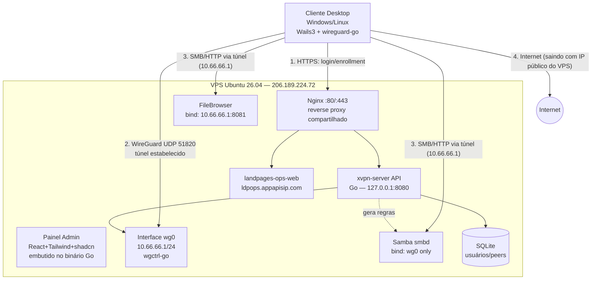
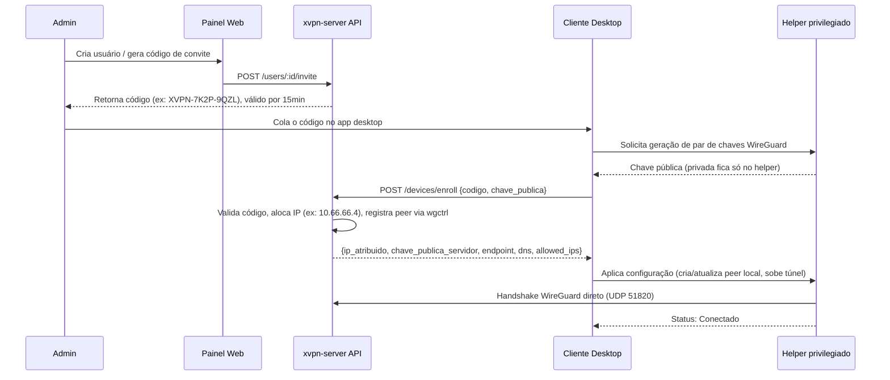
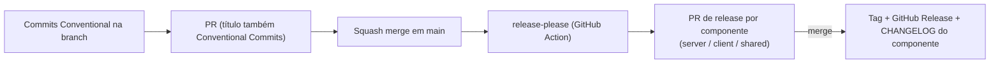

# XVPN — Plano Técnico Completo

> Rede privada própria (estilo "VPN pessoal com exit node"), painel web de administração e cliente desktop (Windows/Linux) construído em Go + Wails3 + React/Tailwind/shadcn, hospedado no seu VPS Ubuntu.

---

## 1. Diagnóstico do ambiente real (levantado via SSH em `206.189.224.72`)

Antes de desenhar qualquer arquitetura, inspecionei o servidor para não propor nada genérico ou que colida com o que já existe. Fatos relevantes:

| Item | Valor real observado | Impacto no plano |
|---|---|---|
| SO | **Ubuntu 26.04 LTS** (kernel `7.0.0-27-generic`) | Você mencionou 24.04 — o servidor na verdade está em 26.04. Não é problema (é mais novo), só registro o fato. Todo o plano abaixo é compatível com 26.04. |
| CPU/RAM/Disco | 4 vCPU, 7.8 GB RAM, 155 GB disco (2,6 GB usados) | Muito folgado para o volume de uso (uso pessoal, 1–3 dispositivos). Não há necessidade de dimensionar para escala agora. |
| WireGuard | Módulo de kernel **já presente** (`wireguard.ko.zst`, v1.0.0), só não carregado | Não precisamos compilar nada — é suporte nativo do kernel. |
| Redes já em uso | `eth0`: IP público `206.189.224.72/20` **+ `10.10.0.10/16`**; `eth1`: `10.136.0.14/16` (rede privada DigitalOcean/VPC) | **Não posso usar `10.10.0.0/24` para a VPN** (colide com rota já existente no `eth0`). Vou usar `10.66.66.0/24`, que está livre. |
| `ip_forward` | `0` (desativado) | Precisa ser habilitado para o servidor rotear/NAT o tráfego dos clientes. |
| Firewall (`ufw`) | Instalado, mas **inativo** | Precisamos configurar regras e ativar como parte do hardening. |
| SSH | `PermitRootLogin yes`; `PasswordAuthentication` **conflitante** entre `50-cloud-init.conf` (yes) e `60-cloudimg-settings.conf` (no) | Como o OpenSSH usa o *primeiro* valor encontrado e `50-*` é lido antes de `60-*`, na prática **login por senha pode ainda estar habilitado**, mesmo você achando que só a chave funciona. Vamos fechar isso explicitamente (ver §9). |
| Nginx / Docker / Samba / Go / Node | Nenhum instalado ainda | Ambiente limpo — vamos instalar tudo do zero, com controle total sobre versões. |
| **Outra aplicação em preparação** | `/opt/landpages-ops/landpages-ops-web` (binário Go, usuário de sistema dedicado `landpages-ops`), vai usar **Nginx** e domínio próprio `ldpops.appapisip.com` | **Decisão de arquitetura:** o Nginx será um **reverse proxy compartilhado** no servidor, com um *server block* por aplicação/domínio. O XVPN não pode assumir que é o único serviço HTTP da máquina. |
| **Domínios confirmados (DNS já verificado)** | `vpn.officeempresa.com` → XVPN (painel/API); `ldpops.appapisip.com` → landpages-ops. Ambos resolvendo para `206.189.224.72` (confirmado via `dig`) | Já podemos configurar os *server blocks* do Nginx e emitir certificados Let's Encrypt para os dois, sem esperar propagação de DNS. |

Essa última linha muda uma decisão importante: eu ia sugerir **Caddy** (TLS automático, config mais simples) para o painel — mas como já vai existir Nginx no servidor para outra app, **vamos padronizar tudo em Nginx + Certbot**, para não ter dois reverse proxies brigando pelas portas 80/443. É a decisão tecnicamente mais correta dado o contexto real do servidor, mesmo custando um pouco mais de configuração manual de TLS.

---

## 2. Objetivo real por trás do pedido

Traduzindo o pedido em requisitos concretos:

**Funcionais**
1. Você (e futuramente outras pessoas) deve conseguir "entrar" numa rede privada cujo nó central é o VPS, e sair para a internet com o IP público do VPS (full-tunnel, não apenas split-tunnel de LAN).
2. Acesso a diretórios do VPS como unidade de rede nativa (Samba) **e** também via navegador (painel tipo "meus arquivos").
3. Cliente desktop (Windows e Linux) que instala, configura e conecta/desconecta a VPN com um clique.
4. Painel web no VPS para administração: adicionar/remover usuários e dispositivos, e espaço para funcionalidades futuras.

**Não funcionais (o que você descreveu como "rápido, estável e seguro")**
- **Rápido**: implica WireGuard (não OpenVPN/IPSec — ver comparação em §3.1), rodando em kernel space quando possível.
- **Estável**: reconexão automática, keepalive para NAT, serviço gerenciado por `systemd`, não depender de sessões de terminal.
- **Seguro**: chave privada nunca sai do dispositivo do cliente, Samba/compartilhamento **nunca exposto na internet pública** (só dentro do túnel), firewall padrão-nega, hardening de SSH, TLS no painel.

**Premissas confirmadas com você:**
- Escala: uso pessoal, 1–3 dispositivos (mas o desenho já deixa margem para crescer sem retrabalho).
- Você tem domínio próprio para apontar ao VPS (TLS via Let's Encrypt).
- Prioridade: ir direto para a arquitetura "produto completo" no cliente (engine WireGuard embarcada + helper privilegiado + kill switch), não uma versão descartável.
- Compartilhamento: **ambos** — unidade de rede (Samba) e painel web de arquivos.
- Convivência com outra aplicação Go (`landpages-ops`) atrás do mesmo Nginx, em domínio separado.

---

## 3. Decisões de arquitetura (com análise comparativa)

### 3.1 Protocolo de VPN: WireGuard vs. alternativas

| Critério | **WireGuard** | OpenVPN | IPSec/IKEv2 | Tailscale/Netbird (mesh gerenciado) |
|---|---|---|---|---|
| Performance | Excelente (kernel-space, criptografia moderna Curve25519/ChaCha20) | Média (TLS overhead, geralmente userspace) | Boa, mas complexa | Boa (usa WireGuard por baixo) |
| Estabilidade em redes móveis/NAT | Muito boa (roaming nativo, UDP simples) | Razoável | Complicada (negociação IKE pesada) | Muito boa |
| Simplicidade de implementação em Go | Alta (`wgctrl-go`, `wireguard-go` mantidos pelo próprio projeto WireGuard) | Baixa (sem lib Go nativa boa, geralmente shell-out) | Muito baixa | N/A (é outro produto, não uma lib) |
| Superfície de ataque | Pequena (código enxuto, auditado) | Maior (OpenSSL, muitas opções) | Grande (histórico de CVEs) | Herda do WireGuard |
| Controle total / white-label | Total | Total | Total | **Não** — você usaria a infra deles |

**Decisão: WireGuard**, controlado via `wgctrl-go` (para o control-plane no servidor) e `wireguard-go` + `wintun` (para o motor embarcado no cliente desktop). É a escolha alinhada com "rápido, estável, seguro" e com o pedido explícito de construir seu próprio produto.

> **Nota honesta de especialista:** se seu objetivo fosse apenas "ter uma VPN funcionando o mais rápido possível", ferramentas prontas como **Headscale + Tailscale**, **Netbird** ou até **wg-easy** resolveriam 80% disso em horas, sem escrever uma linha de Go. Você está optando conscientemente por construir do zero — o que faz sentido se o objetivo inclui aprendizado, controle total do stack, ou transformar isso num produto próprio no futuro (o pedido de cliente com marca própria em Wails3 sugere isso). Só reforço essa alternativa aqui para que a escolha seja informada, não por desconhecimento.

### 3.2 Arquitetura do cliente desktop: onde fica o "motor" WireGuard?

| Abordagem | Prós | Contras |
|---|---|---|
| **A. Shell-out para `wg-quick`/WireGuard instalado no SO** | Rápido de implementar; usa binário oficial e testado | Depende de instalação externa (usuário precisa instalar WireGuard antes); no Linux exige `sudo` a cada comando (ruim para UX); no Windows exige o app oficial instalado |
| **B. Engine embarcada (`wireguard-go` + `wintun`) com processo GUI sem privilégio + helper privilegiado via IPC** | Zero dependência externa — um instalador só, self-contained; UX de um clique (usuário só faz elevação **uma vez**, na instalação do serviço); é o padrão usado por produtos reais (Tailscale, NordVPN, Mullvad, e o projeto de referência `wireguide`, que usa exatamente Go + Wails3 + `wireguard-go`) | Mais trabalho de engenharia inicial; precisa lidar com assinatura de driver/instalador no Windows (SmartScreen) |

**Decisão: Opção B**, conforme sua preferência por já construir a versão "produto completo". Arquitetura de separação de privilégios:

```mermaid
graph LR
    subgraph GUI["Processo GUI (sem privilégio) — Wails3 + React"]
        A1[Tela Conectar/Desconectar]
        A2[Login / Enrollment]
        A3[System tray]
        A4[Configurações]
    end
    subgraph Helper["Serviço Helper (privilegiado) — systemd (Linux) / Windows Service"]
        B1[wireguard-go + wgctrl-go]
        B2[TUN device: wintun (Win) / kernel wg (Linux)]
        B3[Rotas, DNS, Kill Switch nftables/WFP]
        B4[Monitor de reconexão]
    end
    GUI <-->|"IPC: JSON-RPC/gRPC via Unix Socket (Linux) ou Named Pipe (Windows)"| Helper
    Helper -->|"UDP 51820"| Server[(VPS xvpn-server)]
```

Isso resolve o maior problema de UX de VPNs "amadoras": o usuário não digita senha de admin toda vez que conecta — só uma vez, quando o instalador registra o serviço privilegiado.

### 3.3 Reverse proxy e TLS: Nginx (não Caddy)

Como definido em §1, o Nginx será compartilhado entre o XVPN e o `landpages-ops`. Cada aplicação recebe:
- Seu próprio *server block* (`/etc/nginx/sites-available/xvpn.conf` para `vpn.officeempresa.com`, e um equivalente para `ldpops.appapisip.com`);
- Seu próprio certificado (via **Certbot**, plugin nginx, renovação automática por timer systemd) — como os dois domínios já resolvem para `206.189.224.72`, os certificados já podem ser emitidos (`certbot --nginx -d vpn.officeempresa.com` e `-d ldpops.appapisip.com`), sem esperar propagação de DNS;
- Seu próprio backend em `127.0.0.1:<porta>` — **nunca exposto diretamente na internet**, só via proxy.

### 3.4 Compartilhamento de arquivos: Samba + FileBrowser, ambos **restritos à VPN**

| Solução | Experiência | Segurança se mal configurado | Uso recomendado |
|---|---|---|---|
| **Samba (SMB3)** | Nativa — "mapear unidade de rede" no Windows, integra com Nautilus/Dolphin no Linux via GVFS | Historicamente alvo de exploits **se exposto à internet** | Diretórios de trabalho, edição de arquivos grandes, uso do dia a dia |
| **FileBrowser** (self-hosted, binário Go único) | Interface web tipo Google Drive, upload/download pelo navegador, sem precisar montar nada | Baixo, é uma app web comum | Acesso rápido/pontual, inclusive de um dispositivo sem VPN configurada mas já dentro do túnel (ex.: notebook emprestado) |

**Decisão crítica de segurança:** diferente do painel de administração (que **precisa** ser público, senão você não consegue nem se cadastrar/enrolar um dispositivo antes de ter VPN), o compartilhamento de arquivos **não tem esse problema de ovo-e-galinha** — então ele fica **inacessível pela internet pública**, só respondendo na interface `wg0` (IP `10.66.66.1`):

- Samba: `smb.conf` com `bind interfaces only = yes` + `interfaces = 10.66.66.1/24 127.0.0.1/8` — mesmo que o firewall falhe, o serviço fisicamente não aceita conexão vinda do `eth0`. Especificado por IP/CIDR, não pelo nome da interface (`wg0`): o Samba detecta interfaces automaticamente supondo broadcast/netmask convencionais, e `wg0` é ponto-a-ponto (sem broadcast) — com `interfaces = wg0 lo` o `smbd` sobe normal mas só fica escutando em `127.0.0.1`, achado ao validar a Fase 5 via túnel real (ver `ROADMAP.md`).
- FileBrowser: processo escuta em `10.66.66.1:8081`, **não** cadastrado no Nginx público, sem domínio/certificado público. Acesso via `http://10.66.66.1:8081` só funciona com o túnel ativo. Implementado com o fork ativamente mantido **FileBrowser Quantum** (`gtsteffaniak/filebrowser`) — o projeto original (`filebrowser/filebrowser`) foi arquivado em 2026-09-01, sem mais correções de segurança (ver `ROADMAP.md` Fase 5).

Isso é defesa em profundidade: mesmo um erro de firewall não expõe seus arquivos ao mundo.

### 3.5 Geração de chaves: onde nasce a chave privada?

Ponto que muita implementação amadora erra: **a chave privada do WireGuard do cliente é gerada localmente, no próprio dispositivo, pelo helper privilegiado — nunca no servidor.** O cliente envia ao servidor apenas a **chave pública** durante o *enrollment*. Isso significa que, mesmo que o servidor seja comprometido, um invasor não consegue se passar por um cliente existente (só consegue ver quem tem acesso, não personificar).

---

## 4. Arquitetura geral



---

## 5. Alocação de rede, portas e domínios (registro para não colidir com `landpages-ops`)

| Recurso | Valor | Observação |
|---|---|---|
| Domínio XVPN (painel/API) | `vpn.officeempresa.com` | DNS já apontado para `206.189.224.72` (confirmado via `dig`) |
| Domínio landpages-ops | `ldpops.appapisip.com` | DNS já apontado para `206.189.224.72` (confirmado via `dig`) |
| Sub-rede WireGuard | `10.66.66.0/24` | Servidor = `10.66.66.1`; clientes a partir de `10.66.66.2` |
| ~~`10.10.0.0/24`~~ | **Evitar** | Já roteada no `eth0` pela infra atual |
| ~~`10.136.0.0/16`~~ | **Evitar** | Já usada pelo `eth1` (VPC DigitalOcean) |
| Porta WireGuard | `51820/udp` | Público, é o único ponto de entrada da VPN |
| Painel/API XVPN | `127.0.0.1:8080` (interno) → `https://vpn.officeempresa.com` (via Nginx) | Nunca exposto direto |
| `landpages-ops-web` | Porta a definir por aquele projeto (ex. `127.0.0.1:3000`) → `https://ldpops.appapisip.com` (via Nginx) | **Não usar `8080`/`51820`/`8081` nem `10.66.66.0/24`** para evitar colisão |
| Samba (SMB) | `445/tcp` | Bind **somente** em `wg0` (`10.66.66.1`) — nunca no `eth0`. NetBIOS/`139` (`nmbd`) desabilitado de propósito: clientes modernos resolvem por IP direto via SMB2/3, dispensando essa superfície extra (ver Fase 5 do `ROADMAP.md`) |
| FileBrowser | `10.66.66.1:8081` | Bind somente em `wg0` — nunca público |
| SSH | `22/tcp` | Mantém, mas hardening (§9) |
| DNS interno (opcional, fase futura) | `10.66.66.1:53` | Evita vazamento de DNS quando full-tunnel ativo |

> Ação recomendada: manter este bloco como a "fonte da verdade" de portas usadas no servidor, e pedir para quem for configurar o `landpages-ops` checar aqui antes de escolher porta/subdomínio.

---

## 6. Especificação do Servidor (`xvpn-server`)

### 6.1 Control-plane (Go)
- Framework HTTP: **Gin** (`v1.10.1`, fixado deliberadamente — a `v1.12.x` exige Go ≥1.25 e traz um grafo de dependências bem mais pesado por causa de suporte a HTTP/3, desnecessário para uma API administrativa pequena).
- ORM/DB: **GORM + SQLite** (`mattn/go-sqlite3`, via cgo; arquivo único em `/opt/xvpn/data/xvpn.db`), suficiente e sem overhead operacional para 1–15 usuários. Migração para Postgres é trivial via GORM se um dia escalar.
- Autenticação do painel: JWT (`golang-jwt/jwt/v5`, HMAC-SHA256) + senha com hash Argon2id (parâmetros OWASP 2024: 64 MB, t=3, p=2).
- Integração WireGuard: **`golang.zx2c4.com/wireguard/wgctrl`** cuida só da parte "WireGuard" (chave privada, porta, peers) — ela **não** cria a interface de rede nem atribui IP. Para isso (equivalente a `ip link add wg0 type wireguard` + `ip addr add`), o control-plane usa `github.com/vishvananda/netlink` diretamente, mantendo o princípio de "nunca faça shell-out" (`go-backend.mdc`) também nessa parte. `EnsureInterface` é idempotente: cria a interface só se ela ainda não existir (ex.: primeira vez) e sempre reconfigura chave/porta/endereço, sem depender de estado prévio. Peers são adicionados/removidos **dinamicamente em memória**, sem reiniciar a interface nem escrever/reler arquivos `.conf`. No boot do serviço, `ReconcilePeers` sincroniza o conjunto de peers do kernel com o que está no banco (`ReplacePeers: true`), garantindo consistência mesmo após um restart do serviço. O pacote `wireguard-tools` (comando `wg`, usado só para operação manual/depuração via as skills do Cursor) precisa ser instalado à parte — o módulo de kernel por si só não traz o CLI.
- Capacidades: o binário roda como usuário de sistema dedicado `xvpn` (mesmo padrão do `landpages-ops`), mas com `AmbientCapabilities=CAP_NET_ADMIN` no `systemd` — **não precisa rodar como root completo** para manipular a interface WireGuard. A unit também usa `ProtectSystem=strict` (só `/opt/xvpn/data` é gravável), `ProtectHome`, `PrivateTmp` e `NoNewPrivileges` como hardening adicional.
- NAT/roteamento: `sysctl net.ipv4.ip_forward=1` (persistente via `/etc/sysctl.d/`); MASQUERADE de `10.66.66.0/24` saindo por `eth0` implementado via a seção `*nat`/`POSTROUTING` nativa do `/etc/ufw/before.rules` (evita duas ferramentas de firewall concorrentes). **Importante**: a chain `FORWARD` do `ufw` é `deny` por padrão — além do NAT, é preciso uma regra explícita `ufw route allow in on wg0 out on eth0` (least-privilege: só libera encaminhamento partindo de `wg0`, não um `DEFAULT_FORWARD_POLICY=ACCEPT` genérico) para o tráfego não ser descartado antes de chegar ao NAT.
- Bootstrap do primeiro admin: se a tabela de usuários estiver vazia no boot, um usuário `admin` é criado automaticamente — com `XVPN_ADMIN_USERNAME`/`XVPN_ADMIN_PASSWORD` se definidos no ambiente, ou com uma senha aleatória gerada e logada **uma única vez** no journal (`journalctl -u xvpn-server`). Evita ter que semear o banco manualmente ou hardcodar uma senha padrão conhecida.

### 6.2 API — principais endpoints

| Endpoint | Descrição |
|---|---|
| `POST /api/auth/login` | Login do admin no painel |
| `GET /api/users` / `POST /api/users` / `DELETE /api/users/:id` | CRUD de usuários |
| `POST /api/users/:id/invite` | Gera token de convite/enrollment de curta duração (usado pelo cliente desktop para se cadastrar sem precisar de senha do admin) |
| `POST /api/devices/enroll` | Cliente envia sua **chave pública** + token de convite → servidor responde com IP alocado, chave pública do servidor, endpoint, DNS |
| `GET /api/devices` | Lista peers com estatísticas ao vivo (via `wgctrl`: último handshake, bytes rx/tx, endpoint atual) |
| `DELETE /api/devices/:id` | Revoga um dispositivo (remove peer da interface imediatamente) |
| `GET /api/status` | Saúde do servidor, uso de CPU/rede, nº de peers conectados |

### 6.3 Painel Web (React + Tailwind + shadcn/ui)
Páginas: **Login**, **Dashboard** (peers ativos, throughput agregado), **Usuários** (CRUD + gerar convite/QR code), **Dispositivos** (status, revogar), **Compartilhamentos** (gerenciar pastas Samba/FileBrowser e permissões), **Configurações** (rede, DNS, firewall), **Auditoria** (log de conexões/ações administrativas).

Build: `vite build` → arquivos estáticos embutidos no binário Go via `embed.FS`. Resultado: **um único binário** `xvpn-server` sobe API + painel + lógica WireGuard. Simplifica deploy/systemd a um único serviço.

**Implementado na Fase 3** (ver `ROADMAP.md` para o checklist e achados completos): `go:embed` não aceita `..` no caminho do diretório embutido, então o Vite builda direto dentro da árvore do pacote Go que faz o embed (`server/internal/webui/dist/`, não `server/web/dist/`) — ver `server/internal/webui/webui.go` e `server/web/vite.config.ts`. Dois endpoints de leitura foram adicionados além do previsto originalmente na Fase 2, só para alimentar as telas do painel: `GET /api/config` (config de rede não sensível) e `GET /api/audit` (últimas entradas de auditoria).

### 6.4 Compartilhamento de arquivos
- Samba: pacote `samba`, config em `/etc/samba/smb.conf`, um share por usuário/propósito (ex.: `[shared]`, `[home-<usuario>]`), autenticação própria do Samba (`smbpasswd`) — **pode ser sincronizada pelo painel** (ao criar usuário no XVPN, opcionalmente cria também o usuário Samba).
- FileBrowser: binário único, roda como serviço `systemd` separado (`xvpn-filebrowser.service`), banco próprio (SQLite dele), autenticação própria (ou, em fase futura, SSO simples via o mesmo JWT do painel).

### 6.5 Hardening do servidor (checklist)
- [x] Corrigir ambiguidade de `PasswordAuthentication` (`/etc/ssh/sshd_config.d/00-xvpn-hardening.conf` — ver §9 para o porquê do nome `00-`, não `99-`).
- [x] Ativar `ufw`: negar tudo por padrão, permitir `22/tcp`, `80/tcp`, `443/tcp`, `51820/udp`.
- [x] Instalar `fail2ban` para SSH.
- [x] `unattended-upgrades` para patches de segurança automáticos (já vinha habilitado por padrão na imagem).
- [x] Samba/FileBrowser **nunca** nas regras do `ufw` para `eth0` — só respondem em `wg0` por design do próprio serviço (defesa em profundidade, não depender só do firewall). *(aplicado na Fase 5: `ufw allow in on wg0 to any port 445/8081`, bind exclusivo em `10.66.66.1`/`127.0.0.1`, validado via túnel real e via IP público, ver `ROADMAP.md` Fase 5)*
- [x] Backup do `xvpn.db` (cron simples com `sqlite3 .backup` para `/opt/xvpn/backups/`, rotação 7 dias) — implementado na Fase 2 (`server/deploy/backup.sh` + `server/deploy/xvpn-backup.cron`, diário às 03:15).

### 6.6 Landing pública e lista de espera (feature adicional, fora das 9 fases originais)

Adicionado depois da Fase 6, a pedido do usuário: `vpn.officeempresa.com/` deixa de ser o dashboard (que passa a viver em `/dashboard`, atrás de login) e passa a ser uma **landing page pública** explicando o produto, com um formulário de "lista de espera" (nome + e-mail + mensagem opcional).

**Decisão de design — aprovação não provisiona acesso automaticamente**: `POST /api/waitlist` (único endpoint de escrita da API **sem autenticação**) só grava um `WaitlistEntry` com status `pending`. Uma tela nova no painel (`/waitlist`, autenticada) lista os cadastros e permite marcá-los como `approved`/`rejected` — mas isso é só um sinalizador de "pode liberar". Aprovar **não** cria `User`/`InviteToken` automaticamente: o admin ainda cria o usuário e gera o convite manualmente na tela Usuários já existente (Fase 2/3), usando nome/e-mail do cadastro como referência. Justificativa: evita criar um segundo caminho de provisionamento de acesso (com sua própria superfície de bugs/segurança) só para essa conveniência — o único caminho que cria acesso real (`POST /api/users` → `POST /api/users/:id/invite`) continua sendo o mesmo já testado desde a Fase 2, sem mudanças. Mesmo padrão de decisão já usado para usuários Samba (§6.4/`ROADMAP.md` Fase 5): privilegiar manter operações sensíveis manuais em vez de automatizar via um caminho novo e menos escrutinado.

**Superfície pública nova, mitigação**: como é o único endpoint de escrita sem login de toda a API, `POST /api/waitlist` tem rate limit por IP em memória (5 tentativas / 10 min, `server/internal/api/ratelimit.go`) e validação estrita (nome não vazio, e-mail via `net/mail.ParseAddress`, mensagem truncada em 2000 caracteres). Reenviar o mesmo e-mail não cria duplicata (idempotente) e não expõe erro diferenciado — evita enumeração de quem já está na lista sem, ao mesmo tempo, sujar o banco com repetições.

Nenhuma porta/domínio novo: tudo dentro do mesmo binário/processo `xvpn-server` e do mesmo server block Nginx já registrado em §5.

---

## 7. Especificação do Cliente Desktop (`xvpn-client`)

### 7.1 Stack
- **Wails v3** (atenção: está em **beta** — API considerada estável, mas ainda pré-1.0; ver riscos §10) + React + TailwindCSS + shadcn/ui no frontend.
- Engine: `wireguard-go` + `wgctrl-go`; TUN via `wintun` (Windows, DLL embutida com `go:embed`) e dispositivo `wg`/kernel nativo no Linux.
- Empacotamento: NSIS para instalador Windows (`.exe`), `.deb` + `AppImage` para Linux.

### 7.2 Funcionalidades do cliente
- Tela principal: botão Conectar/Desconectar, status (IP atribuído, latência, throughput, tempo conectado).
- Ícone na bandeja do sistema (tray) com atalho rápido conectar/desconectar.
- Fluxo de enrollment: usuário insere um "código de convite" (gerado no painel web) → app gera par de chaves localmente → registra no servidor → recebe config → conecta.
- Kill switch (opcional, ativável): bloqueia todo tráfego fora do túnel se a VPN cair inesperadamente (via `nftables` no Linux / Windows Filtering Platform no Windows).
- Reconexão automática com backoff exponencial.
- Atalho para abrir o compartilhamento de arquivos (botão "Abrir arquivos do servidor" → monta/abre `\\10.66.66.1\shared` no Windows ou `smb://10.66.66.1/shared` no Linux; e/ou abre `http://10.66.66.1:8081` do FileBrowser no navegador padrão).
- Auto-start no boot do SO (opcional, configurável).
- **MTU configurável** em Configurações/Diagnóstico (padrão automático, com override manual). Achado na validação manual da Fase 1 (`ROADMAP.md`): usuários atrás de outra VPN, CGNAT restritivo ou certas redes móveis têm um MTU efetivo menor que o padrão do WireGuard (1420), o que causa um "black hole" de PMTU — handshake e pacotes pequenos (ping) funcionam, mas tráfego HTTP/TLS trava silenciosamente. Sem essa opção, o usuário não teria como contornar o problema sozinho.

### 7.3 Por que separar GUI e helper (reforçando §3.2)
No Windows, criar/gerenciar um adaptador de rede exige privilégio de administrador. No Linux, manipular rotas e a interface WireGuard exige root (ou `CAP_NET_ADMIN`). Rodar a GUI inteira como admin/root é **desnecessário e arriscado** (superfície de ataque maior, prompts de UAC/sudo repetidos e irritantes). O padrão usado por produtos sérios (Tailscale, Mullvad, NordVPN, e o projeto de referência open-source `wireguide`, que usa exatamente Go+Wails3+`wireguard-go`) é:
1. Instalador registra um **serviço de sistema** (Windows Service / `systemd` unit) que roda com privilégio, uma única vez, na instalação.
2. A GUI roda com o usuário normal, sem privilégio, e conversa com o serviço via **socket local IPC**.
3. Resultado: o usuário só vê um prompt de elevação **na instalação**, nunca mais depois disso.

---

## 8. Fluxo de enrollment/autenticação (sequência)



---

## 9. Correção de segurança imediata recomendada (independente do resto do projeto)

**Aplicada na Fase 0 (ver `ROADMAP.md`).** Antes mesmo de começar a construir o XVPN, valia corrigir a ambiguidade do SSH encontrada em §1, já que ela afetava a segurança do servidor **hoje**:

```bash
# Verificar o efetivo:
sshd -T | grep -i passwordauthentication

# Criar override explícito:
echo -e "PasswordAuthentication no\nPermitRootLogin prohibit-password\nKbdInteractiveAuthentication no" \
  > /etc/ssh/sshd_config.d/00-xvpn-hardening.conf
systemctl reload ssh
```

> **Gotcha descoberto na implementação**: o nome do arquivo importa mais do que parecia. O `sshd_config` usa a regra "primeiro valor obtido vence" (não o último), e a diretiva `Include /etc/ssh/sshd_config.d/*.conf` do Ubuntu roda **antes** das diretivas explícitas do `sshd_config` principal. Como o servidor já tinha `50-cloud-init.conf` (`PasswordAuthentication yes`) e `60-cloudimg-settings.conf` (`PasswordAuthentication no`) — nessa ordem —, um arquivo `99-xvpn-hardening.conf` seria processado **depois** dos dois e não teria efeito nenhum (o `50-cloud-init.conf` já teria fixado o valor primeiro). A correção precisa de um nome que ordene **antes** de `50-cloud-init.conf`; usamos `00-xvpn-hardening.conf`. Validado com `sshd -T` e com uma segunda sessão SSH independente antes de considerar a mudança segura.

Isso era de baixo risco (a chave já estava configurada, então não havia risco de ficar trancado para fora) e fechou uma porta de entrada que não tinha relação direta com o projeto, mas que foi descoberta durante o diagnóstico.

---

## 10. Riscos, limitações e mitigações

| Risco | Impacto | Mitigação |
|---|---|---|
| Wails v3 ainda em **beta** (não é v2, que é a versão estável) | Possíveis breaking changes entre versões beta | Fixar a versão exata no `go.mod`/`package.json`; acompanhar changelog antes de atualizar; a API "desktop" já é considerada estável pelo próprio time do Wails |
| Driver `wintun` no Windows sem certificado de assinatura EV | Windows SmartScreen/antivírus pode alertar na instalação | Aceitável para uso pessoal/piloto; se for distribuir para terceiros no futuro, avaliar certificado de assinatura de código |
| VPS é ponto único de falha (1 servidor) | Se o VPS cair, toda a VPN e os arquivos ficam inacessíveis | Aceitável para o escopo atual (uso pessoal); backups do `xvpn.db` e documentação de restauração mitigam o pior caso |
| Termos de uso do provedor VPS quanto a atuar como "saída de internet" (proxy/exit) | Uso indevido por terceiros poderia gerar reclamações de abuso ao provedor | Como é uso pessoal (1–3 dispositivos, você mesmo), risco é baixo; ainda assim, vale checar a ToS da DigitalOcean/provedor atual |
| Cliente atrás de CGNAT/firewall corporativo restritivo pode bloquear UDP | Falha de conexão em certas redes | WireGuard usa só UDP; documentar isso como limitação conhecida; porta pode ser trocada de `51820` para uma menos filtrada (ex. `443/udp`) se necessário no futuro |
| Samba tem histórico de vulnerabilidades quando exposto à internet | Risco alto **se mal configurado** | Mitigado por design (§3.4): bind exclusivo em `wg0`, nunca no firewall público |

---

## 11. Estrutura de diretórios (monorepo)

```
xvpn/
├── PLAN.md
├── server/
│   ├── cmd/xvpn-server/main.go
│   ├── internal/
│   │   ├── api/            # handlers HTTP
│   │   ├── auth/           # JWT, hashing Argon2id
│   │   ├── wireguard/      # wrapper sobre wgctrl-go
│   │   ├── store/          # modelos GORM + SQLite
│   │   └── config/
│   ├── web/                # painel React+Tailwind+shadcn (embutido via embed.FS)
│   ├── deploy/
│   │   ├── systemd/        # xvpn-server.service, xvpn-filebrowser.service
│   │   ├── nginx/          # sites-available/xvpn.conf
│   │   ├── samba/          # smb.conf
│   │   ├── filebrowser/    # config.yaml (FileBrowser Quantum)
│   │   └── setup.sh        # script de provisionamento inicial
│   └── go.mod
├── client/
│   ├── cmd/xvpn-client/main.go   # entrypoint Wails / modo --helper
│   ├── internal/
│   │   ├── tunnel/         # wireguard-go + wgctrl integração
│   │   ├── ipc/            # servidor/cliente JSON-RPC
│   │   ├── platform/       # windows/ e linux/ (wintun, rotas, DNS, firewall)
│   │   └── apiclient/      # cliente HTTP para a API do servidor (enrollment)
│   ├── frontend/           # React+Tailwind+shadcn (UI da GUI Wails)
│   ├── build/              # scripts NSIS, .deb, AppImage
│   └── go.mod
├── shared/                 # tipos/DTOs Go compartilhados entre server e client
└── docs/
```

### 11.1 Convenção de build e artefatos (o que é gerado, onde fica, é commitado?)

Regra geral: **código-fonte é commitado, artefato de build nunca é**. Todo caminho de saída abaixo tem uma entrada correspondente no `.gitignore` raiz — se um novo componente de build for adicionado, as duas coisas (esta tabela e o `.gitignore`) precisam ser atualizadas juntas.

| Componente | Comando de build | Caminho de saída | Commitado no Git? |
|---|---|---|---|
| Servidor (`xvpn-server`, Go) | `go build -o bin/xvpn-server ./cmd/xvpn-server` (rodado em `server/`) | `server/bin/xvpn-server` | **Não** |
| Painel Web (Vite, admin) | `npm run build` (rodado em `server/web/`) | `server/internal/webui/dist/` (não `server/web/dist/` — `go:embed` não aceita `..`, ver §6.3) | **Não** — só um `placeholder.txt` fica commitado ali, para o `go:embed`/`go build` funcionarem num checkout limpo antes do painel ser compilado |
| Frontend do cliente desktop (Vite, dentro do Wails) | `npm run build` (rodado em `client/frontend/`) | `client/frontend/dist/` | **Não** — consumido pelo `wails3 build` |
| Bindings TS do cliente desktop (Wails) | `wails3 generate bindings` (via `task generate:bindings`, roda `-clean=true` antes de cada build) | `client/frontend/bindings/` | **Não** — gerado a partir dos structs/métodos Go expostos (`vpnservice.go`); nunca editado à mão |
| Cliente desktop (binário, `wails3 build`) | `wails3 build` (rodado em `client/`) | `client/bin/` | **Não** |
| Instalador Windows (NSIS) | script em `client/build/windows/` | `client/build/dist/*.exe` | **Não** — candidato a virar release asset (GitHub Releases) quando houver CI (Fase 7) |
| Pacotes Linux (`.deb`/AppImage) | scripts em `client/build/linux/` | `client/build/dist/*.deb`, `client/build/dist/*.AppImage` | **Não** — idem acima |
| Banco de dados (`xvpn.db`) | gerado em runtime pelo servidor | `/opt/xvpn/data/xvpn.db` (produção) / `server/xvpn.db` (dev local) | **Nunca** — nem local nem produção; é dado de runtime/sensível, não artefato de build, mas segue a mesma regra de não versionar |

Convenções de nomenclatura de pasta usadas de propósito, para ficar previsível em todo o monorepo:

- `bin/` → binário compilado, pronto para executar.
- `dist/` → saída de build de frontend/web (HTML/JS/CSS estático).
- `build/dist/` → artefato final empacotado para distribuição (instalador).

---

## 12. Roadmap por fases

| Fase | Entregável | Critério de "pronto" |
|---|---|---|
| **0. Hardening + provisionamento base** | Fix SSH (§9), `ufw` ativo, usuário de sistema `xvpn`, pacotes base instalados (Nginx, Certbot, Samba) | `ssh` só por chave confirmado; `ufw status` mostra regras ativas |
| **1. Validação manual do túnel WireGuard** | Subir `wg0` manualmente via `wg`/`ip`, um peer de teste, confirmar exit pelo IP público | `curl ifconfig.me` de dentro do túnel retorna `206.189.224.72` |
| **2. Control-plane API (Go)** | CRUD usuários/dispositivos, integração `wgctrl`, JWT, SQLite | Criar/revogar peer via API reflete imediatamente em `wg show wg0` |
| **3. Painel Web (React+Tailwind+shadcn)** | Login, Dashboard, Usuários, Dispositivos, Compartilhamentos | Fluxo completo: criar usuário → gerar convite → ver dispositivo aparecer conectado |
| **4. Cliente Desktop MVP (Wails3)** | GUI conecta/desconecta usando engine embarcada + helper privilegiado, Windows e Linux | Enrollment via código funciona ponta a ponta nos dois SOs |
| **5. Compartilhamento de arquivos** | Samba scoped a `wg0` + FileBrowser | Unidade de rede monta no Windows/Linux; FileBrowser acessível só com túnel ativo |
| **6. Recursos avançados do cliente** | Kill switch, auto-reconexão, tray, auto-start, split-tunnel opcional | Queda de conexão não vaza tráfego fora do túnel (com kill switch ativo) |
| **7. Empacotamento e distribuição** | Instalador `.exe` (NSIS) e `.deb`/AppImage assinados/versionados | Instalação limpa numa VM nova funciona sem passos manuais |
| **8. Observabilidade e documentação final** | Logs estruturados (`slog` JSON), métricas em `/api/status`, README de operação | Consegue diagnosticar falha de conexão com logs do helper + status do painel/API; README reflete o estado real |

Estimativa de esforço (uma pessoa, dedicação parcial): 6–10 semanas para o conjunto completo (fases 0–8). As fases 2–4 são as mais longas.

---

## 13. Versionamento e releases

Cada componente do monorepo tem **versionamento semântico independente** — `server`, `client` e `shared` (tipos Go compartilhados) evoluem em ritmos diferentes (ex.: um `fix` no cliente não deveria forçar um bump de versão do servidor), então cada um tem seu próprio `CHANGELOG.md` e suas próprias tags no formato `server-vX.Y.Z`, `client-vX.Y.Z`, `shared-vX.Y.Z`.

### 13.1 Automação via release-please

A automação usa o [release-please](https://github.com/googleapis/release-please) (ferramenta padrão do Google, sem necessidade de manter lógica própria de bump de versão), dirigida pelos [Conventional Commits](https://www.conventionalcommits.org/) já obrigatórios (ver `CONTRIBUTING.md`):

- `feat` → bump *minor*.
- `fix` → bump *patch*.
- `!` no tipo/escopo ou rodapé `BREAKING CHANGE:` → bump *major*.

O `release-please` mantém uma **Pull Request de release sempre atualizada por componente**, acumulando o changelog desde a última versão publicada. Mergear essa PR (via squash, como todas as outras) é o que efetivamente corta a versão: cria a tag, publica a GitHub Release e atualiza o `CHANGELOG.md` do componente.



### 13.2 Regra derivada: título do PR precisa ser Conventional Commits

Como a branch `main` só aceita squash merge (§ branch protection em `CONTRIBUTING.md`), **o título do PR — não os commits individuais da branch — vira o commit final em `main`**, e é esse commit que o `release-please` analisa. Um título fora do padrão faz o `release-please` não classificar a mudança corretamente (ou ignorá-la). A skill `ship-pr` (`.cursor/skills/ship-pr/`) valida isso antes de abrir o PR.

### 13.3 Contrato de compatibilidade client↔server

O endpoint `GET /api/status` do servidor expõe um campo `api_version` (implementado na Fase 2 como **inteiro incremental**, começando em `1` — constante `api.APIVersion`, também devolvido em `POST /api/devices/enroll`). O cliente desktop (Fase 4+) valida essa versão ao conectar/enrolar e avisa o usuário caso as versões de cliente e servidor sejam incompatíveis, evitando falhas silenciosas por desalinhamento de protocolo. Bump sempre que um endpoint mudar de forma incompatível com clientes existentes.

### 13.4 Implantação faseada

- **Fase 2** (control-plane) — ✅ concluído: componente `server` adicionado ao `release-please-config.json` + `.release-please-manifest.json` (versão inicial `0.0.0`) + workflow `.github/workflows/release-please.yml` (`release-type: go`, changelog próprio em `server/CHANGELOG.md`).
- **Fase 4** (cliente desktop): adicionar o componente `client` ao mesmo manifesto quando `client/` existir.

A skill `release-status` (`.cursor/skills/release-status/`) consulta as PRs de release abertas assim que essa automação existir.

### 13.5 Papel do `CHANGELOG.md` da raiz

O `CHANGELOG.md` na raiz do monorepo **não** é substituído pelos changelogs por componente — ele continua registrando mudanças "de projeto" que não pertencem a um componente específico (documentação, `.cursor/`, workflow de Git, infraestrutura/VPS). Essa separação já está em uso desde a fundação do projeto.

---

## 14. Estado e próximos passos

**Concluído na `main` (Fases 0–5):** hardening do VPS, túnel WireGuard, control-plane + painel, cliente desktop MVP, Samba/FileBrowser só em `wg0`.

**Em PRs (não na `main` ainda):** Fase 6 (recursos avançados do cliente), redesign UI, landing/waitlist, Fase 7 (empacotamento).

**Fase 8 (esta linha):** logs estruturados server/client, métricas agregadas em `GET /api/status`, auditoria VPS via skill, README/PLAN alinhados ao estado real.

Pendências manuais recorrentes: validação Windows real; instalação limpa `.deb`/NSIS em VM; opcional `GIN_MODE=release` + `XVPN_LOG_*` no `/opt/xvpn/xvpn-server.env` de produção.
