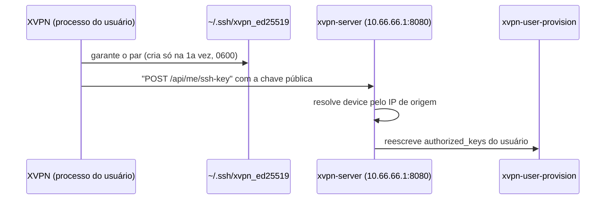

# ROADMAP — XVPN

Checklist de execução do projeto, fase a fase. Baseado nas decisões arquiteturais de `[PLAN.md](./PLAN.md)`. Marque os itens conforme forem concluídos — este arquivo é a fonte da verdade sobre "o que já foi feito" no projeto.

Convenção: `[ ]` pendente · `[x]` concluído · `[~]` em andamento/parcial.

> **Status:** Ciclos **v0.2**–**v0.7** (Fases 0–34) em código. **Fases 35–66** na `main` e no VPS. **Fase 67** = redes overlay (infra ≠ users) + cutover do nó `data` + **xmonitor**. Auth: **só JWE**. Fases 0–21 são históricas (hostname era `vpn.officeempresa.com`).
>
> **Único item parcial da Fase 15:** `[~]` E2E Windows real + helper como Windows Service (rota `/32` já corrigida no código — falta máquina/VM).
>
> **Aplicar no VPS:** runbooks Cloudflare (A já apontam), intranet-dnsmasq, certs `*.corp` + `marketplace`/`xdriver`, Nginx ihuull, Mongo — **não** ligar `XVPN_MONGO_URI` no mesmo instante que o binário JWE. Arquivos **nunca** no hostname público do XDriver.
>
> Também: [backlog legado](#backlog-legado-mvp--fora-das-fases-9).

---

## Preparação do repositório e tooling

- [x] `PLAN.md` criado com arquitetura completa e decisões justificadas
- [x] `README.md` criado
- [x] `ROADMAP.md` criado (este arquivo)
- [x] `AGENTS.md` criado (instruções para agentes de IA)
- [x] `CONTRIBUTING.md` criado
- [x] `SECURITY.md` criado
- [x] `CHANGELOG.md` criado
- [x] Regras do Cursor configuradas (`.cursor/rules/*.mdc`)
- [x] Hooks do Cursor configurados (`.cursor/hooks.json`)
- [x] Skills do Cursor configuradas (`.cursor/skills/*`)
- [x] `.gitignore` completo criado (segredos, artefatos de build, DB, SO/IDE)
- [x] Convenção de build documentada em `PLAN.md` [§11.1](./PLAN.md#111-convenção-de-build-e-artefatos-o-que-é-gerado-onde-fica-é-commitado)
- [x] Hook real de pre-commit criado (`.githooks/pre-commit`)
- [x] Repositório Git inicializado (`git init`) e primeiro commit
- [x] `core.hooksPath` configurado localmente (`.githooks`)
- [x] Repositório remoto criado no GitHub (`rootkit-lab/xvpn`, público — ver `SECURITY.md`) e push inicial
- [x] Repositório configurado para squash merge apenas (merge commit e rebase merge desabilitados)
- [x] Fluxo de trabalho GitHub Flow documentado e obrigatório (`CONTRIBUTING.md`)
- [x] Hook `.githooks/pre-commit` bloqueando commit direto em `main`/`master` (exceto merge)
- [x] Branch protection real aplicada em `main` no GitHub (PR obrigatório, sem push direto, sem force-push, sem deleção, histórico linear, `enforce_admins` ativo) — validado com teste de push direto rejeitado
- [x] Skills de Git/GitHub criadas (`start-task`, `ship-pr`, `release-status` — ver `PLAN.md` [§13](./PLAN.md#13-versionamento-e-releases))
- [x] Estratégia de versionamento independente por componente documentada (`PLAN.md` §13, `CONTRIBUTING.md`)
- [x] Definir e adicionar `LICENSE` — **adiado de propósito** para o [backlog legado](#backlog-legado-mvp--fora-das-fases-9) (repo público, decisão legal fora do escopo das Fases 0–8)

---

## Fase 0 — Hardening e provisionamento base do VPS

- [x] Verificar efetivo do SSH: `sshd -T | grep -i passwordauthentication`
- [x] Criar `/etc/ssh/sshd_config.d/00-xvpn-hardening.conf` (`PasswordAuthentication no`, `PermitRootLogin prohibit-password`, `KbdInteractiveAuthentication no`) — **nota**: usamos `00-` em vez do `99-` originalmente planejado; ver gotcha de ordenação documentado em `PLAN.md` [§9](./PLAN.md#9-correção-de-segurança-imediata-recomendada-independente-do-resto-do-projeto)
- [x] Recarregar sshd e confirmar (`systemctl reload ssh` + segunda sessão SSH independente validada antes de prosseguir)
- [x] Criar usuário de sistema `xvpn` (sem shell de login interativo, home dedicada em `/opt/xvpn`)
- [x] Instalar pacotes base: `nginx`, `certbot`, `python3-certbot-nginx`, `samba`, `fail2ban`, `unattended-upgrades` (`nginx`/`certbot`/`unattended-upgrades` já vinham instalados na imagem; `samba` e `fail2ban` instalados nesta fase)
- [x] Configurar `ufw`: política padrão `deny incoming` / `allow outgoing`
- [x] `ufw allow 22/tcp`, `ufw allow 80/tcp`, `ufw allow 443/tcp`, `ufw allow 51820/udp`
- [x] Ativar `ufw` (`ufw enable`) e confirmar com `ufw status verbose`
- [x] Configurar `fail2ban` para o serviço SSH (jail `sshd` ativa, já baniu tentativas reais de força bruta ao ser habilitada)
- [x] Habilitar e configurar `unattended-upgrades` (já vinha habilitado por padrão na imagem cloud do Ubuntu 26.04 — validado, nenhuma mudança necessária)
- [x] Criar server block Nginx para `vpn.officeempresa.com` (proxy para `127.0.0.1:8080`, retorna 502 temporariamente — validado, sem backend ainda até a Fase 2)
- [x] Emitir certificado: `certbot --nginx -d vpn.officeempresa.com`
- [x] Confirmar renovação automática do certificado (`systemctl list-timers | grep certbot` → `certbot.timer` ativo)
- [x] Coordenar com o setup do `landpages-ops` para não haver conflito de *server block* em `ldpops.appapisip.com` (validado: `ldpops.appapisip.com` continua respondendo normalmente após as mudanças)
- [x] Registrar em `PLAN.md` [§5](./PLAN.md#5-alocação-de-rede-portas-e-domínios-registro-para-não-colidir-com-landpages-ops) qualquer porta/domínio novo definido nesta fase (nenhuma porta/domínio novo além do já registrado)

**Achado de segurança durante a instalação**: o pacote `samba` sobe `smbd`/`nmbd` com o `smb.conf` padrão, que escuta em `0.0.0.0:139`/`0.0.0.0:445` (todas as interfaces) imediatamente após a instalação — violaria o invariante do `AGENTS.md` de que Samba nunca pode ser exposto publicamente. Como a interface `wg0` só é criada na Fase 1 e o `smb.conf` só é restrito a `wg0`/`lo` na Fase 5, paramos e desabilitamos `smbd`/`nmbd` (`systemctl stop/disable`) logo após a instalação, para não deixar a porta exposta entre esta fase e a Fase 5. Serão reabilitados só quando o `smb.conf` estiver com `bind interfaces only = yes` e `interfaces = wg0 lo`.

## Fase 1 — Validação manual do túnel WireGuard

- [x] Confirmar módulo carregado: `modprobe wireguard` + `lsmod | grep wireguard`
- [x] Criar interface: `ip link add dev wg0 type wireguard`
- [x] Gerar par de chaves do servidor (`wg genkey | tee server.key | wg pubkey > server.pub`), salvar chave privada em `/etc/wireguard/server.key` com permissão `600` — **nota**: o pacote `wireguard-tools` (comando `wg`) não vinha instalado por padrão, precisou ser instalado antes de gerar as chaves
- [x] Atribuir IP à interface: `ip addr add 10.66.66.1/24 dev wg0`
- [x] Configurar a interface com a chave privada e porta de escuta (`wg set wg0 listen-port 51820 private-key /etc/wireguard/server.key`)
- [x] Subir a interface: `ip link set wg0 up`
- [x] Habilitar `net.ipv4.ip_forward=1` (persistente via `/etc/sysctl.d/99-xvpn.conf`)
- [x] Configurar regra de NAT/MASQUERADE (`nftables`) para `10.66.66.0/24` saindo por `eth0` — implementada via `*nat`/`POSTROUTING`/`MASQUERADE` em `/etc/ufw/before.rules` (mecanismo nativo do `ufw` para isso), **mais** uma regra explícita `ufw route allow in on wg0 out on eth0`, já que a chain `FORWARD` do `ufw` tem política padrão `deny` — sem essa regra extra o NAT nunca seria alcançado (achado não previsto no checklist original)
- [x] Gerar par de chaves de um peer de teste (no seu notebook/desktop) — gerado num **container Docker isolado** na sua máquina (`--cap-add=NET_ADMIN --device=/dev/net/tun`), em vez de instalar `wireguard-tools` diretamente no SO principal: evita mexer na rede/rotas da máquina de uso diário e não exige sudo interativo. A chave privada nunca saiu do container/máquina local, nunca tocou o servidor.
- [x] Adicionar peer de teste no servidor: `wg set wg0 peer <pubkey_cliente> allowed-ips 10.66.66.2/32`
- [x] Configurar peer de teste localmente (`Endpoint = 206.189.224.72:51820`, `AllowedIPs = 0.0.0.0/0`, `PersistentKeepalive = 25`) — `::/0` omitido porque o container Docker de teste não tinha rota IPv6 configurada (irrelevante para o resultado do teste)
- [x] Subir túnel no peer de teste e validar handshake (`wg show` nos dois lados) — handshake confirmado nos dois lados
- [x] Validar exit: `curl ifconfig.me` de dentro do túnel deve retornar `206.189.224.72` — confirmado, após o ajuste de MTU abaixo
- [x] Validar latência/throughput básico (`ping`, opcionalmente `iperf3`) — `ping` ~135ms (esperado, tráfego passa por um túnel adicional pré-existente na máquina de teste — ver nota de MTU); download de 10 MB via `curl` em 1.77s (~45 Mbit/s)
- [x] Validar que o peer de teste consegue alcançar `10.66.66.1` (o próprio servidor) — confirma que "estar na mesma rede" funciona, não só o exit — confirmado via `ping 10.66.66.1`, 0% de perda
- [x] Documentar quaisquer ajustes de MTU/roteamento encontrados — **achado**: a máquina de teste já tinha uma VPN própria ativa (Cloudflare WARP, MTU 1280) como rota padrão. Com o MTU padrão do WireGuard (1420) para o túnel de teste, pacotes pequenos (ICMP) passavam mas requisições HTTP/TLS "sumiam" (black hole de PMTU, comum quando ICMP "packet too big" é descartado por túneis intermediários). Corrigido definindo `MTU = 1200` no `[Interface]` do peer de teste. **Relevante para o cliente real** (Fase 4/6): o cliente desktop deve permitir configurar/ajustar o MTU manualmente para usuários atrás de outra VPN, CGNAT restritivo ou redes móveis — considerar adicionar isso à tela de Configurações/Diagnóstico.
- [x] Peer de teste e container Docker removidos ao final (nenhum resíduo no servidor ou na máquina local); auditoria (`vps-security-audit`) confirmando `wg0` limpo, sem peers residuais

## Fase 2 — Control-plane API (Go)

- [x] Criar `server/` e inicializar módulo Go (`go mod init`)
- [x] Modelagem de dados via GORM: `User`, `Device`/`Peer`, `InviteToken`, `AuditLog`
- [x] Camada de autenticação: hash de senha com Argon2id, emissão/validação de JWT
- [x] Pacote `internal/wireguard/`: wrapper sobre `wgctrl-go` (`EnsureInterface`, `AddPeer`, `RemovePeer`, `ListPeers` com estatísticas rx/tx/handshake, `ReconcilePeers`) — **nota**: além do `wgctrl` (que só configura chave/porta/peers), a *criação* da interface (`ip link add ... type wireguard`, atribuição de IP, "link up") usa a lib `github.com/vishvananda/netlink` diretamente (nunca `exec.Command("ip", ...)`), mantendo o espírito de "nunca faça shell-out" do `go-backend.mdc` mesmo para essa parte que o `wgctrl` não cobre
- [x] Endpoint `POST /api/auth/login`
- [x] Endpoints CRUD `GET/POST/DELETE /api/users`
- [x] Endpoint `POST /api/users/:id/invite` (gera token de convite, expira em 15 min)
- [x] Endpoint `POST /api/devices/enroll` (recebe chave pública + token, aloca IP livre em `10.66.66.0/24`, registra peer via `wgctrl`)
- [x] Endpoint `GET /api/devices` (lista peers + estatísticas ao vivo)
- [x] Endpoint `DELETE /api/devices/:id` (revoga peer imediatamente)
- [x] Endpoint `GET /api/status` (saúde do servidor, nº de peers conectados, `api_version`)
- [x] Testes unitários dos handlers principais e da camada `wireguard/` — a camada `api/` é testada com um `wireguard.PeerManager` fake (interface extraída especificamente para isso) + SQLite em memória, sem precisar de `CAP_NET_ADMIN`/kernel real; a camada `wireguard/` em si só tem testes unitários da lógica pura de alocação de IP (`AllocateIP`), já que manipular a interface de fato exige privilégio e um kernel com suporte a WireGuard — não reproduzível de forma confiável em CI/sandbox. A validação de ponta a ponta real (API → `wgctrl` → `wg show`) foi feita manualmente em produção (ver abaixo).
- [x] `systemd` unit `xvpn-server.service` com `AmbientCapabilities=CAP_NET_ADMIN` (rodando como usuário `xvpn`, não root) — hardening com `ProtectSystem=true`, `PrivateTmp`; após Fase 13: `NoNewPrivileges=false` + `ProtectHome=false` (obrigatório para `sudo → xvpn-user-provision`; `ProtectSystem=strict` quebra o lock do `useradd`)
- [x] Apontar o server block Nginx de `vpn.officeempresa.com` para `127.0.0.1:8080` (backend real) — o server block já apontava para lá desde a Fase 0 (retornava 502); nenhuma mudança de config necessária, só o backend passou a existir
- [x] Configurar backup automático do `xvpn.db` (cron + `sqlite3 .backup`, rotação de 7 dias) — `sqlite3` (CLI) precisou ser instalado à parte no VPS (não vem por padrão); testado manualmente com sucesso (`sudo -u xvpn /opt/xvpn/bin/backup.sh`)
- [x] Adicionar componente `server` (e `shared`, se já criado) ao `release-please-config.json` + `.release-please-manifest.json` + criar workflow `.github/workflows/release-please.yml` (ver `PLAN.md` [§13.4](./PLAN.md#134-implantação-faseada)) — `shared/` ainda não existe, só `server` foi adicionado por enquanto

**Achados durante o deploy em produção:**

1. **Permissão da chave privada**: `/etc/wireguard/server.key` era `600 root:root` (criada manualmente na Fase 1) — o processo `xvpn-server`, rodando como usuário `xvpn`, não conseguia lê-la. Corrigido com `chgrp xvpn` + `chmod 640` (nunca `chmod o+r` — mantém a chave ilegível para qualquer usuário fora do grupo `xvpn`/root).
2. `XVPN_DB_PATH` **relativo quebra com** `ProtectSystem=strict`: o valor padrão do caminho do banco (`xvpn.db`, relativo ao `WorkingDirectory=/opt/xvpn`) tentava gravar em um diretório que o hardening do systemd (`ProtectSystem=strict`, só libera escrita em `ReadWritePaths=/opt/xvpn/data`) torna somente leitura. Corrigido definindo `XVPN_DB_PATH=/opt/xvpn/data/xvpn.db` explicitamente no `.env` de produção; o `.env.example` no repo já reflete isso como obrigatório.
3. `sqlite3` **(CLI) não vem instalado por padrão** no VPS — só a biblioteca é usada pelo Go via `mattn/go-sqlite3` (cgo), o binário `sqlite3` usado pelo script de backup precisou ser instalado à parte (`apt-get install sqlite3`).

**Validação de ponta a ponta em produção** (critério de "pronto" da Fase 2, `PLAN.md` §12): criado um convite via API, gerado um par de chaves de teste, feito o enrollment via `https://vpn.officeempresa.com/api/devices/enroll` — o IP `10.66.66.2/32` foi alocado corretamente e o peer apareceu **imediatamente** em `wg show wg0` no servidor. Revogado o mesmo device via `DELETE /api/devices/:id` — o peer sumiu do `wg show wg0` na mesma hora. Testado também um `systemctl restart xvpn-server`: a interface e a chave pública do servidor permaneceram intactas, e a reconciliação de peers a partir do banco rodou sem erro. Auditoria de segurança pós-deploy confirma `xvpn-server` escutando **só** em `127.0.0.1:8080` (nunca exposto direto).

## Fase 3 — Painel Web (React + Tailwind + shadcn/ui)

- [x] Scaffold Vite + React + TypeScript em `server/web/`
- [x] Configurar TailwindCSS + shadcn/ui (Tailwind v4, `components.json` com alias `@/`, estilo `new-york`)
- [x] Tela de Login
- [x] Dashboard (peers ativos, throughput agregado, status geral)
- [x] Tela Usuários (CRUD + gerar convite / QR code)
- [x] Tela Dispositivos (status, último handshake, revogar)
- [x] Tela Compartilhamentos (placeholder explícito — implementação real chega na Fase 5)
- [x] Tela Configurações (rede, DNS, firewall) — rede WG permanece só leitura; DNS da intranet é editável em `/admin/dns` (Fase 34)
- [x] Tela Auditoria (log de ações administrativas)
- [x] Build do painel embutido no binário Go via `embed.FS`
- [x] Teste end-to-end manual: criar usuário → gerar convite → dispositivo aparece conectado no painel

**Notas de implementação:**

- `server/web/` usa Vite + React 19 + TypeScript + Tailwind v4 (`@tailwindcss/vite`, CSS-first, sem `tailwind.config.js`) + shadcn/ui (`components.json`, estilo `new-york`, ícones `lucide-react`).
- **Gotcha do shadcn CLI**: `npx shadcn@latest add ...` criou os componentes numa pasta literal `@/components/ui/` (não resolveu o alias do `tsconfig`) — precisou mover manualmente para `src/components/ui/`. Rodar `ls` para confirmar o destino real sempre que usar o CLI novamente.
- **Gotcha do** `go:embed`: não aceita `..` no caminho, então o Vite builda direto dentro da árvore do pacote Go (`outDir: server/internal/webui/dist`, não `server/web/dist`) — ver `server/web/vite.config.ts` e `server/internal/webui/webui.go`. O diretório de saída é ignorado no Git exceto um `placeholder.txt` committado, só para o `go:embed`/`go build` nunca falharem num checkout limpo antes do `npm run build` ter rodado.
- Dois endpoints novos no backend, necessários para as telas de Configurações e Auditoria (não estavam no escopo original da Fase 2): `GET /api/config` (somente leitura, nunca expõe `JWTSecret` nem a chave privada WireGuard) e `GET /api/audit` (últimas 200 entradas). Cobertos por testes em `internal/api/config_handler_test.go` e `audit_handler_test.go`.
- Cliente HTTP único em `src/lib/api.ts` (token em `localStorage`, 401 limpa sessão e redireciona a `/login`), contexto de auth em `src/lib/auth-context.tsx`, polling simples via `usePollingData` (dashboard/dispositivos a cada 10s, usuários/auditoria mais devagar).
- QR code do convite (`qrcode.react`) codifica `{"invite_token": "..."}` — pensado para o cliente desktop (Fase 4) escanear no fluxo de enrollment.
- Validado localmente: `go build`/`go test` (backend) e `npm run build`/`npm run lint` (frontend) passam limpos; verificação manual via `httptest` confirmou que `/` e rotas SPA (ex.: `/users`) servem `index.html` e que `/api/rota-inexistente` continua devolvendo 404 JSON (teste descartado depois, não é parte da suíte permanente — depende do estado do build do painel).

## Fase 4 — Cliente Desktop MVP (Wails3)

- [x] Criar `client/` e inicializar com `wails3 init` (Go + React)
- [x] Configurar TailwindCSS + shadcn/ui no frontend do cliente
- [x] Implementar helper privilegiado (`internal/tunnel/`: `wireguard-go` + `wgctrl-go`)
- [x] Implementar TUN no Linux (dispositivo `wg` nativo do kernel)
- [x] Implementar TUN no Windows (`wintun` embutido via `go:embed`) — implementado e compila via cross-compile no Linux; **não testado em Windows real** (ver nota abaixo)
- [x] Implementar IPC GUI ↔ Helper (JSON-RPC via Unix Socket no Linux / Named Pipe no Windows)
- [x] Tela de enrollment (inserir código de convite gerado no painel)
- [x] Tela principal: Conectar/Desconectar, status (IP, latência, throughput, tempo conectado)
- [x] Ícone de bandeja (tray) básico
- [x] Instalação do serviço/helper (systemd unit no Linux / Windows Service no instalador) — unit systemd criada (`client/deploy/systemd/`); instalador do Windows Service fica para a Fase 7 (empacotamento)
- [x] Testar enrollment e conexão ponta a ponta no Linux
- [x] Testar enrollment e conexão ponta a ponta no Windows — **fora do escopo desta fase** (dev em Linux); item no [backlog legado](#backlog-legado-mvp--fora-das-fases-9)
- [x] Adicionar componente `client` ao `release-please-config.json` + `.release-please-manifest.json` (ver `PLAN.md` [§13.4](./PLAN.md#134-implantação-faseada))

**Notas de implementação:**

- Arquitetura em duas partes no mesmo binário: GUI (Wails, sem privilégio) fala por IPC com um **helper privilegiado** (`xvpn-client --helper`, roda como serviço systemd só com `CAP_NET_ADMIN` — não root, ver `client/deploy/systemd/xvpn-client-helper.service`) que é o único a tocar na rede — ver `client/README.md`. Evita rodar WebView/GTK com qualquer privilégio elevado.
- Engine de túnel por plataforma (`internal/platform/`): Linux usa o WireGuard nativo do **kernel** via `netlink`+`wgctrl` (mesma dupla do `server/`); Windows usa `wireguard-go` (userspace) + driver `wintun`, já que o Windows não tem WireGuard no kernel.
- `wintun.dll` não é commitado (binário de terceiros) — `internal/platform/windows/wintun/` guarda só um placeholder para o `go:embed` nunca falhar num checkout limpo; `build/windows/fetch-wintun.ps1` baixa o `.dll` real (com verificação de SHA256) antes de um build Windows de verdade.
- IPC: socket Unix `0660` num grupo `xvpn` dedicado no Linux (mesmo padrão do socket do Docker); named pipe com SDDL restrito a "Authenticated Users" no Windows via `go-winio`.
- **Achado de MTU (reafirma o da Fase 1)**: o mesmo "PMTU black hole" apareceu no teste E2E do cliente (handshake OK, mas `curl` via TLS travava). Corrigido adicionando um campo `MTU` opcional em todo o caminho — `EnrollRequest` → `config.DeviceState` → `tunnel.Config` — exposto como opção avançada na tela de enrollment da GUI.
- **Achados de roteamento no teste E2E (Docker, Linux)**, todos em `internal/platform/linux/engine_linux.go`:
  1. Detecção da rota padrão via `netlink.RouteList` precisa tratar tanto `Dst == nil` quanto um `IPNet` explícito `0.0.0.0/0`, dependendo da versão do kernel/netlink.
  2. Em túnel completo (`AllowedIPs` contendo `0.0.0.0/0`), a rota adicionada via `xvpn0` **substitui** (não empilha com) a entrada da rota padrão original na tabela principal (`netlink.RouteReplace` é um `NLM_F_REPLACE`) — sem salvar e reaplicar essa rota original em `Disconnect`, a máquina ficava **sem rota padrão nenhuma** depois de desconectar. Corrigido capturando a rota original em `Connect` e restaurando-a explicitamente no `teardown`.
  3. Qualquer erro no meio de `Connect` (ex.: falha ao configurar uma rota) só desfazia a rota de exceção do IP do servidor, mas **não** removia a interface `xvpn0` já criada/configurada/up — deixando-a "half-configured" segurando a rota padrão mesmo com `Connect()` tendo retornado erro. Corrigido com rollback único via `defer`/flag `success`, que desfaz tudo (interface, rota de exceção, rota padrão original) em qualquer caminho de erro.
  4. O servidor sempre inclui `::/0` nas `AllowedIPs` do peer como blackhole anti-vazamento de IPv6 (o túnel só tem endereço IPv4). Em ambientes sem stack IPv6 na interface recém-criada (containers Docker restritos, kernels com `ipv6.disable=1`) adicionar essa rota falha com "no such device" — tratado como best-effort (não derruba o túnel IPv4): sem IPv6 utilizável já não há vazamento possível de qualquer forma.
- `client/frontend/bindings/` (TypeScript gerado pelo `wails3 generate bindings` a partir dos métodos Go expostos) é artefato de build, não é commitado — adicionado ao `.gitignore` e à tabela do `PLAN.md` §11.1 (o `client/.gitignore` gerado pelo `wails3 init` não incluía essa pasta).
- `cmd/devtool-helper` e `cmd/devtool-e2e`: o binário Wails principal linka `libX11`/GTK/WebKit2GTK mesmo em modo `--helper`, o que quebra em containers headless. Esses dois comandos mínimos (helper sem GUI + cliente IPC de CLI) isolam a lógica de rede para testar em Docker/CI sem esse problema.
- **Validação de ponta a ponta em Linux**: usando um container Docker (`ubuntu:24.04`, `--cap-add=NET_ADMIN --device /dev/net/tun`) rodando `devtool-helper`, feito enrollment real contra `https://vpn.officeempresa.com` (convite gerado via API), `connect` estabeleceu handshake com o servidor de produção, `curl https://ifconfig.me` de dentro do container retornou o IP público do VPS (`206.189.224.72`), e `disconnect` restaurou a rota padrão original do container. Ciclo connect→disconnect→connect repetido sem vazamento de estado.
- **Achado na instalação real da unit systemd (fora do Docker)**: `xvpn-client-helper.service` falhava no start com `226/NAMESPACE` — causa era `ReadWritePaths=/etc/xvpn-client` apontando para um diretório que ainda não existia na primeira instalação (`ProtectSystem=strict` + `ReadWritePaths` de um caminho inexistente falha a montagem do namespace nessa versão do systemd). Corrigido trocando por `StateDirectory=xvpn-client` (systemd cria `/var/lib/xvpn-client` automaticamente, já com o dono/permissão certos, antes do processo subir — mesmo mecanismo do `RuntimeDirectory` já usado para `/run/xvpn-client`). Também corrigiu o local convencionalmente certo para estado de serviço no Linux (`/var/lib`, não `/etc`, que é para config fornecida pelo administrador) — `internal/config/path_linux.go` atualizado de `/etc/xvpn-client/device.json` para `/var/lib/xvpn-client/device.json`.
- **Decisão de escopo Windows** (combinada no início da Fase 4): o ambiente de desenvolvimento é Linux, então o código Windows (`platform/windows`, `wintun`, named pipes) foi escrito multiplataforma e validado até onde o Linux permite (compila via cross-compile, `go vet`/`gofmt` limpos), mas o teste manual real num Windows fica para quando o usuário validar esta fase.

## Fase 5 — Compartilhamento de arquivos

- [x] Instalar e configurar Samba (`bind interfaces only = yes`, `interfaces` restrito à VPN — ver achado sobre nome vs. IP/CIDR abaixo)
- [x] Criar share inicial `[shared]` (`/srv/xvpn/shared`, grupo dedicado `xvpn-samba`) — `[home-<usuario>]` por pessoa não foi criado nesta fase, ver decisão de escopo abaixo
- [x] (Opcional) Sincronizar criação de usuário Samba com criação de usuário XVPN via painel — **decidido não fazer**, ver justificativa abaixo e na skill `samba-user-ops`
- [x] Instalar FileBrowser, `systemd` unit `xvpn-filebrowser.service`, bind exclusivo em `10.66.66.1:8081` — **trocado para o fork ativo FileBrowser Quantum**, ver achado abaixo
- [x] Botão no cliente desktop: "Abrir arquivos do servidor" (unidade de rede e/ou FileBrowser)
- [x] Validar externamente (fora da VPN) que Samba e FileBrowser são **inacessíveis** via `eth0`/IP público

**Notas de implementação:**

- **Achado crítico — projeto FileBrowser original arquivado**: ao instalar `filebrowser/filebrowser` (release `v2.63.23`), o próprio binário avisou no log que o repositório **será arquivado em 2026-09-01**, sem mais releases/correções de segurança — a última versão planejada já foi publicada. Trocado pelo fork ativo **FileBrowser Quantum** (`gtsteffaniak/filebrowser`, release `v1.5.1-stable`), que mantém a mesma arquitetura (binário Go único, `systemd` próprio, bind exclusivo em `10.66.66.1:8081`) com manutenção de segurança contínua.
- **Bug encontrado no FileBrowser Quantum** `v1.5.1-stable`: a variável de ambiente `FILEBROWSER_ADMIN_PASSWORD` reescreve a senha do admin **em texto puro** no banco a cada boot (o caminho de código usado — `validateUserInfo` → `Update` — não re-hasheia, diferente do caminho de criação inicial via `Save`), quebrando o login permanentemente assim que usada. Confirmado lendo o código-fonte da tag da release. Solução: **nunca** usar essa env var; definir/redefinir a senha do admin manualmente, com o serviço parado, via `filebrowser set -u admin,<senha> -a -c /etc/xvpn-filebrowser/config.yaml` (esse caminho de código hasheia corretamente) — documentado em `server/deploy/filebrowser/config.yaml` e no comentário da `xvpn-filebrowser.service`.
- **Achado —** `cacheDir` **do FileBrowser**: por padrão o cache (thumbnails etc.) vai para `./tmp`, relativo ao `WorkingDirectory` — que é o próprio `/srv/xvpn/shared`, poluindo o compartilhamento (a pasta `tmp` aparecia também via Samba). Corrigido apontando `server.cacheDir` para `/var/lib/xvpn-filebrowser/cache` (dentro do `StateDirectory` do systemd, fora do share).
- **Achado — Samba não faz bind correto por nome de interface WireGuard**: com `interfaces = wg0 lo`, o `smbd` subia normalmente mas só ficava escutando em `127.0.0.1:445` — nunca em `10.66.66.1`, mesmo com `bind interfaces only = yes`. Causa: a detecção automática de interface do Samba assume broadcast/netmask convencionais, e `wg0` é ponto-a-ponto (sem broadcast). Corrigido especificando IP/CIDR explícito: `interfaces = 10.66.66.1/24 127.0.0.1/8`. Só foi detectado testando via túnel real de outra máquina — o teste local (loopback) no próprio servidor não pega esse problema, por isso a Fase 5 exige validação a partir de um peer WireGuard de verdade, não só `localhost`.
- **Decisão de escopo — sem sincronização automática de usuário Samba com o painel**: o processo `xvpn-server` roda com privilégio mínimo (só `CAP_NET_ADMIN`, ver `PLAN.md` §6.1); dar a ele permissão para criar usuários de sistema/Samba aumentaria bastante a superfície de risco de qualquer bug no painel. Criação/remoção de usuário Samba ficou manual, via a nova skill `.cursor/skills/samba-user-ops/` (mesmo padrão da `wireguard-peer-ops` da Fase 1). Pode ser revisitado numa fase futura com um endpoint de admin dedicado e seu próprio hardening.
- **Decisão de escopo — só o share** `[shared]`**, sem** `[home-<usuario>]` **por pessoa**: como não há sincronização automática de usuário (ver acima), criar uma pasta pessoal por usuário exigiria o mesmo processo manual da skill `samba-user-ops` mais uma etapa extra de `mkdir`/`chown` por pessoa. Para o uso atual (rede privada pessoal/familiar), um único share compartilhado atende; pastas individuais ficam para quando houver de fato múltiplos usuários com necessidade de área privada.
- Validação via túnel real (não só loopback): a partir de uma segunda máquina já conectada à VPN (`10.66.66.2`), testado `smbclient`/`smbprotocol` (listar, subir e ler arquivo de volta) contra `\\10.66.66.1\shared` e `curl` contra `http://10.66.66.1:8081` — ambos funcionando. Fora do túnel (rota real via `eth0`/internet até o IP público `206.189.224.72`), as portas `445` e `8081` retornam recusado/timeout, tanto testado a partir de outra máquina quanto do próprio servidor contra seu IP público.
- Firewall: liberadas `445/tcp` e `8081/tcp` no `ufw`, mas escopadas só à interface `wg0` (`ufw allow in on wg0 to any port ...`) — o bind exclusivo em `10.66.66.1` já impede acesso via `eth0` por si só (defesa em profundidade, ver `AGENTS.md` invariante #2), o firewall é uma segunda camada, não a única.
- Botão no cliente: `client/internal/opener/` (novo pacote, arquivos `_linux.go`/`_windows.go` com `//go:build`) abre a unidade de rede (`smb://.../shared` via `xdg-open` no Linux, caminho UNC via `cmd /c start` no Windows) ou o FileBrowser no navegador padrão. Roda inteiramente no processo GUI sem privilégio — não precisa passar pelo helper, já que só abre um app externo.

## Fase 6 — Recursos avançados do cliente

- [x] Kill switch (`nftables` no Linux / Windows Filtering Platform no Windows) — Windows **não testado em hardware real**, ver decisão de escopo abaixo (mesmo padrão da Fase 4)
- [x] Reconexão automática com backoff exponencial
- [x] Ícone de bandeja completo (status visual, atalhos rápidos)
- [x] Auto-start no boot do sistema operacional (opcional, configurável)
- [x] Split-tunnel opcional (só `10.66.66.0/24` vs. full-tunnel `0.0.0.0/0`)
- [x] Página de diagnóstico no cliente (logs, teste de conectividade, exportar relatório)

**Notas de implementação:**

- **Preferências** (`kill_switch`, `split_tunnel`, `auto_reconnect`) persistidas em `config.DeviceState.Preferences` (mesmo arquivo de estado do enrollment, só o helper lê/escreve) e ajustáveis a qualquer momento pela GUI via `get_preferences`/`set_preferences` (IPC) — se o túnel já estiver conectado, `handleSetPreferences` reaplica a config imediatamente (reconecta com kill switch/split-tunnel novos sem exigir um disconnect manual). `auto_reconnect` vem `true` por padrão só para dispositivos enrollados a partir desta fase (dispositivos antigos mantêm o comportamento anterior até o usuário ligar manualmente).
- **Kill switch fail-closed**: Linux via `nftables` (tabela dedicada `xvpn_killswitch`, chain `output` com `policy drop` e exceções para loopback, a própria interface do túnel e o IP público do servidor — essa última exceção é o que permite o próprio WireGuard reconectar depois de uma queda); Windows via Windows Filtering Platform (`github.com/tailscale/wf`, sessão WFP **dinâmica** — se o helper morrer, o kernel remove os filtros automaticamente, nunca trava a máquina sem internet). Ativação e desativação são sempre fail-closed: se `enableKillSwitch` falhar, `Connect()` inteiro é desfeito (rollback); numa reconexão automática (ou uma tentativa de reconexão que falha), o kill switch **nunca** é desligado no meio do caminho — só um `Disconnect()` explícito do usuário (ou desligar a preferência) o remove de fato.
- **Reconexão automática** (`internal/helper/reconnect.go`): monitor com `time.Ticker` de 5s detecta queda comparando `engine.Status()`; ao detectar, tenta reconectar com backoff exponencial (1s, 2s, 4s, ... até um teto de 60s). Cancelado de forma limpa via `context.Context` em qualquer `Disconnect()` explícito (sem race: o `select` do backoff também escuta `ctx.Done()`).
- **Split-tunnel**: quando ativo, as `AllowedIPs` configuradas no peer local passam a ser só `10.66.66.0/24` (em vez do que o servidor concedeu, tipicamente `0.0.0.0/0`) — o resto do tráfego do dispositivo continua saindo direto pela rede local, sem tocar o túnel.
- **Ícone de bandeja dinâmico** (`internal/trayicons/`, ícones PNG gerados via Pillow e embutidos com `go:embed`): tooltip e ícone (verde/cinza/âmbar/vermelho) atualizados por um goroutine (`monitorTray` em `main.go`) que faz *polling* do `Status()` a cada poucos segundos, refletindo conectado/desconectado/reconectando/helper indisponível.
- **Auto-start** (`internal/autostart/`): entrada `.desktop` em `~/.config/autostart/` no Linux (`X-GNOME-Autostart-enabled=true`, reconhecido por GNOME/KDE/XFCE/COSMIC), chave `HKCU\...\Run` no Windows — sempre no espaço do usuário sem privilégio (nunca toca o helper), consistente com a separação de privilégio do `.cursor/rules/go-client.mdc`.
- **Página de diagnóstico**: `RunDiagnostics()` junta o status do helper com dois testes de conectividade ativos — painel web pela internet normal (`ServerBaseURL + /api/status`) e o próprio servidor dentro da VPN (`10.66.66.1:8081`, só com túnel ativo) — pensado para diferenciar "sem internet" de "internet ok, mas VPN não conecta". Nunca inclui a chave privada. Logs recentes do helper expostos via um ring buffer em memória (`internal/helper/logbuffer.go`, últimas ~200 linhas) — sem depender de `journalctl`/Visualizador de Eventos, que a GUI sem privilégio não acessaria de qualquer forma. Relatório exportável como JSON pela UI.
- **Validação de ponta a ponta em Linux (Docker + VPS real de produção)**: criado um peer de teste temporário (`10.66.66.50/32`, chave gerada localmente via `wgtypes.GeneratePrivateKey` — nunca no servidor) registrado manualmente via `wg set` (mesmo fluxo da skill `wireguard-peer-ops`), removido ao final. Testado num container Docker `--privileged` (ver achado de capabilities abaixo) rodando `devtool-helper` (mesmo binário sem GUI usado na Fase 4) com um `device.json` fabricado apontando para esse peer:
  - **Kill switch**: com o túnel conectado e kill switch ligado, tráfego que tenta contornar o túnel saindo explicitamente por `eth0` (`ping -I eth0`) é bloqueado (timeout); tráfego legítimo pelo túnel (inclusive para o próprio servidor, `10.66.66.1`, e para outro peer real da VPN) continua funcionando.
  - **Queda inesperada + kill switch**: simulada removendo a interface do túnel por fora (`ip link delete xvpn0`) sem passar por `Disconnect()` — o kill switch permanece bloqueando tráfego durante toda a janela até a reconexão automática (~1s de backoff) restabelecer o túnel com handshake novo.
  - **Reconexão automática**: detectada e executada dentro do intervalo esperado (monitor de 5s + backoff inicial de 1s), confirmada via `wg`/logs do helper (`"túnel caiu, tentando reconectar..."` → `"túnel reconectado automaticamente"`).
  - **Split-tunnel**: validado em container limpo — só a rota `10.66.66.0/24` passa a apontar para a interface do túnel, a rota padrão original (via `eth0`) permanece intocada; tráfego para fora da sub-rede da VPN sai direto, tráfego para dentro dela passa pelo túnel. `Disconnect()` a partir desse modo restaura a tabela de rotas exatamente ao estado anterior.
  - **Desconexão explícita**: kill switch desativado de fato (tabela `nftables` removida), interface do túnel removida, rota padrão original restaurada.
- **Bug encontrado e corrigido durante a validação**: `Status()` (Linux e Windows) reportava `KillSwitchActive=false` sempre que o túnel era detectado como caído (`!e.connected`, ou a interface do WireGuard não existia mais no kernel) — mesmo quando a tabela `nftables`/sessão WFP continuava genuinamente ativa e bloqueando tráfego nesse meio-tempo (proteção real intacta; era só o *reporte* de status que mentia). Corrigido em `engine_linux.go`/`engine_windows.go` para sempre refletir `e.killSwitchActive`/`e.killSwitch != nil` mesmo no caminho "desconectado" — importante para a página de diagnóstico e o ícone de bandeja não mostrarem um estado inconsistente logo no momento em que o kill switch mais importa.
- **Achado de capabilities do Docker**: as mesmas capabilities usadas na validação da Fase 4 (`--cap-add=NET_ADMIN --cap-add=NET_RAW`) foram suficientes para WireGuard/rotas, mas **não** para o kernel de fato aplicar os hooks do `nftables` (`policy drop` no `output` não bloqueava nada, apesar do `nft list ruleset` mostrar a tabela corretamente criada) — precisou `--privileged` para o teste do kill switch. Isso é uma particularidade do ambiente de teste em container (namespace de rede sem todas as capabilities do netfilter); não afeta o helper rodando direto no host (via `systemd`, com `CAP_NET_ADMIN` de verdade), só o arcabouço de teste em Docker.
- **Decisão de escopo — kill switch Windows não testado em hardware real**: implementado usando a mesma biblioteca WFP (`github.com/tailscale/wf`) usada em produção pelo cliente Windows da Tailscale, seguindo de perto o desenho de referência do `wireguard-windows` oficial (sessão dinâmica — falha do processo nunca deixa a máquina bloqueada permanentemente). Validado só via cross-compilation (`GOOS=windows`, `go vet`/`gofmt` limpos) — mesma decisão de escopo combinada no início da Fase 4, o teste manual em Windows real fica para quando o usuário validar esta fase.
- Utilitário `cmd/devtool-e2e` (criado na Fase 4) ganhou os comandos `get-prefs`/`set-prefs`/`logs` para exercitar os novos métodos IPC sem precisar de GUI.

## Fase 7 — Empacotamento e distribuição

- [x] Instalador Windows via NSIS (`.exe`) — gerado via `task windows:create:nsis:installer`; registro do helper como Windows Service fica pendente de validação em hardware real (mesmo padrão das Fases 4/6)
- [x] Empacotamento `.deb` para Linux — `nfpm` + `postinstall` cria grupo `xvpn`, usuário `xvpn-client-helper`, instala/enable a unit systemd
- [x] Empacotamento AppImage para Linux — portátil (GUI); instalação completa do helper continua sendo via `.deb`
- [x] Versionamento semântico no build (`build/scripts/resolve-version.sh` → ldflags + `XVPN_VERSION` no nfpm); changelog do componente segue o `release-please`
- [x] Página `/download` no portal (após login) com links para GitHub Releases e instruções por plataforma
- [x] Testar instalação limpa em VM nova (Windows) — **fora do escopo desta fase** (sem hardware Windows no ciclo MVP); item no [backlog legado](#backlog-legado-mvp--fora-das-fases-9)
- [x] Testar instalação limpa (Linux) — **2026-08-13**: `.deb` instalado e validado na máquina do usuário (Pop!_OS / uso real, não só Docker)
- [x] (Futuro/opcional) Avaliar certificado de assinatura de código para reduzir alertas do SmartScreen — movido ao [backlog legado](#backlog-legado-mvp--fora-das-fases-9)

**Notas de implementação:**

- Metadados de branding atualizados (`build/config.yml`, `build/windows/info.json`, `nfpm.yaml`): produto XVPN, homepage `https://vpn.officeempresa.com`.
- `VPNService.Version()` e `DiagnosticsReport.ClientVersion` expõem a versão embutida no binário.
- Artefatos (`*.deb`, `*.AppImage`, `*-installer.exe`, `wintun.dll`) permanecem fora do Git (`.gitignore` / `PLAN.md` §11.1); distribuição via GitHub Releases.
- Instalação real do `.deb` no host do usuário confirmou o fluxo postinstall (grupo `xvpn`, helper systemd, GUI) além dos testes em Docker das fases anteriores.

## Fase 8 — Observabilidade e documentação final

- [x] Logs estruturados no servidor (`server/internal/logging`, `log/slog` JSON; middleware HTTP sem headers/corpo)
- [x] Logs estruturados no cliente (`client/internal/applog`, JSON + ring buffer em memória)
- [x] Métricas básicas em `GET /api/status`: peers conectados/total, uptime, `receive_bytes_total` / `transmit_bytes_total` (dashboard usa o agregado)
- [x] Rodar a skill `vps-security-audit` e revisar todos os achados — **2026-08-13**: SSH ok (`passwordauthentication no`, `permitrootlogin prohibit-password`); `ufw` ativo com portas públicas `22/80/443` + `51820/udp` e `445`/`8081` só em `wg0`; Samba `interfaces = 10.66.66.1/24 127.0.0.1/8` + `bind interfaces only = yes`; `smbd`/`filebrowser` escutando só em `10.66.66.1` (e smb também em `127.0.0.1`); `xvpn-server` só em `127.0.0.1:8080`; `ip_forward=1`; fail2ban ativo. Sem regressões vs. `PLAN.md` §5 / `SECURITY.md`.
- [x] Atualizar `README.md` com instruções finais de build/uso/operação
- [x] Revisão do `PLAN.md` (§12 critério da Fase 8, §14 estado atual)

**Notas:**

- Página de diagnóstico rica na GUI do cliente (logs + testes de conectividade) foi implementada na Fase 6 (PR `feat/client-advanced-features`); nesta fase o helper/GUI passam a emitir slog estruturado e o ring fica disponível via `applog.Recent()`.
- Em produção, recomenda-se `GIN_MODE=release` e opcionalmente `XVPN_LOG_LEVEL`/`XVPN_LOG_FORMAT` em `/opt/xvpn/xvpn-server.env` (ver `server/deploy/xvpn-server.env.example`).

---

## Backlog legado (MVP / fora das Fases 9+)

Itens herdados do fechamento das Fases 0–8 — não bloqueiam a Parte II, mas continuam válidos.

- [x] Definir e adicionar `LICENSE` (repo público — ver README) — MIT na raiz
- [ ] Validar enrollment + conexão ponta a ponta no Windows (máquina/VM real)
- [ ] Validar kill switch / reconexão / split-tunnel no Windows (hardware real)
- [ ] Testar instalação limpa do instalador NSIS em VM Windows nova
- [ ] Registrar o helper como Windows Service no instalador
- [ ] (Opcional) Certificado de assinatura de código (SmartScreen)
- [ ] Publicar a **primeira release** do `release-please` (`server`/`client` ainda em `0.0.0`) e anexar `.deb` / AppImage / NSIS na GitHub Release
- [ ] Operação contínua: `vps-security-audit` periódico, waitlist/usuários no painel
- [ ] (Fase 12, opcional) Página web móvel `/apps` otimizada para baixar APK no Android com VPN ou JWT (mesmo backend da Fase 11) — sem dispositivo Android no ciclo atual
- [ ] (Fase 12, opcional) Quota de download por usuário no marketplace (estatísticas agregadas já atendem a visão gerencial do dashboard)

---

# Parte II — Pós-MVP (Fases 9+)

Escopo deliberado pós-fechamento do MVP: **admin geral (RBAC)**, **marketplace de programas** (Linux / Android / Windows) e **qualidade** (TDD, bugs, performance). Arquitetura: `PLAN.md` [§6.7–6.8](./PLAN.md#67-admin-geral-rbac).

### Diagnóstico (baseline — 2026-08-13)

**TDD / testes hoje:** não há TDD real. Há rede de regressão boa no **server** (`internal/api` ~33 testes + `auth` + `AllocateIP`); **client** quase vazio (`applog` só); **frontends** (painel e desktop) **sem** testes; **CI** só `release-please` (sem `go test` / lint). Pacote `shared/` ainda não existe no repo.

**Bugs / riscos prioritários (código atual):**

| #   | Risco                                                                                                              | Onde                                                                |
| --- | ------------------------------------------------------------------------------------------------------------------ | ------------------------------------------------------------------- |
| 1   | Rollback de enroll **queima o convite** se `AddPeer` falhar                                                        | `server/internal/api/devices_handler.go`                            |
| 2   | Revogar device/user: WG antes do DB — falha de delete pode **reintroduzir peer** no reconcile                      | `devices_handler.go`, `users_handler.go`, `cmd/xvpn-server/main.go` |
| 3   | `POST /api/auth/login` e `POST /api/devices/enroll` **sem rate limit** (DoS CPU via Argon2 / força bruta de token) | `server.go`, `auth_handler.go`                                      |
| 4   | Polling do painel dispara `run()` sobreposto se a API atrasar                                                      | `server/web/src/hooks/use-polling-data.ts`                          |
| 5   | `Helper.mu` segurado durante `engine.Connect` inteiro — UI/tray travam no IPC                                      | `client/internal/helper/helper.go`, `reconnect.go`                  |

**Performance (oportunidades):** cache curto em `GET /api/status` (chama `ListPeers`/netlink a cada hit público); enroll carrega todos os devices só para IPs usados; 3 loops de poll no cliente (UI 2s + tray 3s + reconnect 5s); ring do `applog` com slice O(n); embed grande do painel (`webui/dist`).

> Itens 1–5 da tabela de bugs acima e as 3 melhorias sugeridas abaixo foram todos endereçados no fechamento da Fase 9 (ver checklist e critério de saída). Tabela mantida como registro histórico do diagnóstico original — não reflete mais o estado atual do código.

### Três melhorias sugeridas (priorizar na Fase 9)

1. **Segurança de auth/enrollment** — rate limit em login + enroll; corrigir rollback do convite e ordenação DB↔WG na revogação (itens 1–3 da tabela).
2. **CI + testes mínimos** — workflow `go test ./...` (server + client) em todo PR; pelo menos testes de regressão para os bugs acima; script de teste no frontend do painel (Vitest) para o hook de polling.
3. **Performance do status** — cache 1–2s em `GET /api/status`; unificar/serializar polling no painel e no cliente; não segurar `Helper.mu` durante `Connect` longo.

---

## Fase 9 — Qualidade: bugs, TDD/CI e performance ✅

- [x] Corrigir rollback de enroll (restaurar `invite.UsedAt` / não marcar usado antes do peer OK)
- [x] Tornar revogação de device/user atômica ou ordenada fail-safe (DB primeiro com flag, ou compensar se delete falhar; nunca deixar reconcile “ressuscitar” peer revogado) — compensação: se o passo pós-WG falhar, o peer é re-adicionado/re-removido na hora, em vez de confiar num restart futuro para corrigir
- [x] Rate limit em `POST /api/auth/login` e `POST /api/devices/enroll` (mesmo padrão da waitlist — 10/5min e 20/10min por IP respectivamente)
- [x] Serializar polling do painel (`use-polling-data`: não sobrepor `run()`)
- [x] Liberar / afinar `Helper.mu` durante `engine.Connect` (status/disconnect não bloqueiam) — `engineMu` dedicado serializa só a chamada ao motor; `Status()` ainda pode ser brevemente atrasado pelo mutex interno do próprio `Engine` por plataforma durante uma mutação (intencional, evita expor estado parcial — não é mais o `Helper.mu` geral que causa isso)
- [x] Cache curto (1–2s) em `GET /api/status` + documentar que o endpoint continua público mas barato
- [x] Workflow CI: `go test` (+ `go vet` + `gofmt`) no server e no client em PRs (`.github/workflows/ci.yml`); cross-compile Windows do client só como build-check; lint+build do painel React — falha o PR se quebrarem
- [x] Testes de regressão cobrindo enroll-rollback, revoke+reconcile (device e user), rate limit de login/enroll, cache de status, mutex do helper (`go test -race` limpo em server e client)
- [x] Alinhar ring do `applog` (e do `logbuffer` do helper) a capacidade fixa (desloca em memória já alocada em vez de re-fatiar, que encolhia a capacidade a cada linha)
- [ ] (Adiado — sem infra de teste no frontend ainda) Vitest no painel React (`use-polling-data` e outros); ver nota abaixo
- [x] Atualizar `CHANGELOG.md`

**Nota (Vitest adiado):** o painel React (`server/web`) não tem nenhuma infra de teste hoje (sem Vitest/Testing Library configurados). Corrigir o bug de polling sobreposto não dependia disso (fix aplicado e validado manualmente + via `npm run build`), mas montar a infra do zero é um escopo maior que cabe melhor numa tarefa própria — continua pendente como o item "frontend: 0% de testes" do diagnóstico acima, agora sem bloquear o resto da Fase 9.

**Critério de saída:** ✅ bugs 1–5 da tabela fechados com teste (`go test -race` limpo); CI verde obrigatório (`.github/workflows/ci.yml`); status/polling sem carga óbvia no VPS/desktop em uso normal.

---

## Fase 10 — Admin geral (RBAC) ✅

Hoje todo `User` autentica e tem poder total no painel (JWT sem role). Objetivo: **admin geral** com papéis e operação do dia a dia sem improvisar.

- [x] Campo `role` no model `User` (`super_admin` | `admin` | `viewer` | `member`) — ver `PLAN.md` [§6.7](./PLAN.md#67-admin-geral-rbac)
- [x] Claims JWT com `role`; middleware de autorização por rota (não só "autenticado")
- [x] Migração: usuários existentes → `admin` (ou o bootstrap → `super_admin`); único `super_admin` não pode se auto-apagar
- [x] UI: badge de papel; esconder ações de escrita para `viewer`; `member` não acessa telas de admin (só portal mínimo, se existir)
- [x] Editar usuário (username/role) + reset de senha pelo admin
- [x] Waitlist: ação "aprovar e provisionar" (cria `User` + opcionalmente convite) — caminho único ainda via handlers de users/invite, agora orquestrado
- [x] Portal do membro (MVP): ver próprios dispositivos + revogar o próprio (opcional nesta fase; senão só na 11)
- [x] Auditoria: registrar mudanças de role / reset de senha / provisionamento via waitlist
- [x] Testes: matriz role × endpoint (403 onde couber)

**Notas de implementação:**

- Hierarquia de papéis por rank (`store.Role.Rank()`: `super_admin`=3, `admin`=2, `viewer`=1, `member`=0) com `CanManage(target)` = `target.Rank() <= r.Rank()` — um ator só cria/edita/reseta senha/remove alvos no próprio nível ou abaixo; nunca acima (bloqueia auto-promoção e escalação de privilégio em `handleCreateUser`/`handleUpdateUser`/`handleResetPassword`/`handleDeleteUser`). Espelhado no frontend em `server/web/src/lib/roles.ts` (mantido manualmente em sincronia — o frontend não importa tipos Go).
- Migração idempotente em `store.Open()`: detecta se a coluna `role` já existia antes do `AutoMigrate`; se não existia (banco pré-RBAC), roda `backfillInitialRoles()` uma única vez — promove o usuário mais antigo (bootstrap) a `super_admin` e todos os demais a `admin`. Bootstrap novo (banco vazio) já nasce `super_admin` direto em `cmd/xvpn-server/main.go`.
- Rotas divididas em três grupos em `server.go`: `authed` (qualquer papel — `/auth/me`, `/me/devices`), `viewerUp` (leitura das telas admin — `viewer`+), `adminOnly` (escrita — `admin`+); a distinção `admin` vs. `super_admin` dentro de `adminOnly` (ex.: só `super_admin` promove outro `super_admin`) é aplicada dentro de cada handler via `CanManage`, não no roteamento.
- Guarda de "último `super_admin`" em `handleDeleteUser` (409 se for o único) e defesa em profundidade equivalente em `handleUpdateUser` (na prática inalcançável hoje, pois ninguém troca o próprio papel — guarda de auto-modificação dispara antes — mas mantida para o caso dessa outra guarda mudar no futuro).
- Endpoints novos: `GET /api/auth/me` (restaura `{id, username, role}` no frontend após F5, já que o JWT não é decodificado no cliente), `PATCH /api/users/:id` (username e/ou role), `POST /api/users/:id/reset-password` (senha informada ou gerada e devolvida uma única vez, mesmo padrão do bootstrap), `GET/DELETE /api/me/devices` (autosserviço — qualquer papel autenticado vê/revoga só os próprios dispositivos), `POST /api/waitlist/:id/provision` (cria `User` + `InviteToken` numa transação só, marcando o cadastro aprovado).
- Frontend: `auth-context.tsx` busca `/auth/me` ao carregar/logar e expõe `user`/`isLoadingUser`; `ProtectedRoute` ganhou `allowedRoles`; `app-shell.tsx` filtra a navegação por papel; `/portal` é a tela mínima do `member` (ver/revogar próprios dispositivos); tela Usuários ganhou badge de papel, edição (username/role) e reset de senha (`CopyField` reutilizável para exibir segredo de uso único); tela Waitlist trocou o simples "aprovar" por um diálogo "aprovar e provisionar" (username sugerido a partir do nome + seletor de papel) que mostra senha e convite gerados.
- Testes: `store/models_test.go` (`Valid`/`Rank`/`CanManage`), `store/store_test.go` (backfill roda uma vez só em banco pré-existente, não roda de novo em banco já migrado), `rbac_routes_test.go` (`TestRBACRouteMatrix` — todas as rotas authed × todos os papéis, 403 onde esperado, 401 sem autenticação), mais casos específicos de escalação/auto-modificação/último-super-admin em `users_handler_test.go`/`waitlist_handler_test.go`/`devices_handler_test.go`.

**Critério de saída:** ✅ operador com `viewer` só lê; `admin` gerencia users/devices/waitlist; `super_admin` gerencia roles; nenhum endpoint authed antigo fica sem checagem de papel.

---

## Fase 11 — Marketplace de programas (Linux / Android / Windows) ✅

Catálogo interno para distribuir instaladores/APKs/binários aos usuários da VPN — **não** é loja pública na internet aberta. Decisões: `PLAN.md` [§6.8](./PLAN.md#68-marketplace-de-software).

- [x] Models: `App`, `AppVersion`, `AppAsset` (plataforma `linux`  `windows`  `android`, arch, channel `stable`/`beta`, SHA-256, tamanho)
- [x] Storage em disco (`/opt/xvpn/data/marketplace/…`), **fora do Git**; path + quota no `PLAN.md` §5 / unit systemd (`ReadWritePaths` / `StateDirectory`)
- [x] API admin: CRUD de apps/versões; upload de asset (multipart) com verificação de hash
- [x] API usuário autenticado: listar catálogo liberado para o seu papel/ACL; download autenticado (JWT) via mesmo `https://vpn.officeempresa.com` — **sem porta/domínio novo**
- [x] ACL: app global (todos os `member`+) vs app restrito a usuários/grupos
- [x] UI painel: tela **Marketplace** (admin sobe pacotes; todos autenticados navegam/baixam o que tiverem direito)
- [x] Página `/download` do cliente XVPN continua apontando releases do próprio produto; marketplace é catálogo **separado** (outros programas)
- [x] Metadados mínimos: nome, descrição curta, ícone, changelog da versão, plataformas suportadas
- [x] Audit log: upload, publish, delete, download (actor + app + versão)
- [x] Testes: upload+hash, download 401/403, ACL, listagem por plataforma
- [x] Documentar limites (tamanho máx. por arquivo, disco do VPS) e backup dos blobs (cron ou inclusão no backup existente)

**Fora de escopo nesta fase (backlog explícito):** cliente nativo Android do XVPN; publicação em Play Store / Microsoft Store; CDN externo; antivírus automático (pode ser melhoria futura).

**Notas de implementação:**

- **Storage content-addressed** (`server/internal/marketplace/storage.go`): nome do arquivo em disco = SHA-256 do conteúdo (`blobs/<2 chars>/<hash completo>`, sharding simples para não estourar entradas por diretório), calculado no servidor via `io.TeeReader` durante o próprio upload — o cliente nunca informa o hash. Dois assets com conteúdo idêntico (rebuild sem mudança de bytes, ou o mesmo instalador anexado a duas versões) compartilham o mesmo blob; apagar uma versão/app só remove o arquivo físico se nenhuma outra `AppAsset` ainda apontar pro mesmo hash (`removeOrphanBlobs`, coberto por teste dedicado).
- **Limite de tamanho**: `MaxAssetSize` = 2 GiB, aplicado em duas camadas (`http.MaxBytesReader` na request + `io.LimitReader` no `Put`, defesa em profundidade). VPS de produção tinha ~150 GB livres no momento do deploy — sem quota por usuário/app nesta fase (candidato à Fase 12).
- **Config**: nova variável `XVPN_MARKETPLACE_DIR` (`internal/config/config.go`), obrigatória em produção com caminho absoluto (`/opt/xvpn/data/marketplace`) pelo mesmo motivo do `XVPN_DB_PATH` (Fase 2) — cai fora de `ReadWritePaths` se ficar com o valor padrão relativo. Não precisou de mudança na unit systemd: `ReadWritePaths=/opt/xvpn/data` já cobre o subdiretório novo.
- **Backup dos blobs**: `server/deploy/backup.sh` passou a espelhar `XVPN_MARKETPLACE_DIR` via `rsync -a --delete` (incremental, sem gzip) na mesma rotina diária que já fazia `.backup` do `xvpn.db` — plano seguro porque blobs content-addressed nunca mudam depois de escritos, só são criados/apagados. Mesma limitação de sempre (cópia no mesmo disco, não protege contra falha física); backup off-site fica fora do escopo.
- **ACL**: `AppAccess` (tabela `app_id`↔`user_id`) só é consultada para apps `visibility=restricted`; apps `global` pulam a checagem inteira (liberado pra qualquer papel autenticado, inclusive `member`). Endpoint `PUT /marketplace/apps/:id/access` sempre **substitui** a lista inteira (não faz merge incremental) e valida que todo `user_id` enviado existe antes de gravar.
- **UI**: tela `/marketplace` visível a todo papel autenticado na navegação (mesmo padrão de `/download`); controles de admin (criar/editar/apagar app, publicar versão, enviar/apagar asset, gerenciar ACL) ficam embutidos na própria tela via `isAdminRole`, sem rota/página separada. Upload usa `multipart/form-data` de propósito (`uploadMarketplaceAsset` em `lib/api.ts` monta `FormData` e **não** define `Content-Type: application/json`); download usa `fetch` manual com header `Authorization` + blob temporário (`downloadMarketplaceAsset`) porque um `<a href>` comum não anexa o JWT e cairia em 401 — validado manualmente com um asset real (upload → listagem com hash/tamanho corretos → download incrementando `download_count`).
- Testes: `internal/marketplace/storage_test.go` (hash, dedup, path traversal, oversized) + `internal/api/marketplace_handler_test.go` (upload, download 401/403/404, ACL global vs. restrita, admin sempre com acesso, ordenação de assets, validação de app/versão, cascade delete preservando blob compartilhado, audit log) + `rbac_routes_test.go` (matriz de rotas do marketplace por papel).

**Achados da revisão automática (Cursor Bugbot) antes do merge do PR**, todos corrigidos com teste de regressão:

1. **Blob órfão em upload que falha no banco**: `handleUploadMarketplaceAsset` gravava o blob em disco (`Marketplace.Put`) antes de inserir o `AppAsset` — se o `Create` falhasse depois (ex.: banco cheio/travado), o blob ficava órfão pra sempre, sem nenhum registro referenciando-o. Corrigido chamando `removeOrphanBlobs` (mesma função já usada em delete) no caminho de erro do `Create` — só remove o arquivo se nenhum outro `AppAsset` já apontar pro mesmo hash. Teste: `TestHandleUploadMarketplaceAsset_RollsBackBlobWhenDBCreateFails`.
2. `AppAccess` **órfão ao apagar usuário**: `handleDeleteUser` limpava `Device`/`InviteToken` do usuário removido, mas não `AppAccess` — o ID morto sobrevivia na ACL, e como `handleSetMarketplaceAppAccess` valida que todo `user_id` enviado existe, o admin ficaria travado no próximo "salvar acesso" daquele app (a lista pré-carregada no painel incluiria o ID morto, sem checkbox nenhum pra desmarcá-lo). Corrigido adicionando a limpeza de `AppAccess` na mesma transação de `handleDeleteUser`. Teste: `TestHandleDeleteUser_RemovesMarketplaceAppAccess`.
3. **Nginx rejeitava upload grande antes de chegar no Go** (severidade alta): a API aceita até 2 GiB, mas o server block de referência (`server/deploy/nginx/xvpn.conf`) não definia `client_max_body_size` — o padrão do Nginx (1 MB) devolvia 413 pra qualquer instalador de verdade bem antes do `http.MaxBytesReader` do handler entrar em ação.
4. **Correção do item 3, na primeira tentativa, abriu um segundo problema** (severidade média, pego numa segunda rodada do Bugbot sobre o próprio fix): colocar `client_max_body_size 2200m` na `location /` catch-all valia pra **toda** a API, inclusive `POST /api/auth/login` e `POST /api/waitlist` — endpoints **públicos**, sem JWT. Um anônimo podia forçar o Nginx a bufferizar corpos multi-gigabyte pra essas rotas antes de qualquer rejeição do Go (vetor de DoS de disco/memória). Corrigido isolando o limite grande numa `location` própria só para o path exato de upload (`location ~ ^/api/marketplace/versions/[0-9]+/assets$`), mantendo `client_max_body_size 1m` (padrão do Nginx, agora explícito) em todo o resto — aplicado no Nginx real do VPS no deploy desta fase.

**Deploy em produção**: binário cross-compilado localmente (`GOOS=linux GOARCH=amd64`, mesma arquitetura do VPS — sem toolchain Go instalado lá), painel buildado (`npm run build`) e embutido via `go:embed` antes do build do binário. Backup com timestamp do binário/`backup.sh`/config Nginx anteriores antes de sobrescrever (mesmo padrão das Fases 9/10); `XVPN_MARKETPLACE_DIR=/opt/xvpn/data/marketplace` adicionado ao `.env` de produção; `nginx -t` validado antes do `reload`. **Validação de ponta a ponta em produção** via `https://vpn.officeempresa.com` de verdade (não localhost): login com o JWT novo → criar app → criar versão → upload multipart de asset (confirmando que o `location` novo do Nginx aceita o corpo sem 413) → listagem retorna a árvore app/versão/asset completa → download autenticado com conteúdo idêntico byte a byte e `Content-Disposition`/headers de segurança corretos → download sem token confirma `401` → audit log mostra as 5 ações na ordem certa (`app_create`, `version_create`, `asset_upload`, `asset_download`, depois `app_delete`) → delete cascata confirmado com `204`, listagem volta vazia, tabelas `apps`/`app_versions`/`app_assets` zeradas no SQLite e o blob físico removido de `blobs/` — sem sobrar dado de teste em produção.

**Critério de saída:** ✅ admin sobe um `.deb` (testado manualmente; `.exe`/`.msi`/`.apk` seguem o mesmo caminho de upload, sem validação de conteúdo por plataforma); um `member`/`viewer` autentica e baixa só o que a ACL permite (`admin`/`super_admin` sempre têm acesso); download anônimo pela internet **não** funciona (401 sem JWT, coberto por teste).

---

## Fase 12 — Consumo do marketplace (cliente + endurecimento) ✅

- [x] Seção “Apps” no cliente desktop (Wails): lista por plataforma do SO atual + botão baixar/abrir pasta
- [x] Deep link ou “abrir após baixar” no Linux/Windows
- [ ] (Opcional) Página web móvel `/apps` otimizada para baixar APK no Android **com VPN ou JWT** (mesmo backend da Fase 11) — movido ao [backlog legado](#backlog-legado-mvp--fora-das-fases-9) (sem dispositivo Android no ciclo atual)

- [~] Quota por usuário / estatísticas de download no dashboard admin — **parcial**: estatísticas agregadas implementadas (ver notas); quota por usuário movida ao [backlog legado](#backlog-legado-mvp--fora-das-fases-9)

- [x] Assinatura/checksum exibido na UI antes do download
- [x] Revisar `vps-security-audit` após expor download autenticado (path traversal, content-type, tamanho)

**Notas de implementação:**

- **Cliente do marketplace** (`client/internal/marketplaceclient/`, novo pacote): cliente HTTP autenticado como **usuário do painel** (POST `/api/auth/login` → JWT), distinto do `internal/apiclient` (que só faz enrollment de dispositivo, sem JWT). Sessão mantida **só em memória** pelo processo GUI — nunca gravada em disco: expira sozinha (TTL do JWT no servidor, padrão 12h) e some ao fechar o app. É um segundo segredo de sessão além do `device.json` (chave WireGuard), mas efêmero de propósito — não há "lembrar-me". `ErrNotLoggedIn` é devolvido por `ListApps`/`DownloadAsset` quando não há sessão ou o servidor devolve 401 (nesse caso a sessão local é limpa automaticamente); o frontend usa isso para voltar à tela de login em vez de mostrar "erro 401" cru.
- **Download com verificação de integridade**: `DownloadAsset` faz streaming do corpo direto pra disco (`io.MultiWriter` gravando arquivo + `sha256.New` ao mesmo tempo, sem carregar o arquivo inteiro em memória — mesmo padrão do servidor em `internal/marketplace/storage.go`). `expectedSHA256` vem da própria `ListApps` (não do que o servidor alega no momento do download); se o hash não bater, o arquivo é **apagado** e um erro é devolvido — nunca deixamos um download corrompido/adulterado na pasta do usuário se fazendo passar por íntegro. `uniqueDestPath` evita sobrescrever downloads anteriores do mesmo nome (mesmo padrão "arquivo (1).ext" de navegadores), com `filepath.Base` de novo como defesa em profundidade antes de montar o caminho local.
- **Pasta de destino**: `xdg.UserDirs.Download` (resolve corretamente em Linux via `xdg-user-dirs` e Windows via *known folder* nativo), com fallback pra home só em ambiente exótico. `DownloadsDir()` é exportado para `vpnservice.go` oferecer "abrir pasta" sem duplicar a lógica.
- **VPNService** (`client/vpnservice.go`): novos métodos expostos ao frontend via bindings do Wails — `Platform()` (filtra catálogo por `runtime.GOOS`), `MarketplaceLogin`/`Logout`/`SessionStatus`, `ListMarketplaceApps`, `DownloadMarketplaceAsset`, `OpenLocalPath` (abre arquivo baixado), `OpenDownloadsFolder`. O `marketplace` é um `var` de pacote (não campo de `VPNService`) porque várias partes do código instanciam `&VPNService{}` descartáveis (tray no `main.go`, cada chamada do frontend) — um campo não sobreviveria a essas instâncias, mas o var compartilhado sim.
- **UI** (`client/frontend/src/pages/apps-page.tsx`, nova tela): login de usuário do painel → lista de apps filtrada pela plataforma do dispositivo (apps sem nenhum asset compatível somem, ex.: só Android) → botão "Baixar" por asset com spinner → "Abrir arquivo" / "Abrir pasta" após concluir. SHA-256 exibido no card do asset (tooltip com o prefixo) **antes** do download, atendendo ao item "assinatura/checksum exibido na UI antes do download". Acessada via botão `Store` no header da `MainPage`. Sessão efêmera: qualquer falha de `ListMarketplaceApps` (sessão expirada ou rede) volta pra tela de login com o erro visível — mais simples e robusto do que tentar distinguir os dois casos por texto da mensagem.
- **Estatísticas agregadas no dashboard admin** (`server/internal/api/marketplace_handler.go` + `server.go`): novo endpoint `GET /api/marketplace/stats` no grupo `viewerUp` (mesmo nível de leitura do resto do dashboard/audit — não `authed`, não `adminOnly`). Devolve contagens (apps/versões/assets), soma total de downloads, `total_storage_bytes` **deduplicado por** `storage_path` (dois `AppAsset` com o mesmo conteúdo compartilham um único blob em disco, ver dedupe da Fase 11 — somar `size_bytes` direto na tabela contaria em dobro) e o ranking dos 10 assets mais baixados (`download_count > 0`). `top_assets` sempre vem como lista (mesmo vazia), nunca `null` — mais simples pro frontend não precisar checar null antes de `.map`/`.length`. Card "Marketplace" adicionado ao `dashboard-page.tsx` com essas métricas e o ranking.
- **Opener** (`client/internal/opener/opener.go`): `OpenPath` reusa o mesmo mecanismo de `OpenURL` (`xdg-open`/`start` tratam caminhos de arquivo/pasta locais e URLs de forma idêntica) só com um nome que não confunde o chamador com uma URL. Usado por `OpenLocalPath`/`OpenDownloadsFolder`.
- **Testes**: `client/internal/marketplaceclient/client_test.go` cobre login (sucesso, credenciais inválidas), `ListApps` (exige sessão, envia header `Authorization`, traduz 401 → `ErrNotLoggedIn` limpando sessão), `DownloadAsset` (verifica checksum e grava arquivo, apaga arquivo com checksum incompatível, exige sessão) e `uniqueDestPath` (evita colisão). Server: `TestHandleMarketplaceStats_AggregatesCountsDownloadsAndStorage` (contagens, soma de downloads, dedupe de storage, ranking) + `TestHandleMarketplaceStats_EmptyCatalogReturnsZeroes` (catálogo vazio devolve zeros e lista vazia) + entrada `marketplace-stats` na matriz RBAC (`rbac_routes_test.go`).
- **Auditoria pós-deploy** (`vps-security-audit`): SSH ok (`passwordauthentication no`, `permitrootlogin prohibit-password`); `ufw` ativo com portas públicas `22/80/443/51820` + `445/8081` só em `wg0`; `smbd` em `10.66.66.1:445`+`127.0.0.1:445`, `filebrowser` em `10.66.66.1:8081`, `xvpn-server` em `127.0.0.1:8080`; `smb.conf` com `interfaces = 10.66.66.1/24 127.0.0.1/8` + `bind interfaces only = yes`; `ip_forward=1`; fail2ban ativo. O download autenticado do marketplace entra pelo Nginx em `443` e chega ao backend em `127.0.0.1:8080` — **nenhuma porta nova exposta**, nenhuma regressão vs. `PLAN.md` §5 / `SECURITY.md`. Path traversal já coberto pelos testes da Fase 11; tamanho limitado por `http.MaxBytesReader` + `io.LimitReader` (2 GiB) e pelo `client_max_body_size` isolado do Nginx (Fase 11).

**Fora de escopo nesta fase (movidos ao [backlog legado](#backlog-legado-mvp--fora-das-fases-9)):** página web móvel `/apps` para baixar APK no Android (sem dispositivo Android no ciclo atual); quota de download por usuário (estatísticas agregadas já atendem a visão gerencial do dashboard).

**Critério de saída:** ✅ fluxo completo admin sobe → usuário no Linux baixa pelo app desktop (login de painel → lista filtrada por plataforma → download com verificação de SHA-256 → abrir arquivo/pasta). APK via navegador autenticado no telefone fica como backlog (item opcional explícito no checklist).

---

## Fase 13 — Contas Unix reais por usuário (SFTP + Samba integrados) ✅

Cada `User` do painel pode opcionalmente ganhar uma conta Unix real na VPS, com acesso a arquivos via **SFTP** (chave pública, sem shell) e/ou **Samba**, os dois apontando pro mesmo diretório. Reabre — de forma limitada e mitigada — a decisão da Fase 5 de manter usuários Samba fora do painel. Decisões completas e justificativa: `PLAN.md` [§6.9](./PLAN.md#69-contas-unix-reais-por-usuário-sftp--samba-integrados).

- [x] Binário fixo `xvpn-user-provision` (`create` / `enable-sftp` / `enable-samba` / `disable`), validação estrita de username via regex antes de qualquer chamada de sistema
- [x] `sudoers.d` restrito ao caminho exato do binário (sem wildcard de argumento); documentar em `SECURITY.md`
- [x] Estrutura `/home/<username>/` (root:root, chroot) + `/home/<username>/files/` (dono do usuário — visível via SFTP e via share Samba)
- [x] Campos novos no model `User`: `SFTPEnabled`, `SambaEnabled`, `SSHPublicKey`
- [x] `sshd_config`: `Match User` por conta provisionada → `ForceCommand internal-sftp -d /files` + `ChrootDirectory`, sem `PasswordAuthentication` (só chave pública)
- [x] Reconciliação no boot do `xvpn-server` (mesmo padrão do `ReconcilePeers`): cria o que faltar para usuários com toggle ativo
- [x] Migração dos usuários existentes: conta Unix criada, toggles `SFTPEnabled`/`SambaEnabled` **desligados por padrão**
- [x] UI painel: toggle único "Acesso a arquivos (SFTP)" + toggle "Acesso Samba" + campo para colar chave pública SSH
- [x] Audit log: enable/disable de cada capability (actor = admin, não o binário)
- [x] Rodar `vps-security-audit` após implantar (binário privilegiado novo + `Match User` no sshd)
- [x] Testes: criação idempotente, rejeição de username inválido/injeção, reconcile não duplica, disable remove acesso de fato
- [x] **Review pós-deploy (Bugbot/Security Agent, PR #23):** 6 bugs endereçados (2 HIGH de consistência DB↔sistema no delete/partial-fail, 1 HIGH de Samba guest bloqueado por `map to guest = never`, 1 MEDIUM de SFTP expunha `.ssh/` sem `-d /files`, 1 MEDIUM de rename órfão, 1 MEDIUM de colisão com conta de sistema) + compensação de acesso a arquivos quando delete falha depois do Disable. Limitação de isolamento cross-user do Samba documentada em `PLAN.md` §6.9 e `SECURITY.md` (decisão aceita em revisão).

**Notas de implementação:**

- **Binário privilegiado** (`server/cmd/xvpn-user-provision`): subcomandos `create`, `enable-sftp`, `enable-samba`, `disable`, `disable-sftp`, `disable-samba` (granularidade extra para os toggles independentes do painel). Valida username com `^[a-z][a-z0-9_-]{2,31}$` antes de qualquer syscall. Lê a chave pública SSH do stdin em `enable-sftp` (evita vazar no `ps`/`/proc`).
- **Cliente do binário** (`server/internal/userprovision`): chama via `sudo -n <binário> <subcomando>`, nunca `sh -c`. Pipe de stdin para a chave SSH. `ErrBinaryMissing` quando o caminho configurado não existe (handler devolve 503).
- **Provisionamento** (`server/internal/provision`): `Runner` interface com métodos granulares (`UserExists`, `UserAdd`, `MkdirAll`, `WriteFile`, `Chown`, `ReloadSSH`, `ReloadSamba`, …) — `osRunner` usa `os/exec` + `os`; testes usam `fakeRunner`. `EnableSFTP`/`EnableSamba` chamam `Create` internamente (idempotentes). Validação `sshd -t` e `testparm -s` antes de recarregar.
- **Handler** (`server/internal/api/file_access_handler.go`): `PUT /api/users/:id/file-access` (adminOnly). Calcula diff contra o estado atual, chama só o provisionador pro que mudou. **Consistência DB↔sistema**: cada chamada de provisionador que sucede atualiza o campo correspondente no DB imediatamente — se uma chamada falha no meio, o DB já gravou o que sucedeu e o reconcile no boot converge o resto. Audit log registra `sftp=on/off samba=on/off` (não a chave).
- **Reconcile no boot** (`server/internal/api/reconcile.go`): `App.ReconcileUnixAccounts` percorre usuários do DB e re-aplica `EnableSFTP`/`EnableSamba` para quem tem toggle ativo (idempotente). Best-effort — não bloqueia o boot; agrega falhas e loga. Limitação conhecida: usuários marcados como desligado mas com config stale no sistema não são purgados (fora do escopo do MVP; os `Disable`* do handler cobrem a transição normal).
- **UI** (`server/web/src/pages/users-page.tsx`): diálogo "Acesso a arquivos" (ícone `FolderKey`) com checkboxes SFTP/Samba + textarea para chave pública. `api.setFileAccess` em `server/web/src/lib/api.ts`. `userResponse` agora inclui os três campos.
- **Config**: `XVPN_USER_PROVISION_BIN` (default `/opt/xvpn/bin/xvpn-user-provision`) em `server/internal/config`.

**Fora de escopo nesta fase:** FTP tradicional; shell interativo; quotas de disco por usuário; rotação de chave SSH self-service.

**Critério de saída:** admin liga o toggle de um usuário → ele consegue conectar via SFTP (chave pública) e ver os mesmos arquivos via Samba; usuário sem toggle não tem acesso a nenhum dos dois; nenhuma porta nova aberta no `ufw`.

---

# Parte III — Ciclo v0.2

### Ordem de execução do ciclo v0.2 (decidida)

A ordem sugerida quando o ciclo abriu era `14 → 16.1 → resto da 16 → 15`. **Foi trocada** para:

> correções urgentes → **16.1** → **Fase 14** inteira → resto da **16** → **Fase 15**

Dois motivos, ambos levantados ao auditar o código antes de começar:

1. **A 14 e a 16.1 editam praticamente os mesmos ~13 arquivos do cliente.** Fazer a 14 primeiro significa escrever o código, movê-lo de diretório e depois revisar um rename passando por cima de código recém-escrito — o pior momento possível para um commit de rename, que precisa ser lido como "só mudou de lugar". Com a 16.1 primeiro, o rename atravessa código estável e a 14 nasce já no caminho definitivo.
2. **A urgência da 14 é menor do que o roadmap assumia.** O estado real da produção: **1 usuário** (`rootkit`), **1 device**, os dois toggles (`sftp_enabled`/`samba_enabled`) **desligados**, e **zero shares pessoais** — `/etc/samba/smb.conf.d/xvpn-shares.conf` tem só o cabeçalho de comentário. Ou seja, o segundo bug reportado ("o usuário do compartilhamento não é o mesmo da VPN") não é um cliente que aponta para o share errado: **não existe share pessoal nenhum para apontar**. Ninguém está bloqueado hoje esperando a 14.

**Correções urgentes** (antes de tudo, em PRs próprias, já em andamento): `SetTrustedProxies` no router do servidor (fura os rate limits hoje — ver 14.1) e o `include` do `smb.conf` (ver 14.1).

## Fase 14 — Acesso a arquivos sincronizado com o usuário da VPN

Corrige os dois bugs reportados no botão "Unidade de rede" do cliente desktop. Ambos têm a **mesma causa raiz**: o cliente nunca soube quem ele é. O `enrollResponse` não devolve `username` e o `DeviceState` não guarda esse campo, então `OpenServerFiles` só sabia abrir um destino fixo (`smb://10.66.66.1/shared`).

| Sintoma reportado                                                                         | Causa                                                                                                                                                                                                                                                                                                                                    | Correção                                                                                                                         |
| ----------------------------------------------------------------------------------------- | ---------------------------------------------------------------------------------------------------------------------------------------------------------------------------------------------------------------------------------------------------------------------------------------------------------------------------------------- | -------------------------------------------------------------------------------------------------------------------------------- |
| Cliquei em "Unidade de rede" e não abriu o diretório compartilhado (janela de rede vazia) | `[shared]` tem `guest ok = no` + `valid users = @xvpn-samba`; a URI vai sem credencial, o mount GVFS falha e o gerenciador cai na vista de rede — vazia porque `nmbd` está desligado de propósito (`smb ports = 445`)                                                                                                                    | `[shared]` passa a `guest ok = yes` + `force user`, mesma decisão já tomada na Fase 13                                           |
| O usuário do diretório compartilhado não é o mesmo usuário logado na VPN                  | Credencial manual antiga no keyring (`xvpntest`), sem relação com o usuário do painel. E não há para onde apontar: **nenhum share pessoal** `home-<username>` **existe** — `/etc/samba/smb.conf.d/xvpn-shares.conf` na produção tem só o cabeçalho de comentário, porque o único usuário (`rootkit`) está com os dois toggles desligados | Cliente descobre o próprio `username` via `GET /api/me` e abre `home-<username>`; o share nasce quando o toggle Samba for ligado |

**Identidade pelo IP do túnel.** O IP `10.66.66.x` é ligado ao peer pelo `allowed-ips` do próprio WireGuard, então não é falsificável de dentro da VPN — mesma premissa já aceita e documentada em `[SECURITY.md](./SECURITY.md)` para o Samba guest. Resolve também os dispositivos **já enrolled**, sem exigir re-enrollment.

**O primitivo é** `c.RemoteIP()`**, nunca** `c.ClientIP()` (achado da revisão de segurança do PR #27 — o desenho original desta fase estava errado neste ponto). `ClientIP()` obedece a `X-Forwarded-For`/`X-Real-IP` sempre que o peer TCP for um proxy confiável, e o `xvpn-server` monta o router com `gin.New()` sem nunca chamar `SetTrustedProxies` (`server/internal/api/server.go:94`). O default do Gin `v1.10.1` é `trustedProxies: ["0.0.0.0/0", "::/0"]` com `ForwardedByClientIP: true` — ou seja, **todo mundo é proxy confiável**. Pior: o `validateHeader` do Gin varre o `X-Forwarded-For` da direita para a esquerda e só para quando encontra um hop *não* confiável; como nenhum é, ele chega ao índice 0 e devolve a entrada **mais à esquerda**, que é justamente a que o cliente escreveu. Como o Nginx usa `proxy_set_header X-Forwarded-For $proxy_add_x_forwarded_for` (que *acrescenta* ao header do cliente em vez de sobrescrevê-lo), um `curl` da internet pública com `X-Forwarded-For: 10.66.66.2` faria `ClientIP()` devolver `10.66.66.2`. `RemoteIP()` não tem esse caminho: lê só `Request.RemoteAddr`, o peer TCP real, que não é falsificável por header nenhum.

**Consequência de desenho: um único** `gin.Engine`**, não dois.** Um middleware que exige `RemoteIP()` dentro de `10.66.66.0/24` já rejeita, por construção, tudo que chega pelo Nginx — o Nginx conecta de `127.0.0.1`, que não está na sub-rede. Não é preciso manter uma segunda árvore de rotas só para o listener do túnel: duas árvores são mais superfície para errar (uma rota registrada na árvore errada é uma falha silenciosa) do que um router só com o middleware certo nas duas rotas novas. O desenho anterior desta fase sugeria o contrário; está revisto.

**Por que o listener em** `10.66.66.1:8080` **continua necessário — é roteamento, não segurança.** O cliente instala uma rota `/32` para o IP público do VPS via o gateway original antes de trocar a rota padrão (`addHostRouteException`, `client/internal/platform/linux/engine_linux.go:391-431`), senão os próprios pacotes UDP do handshake WireGuard entrariam em loop. Como `vpn.officeempresa.com` resolve para **esse mesmo IP** (`206.189.224.72`, confirmado via `dig`), o HTTPS do painel cai nessa exceção e **nunca** trafega dentro do túnel: o Nginx sempre veria o IP público doméstico do usuário, jamais um `10.66.66.x`. Nenhum header, nenhuma config de proxy conserta isso — é consequência da topologia de rotas. O peer só alcança um `10.66.66.x` como origem se falar com `10.66.66.1` diretamente, e hoje o servidor sobe um `http.Server` só, em `cfg.HTTPAddr` (`XVPN_HTTP_ADDR`, default `127.0.0.1:8080` — `server/cmd/xvpn-server/main.go:110`). Registrar isso aqui porque é contraintuitivo: alguém vai propor "simplificar" removendo o listener, e o resultado seria uma rota inalcançável, não uma rota mais simples.

> **Dependência:** a correção do `SetTrustedProxies` está sendo tratada numa **PR separada** — o mesmo default do Gin já fura hoje os rate limits de login/enroll/waitlist, que contam por `c.ClientIP()` (`server/internal/api/ratelimit.go:74`), então é bug de segurança presente, não hipotético desta fase. A Fase 14 depende dessa PR estar mergeada, mas **não** deve duplicar o trabalho: com `RemoteIP()` as rotas novas ficam corretas independentemente, e o `SetTrustedProxies` conserta o resto da API.

### 14.1 Identidade do cliente e shares pessoais

- [x] `GET /api/me` resolvendo `c.RemoteIP()` (**nunca** `c.ClientIP()`) contra `Device.AllowedIP` → `{username, samba_enabled, sftp_enabled}`; sem JWT, mas só aceitando origem em `10.66.66.0/24`
- [x] Middleware único `RequireTunnelOrigin` aplicado às duas rotas novas, no mesmo `gin.Engine` já existente — sem segunda árvore de rotas (ver justificativa acima)
- [x] Listener adicional em `10.66.66.1:8080` (`cfg.HTTPAddr` hoje sobe um `http.Server` só); registrar em `PLAN.md` [§5](./PLAN.md#5-alocação-de-rede-portas-e-domínios-registro-para-não-colidir-com-landpages-ops)
- [x] Teste de regressão: requisição com `X-Forwarded-For: 10.66.66.2` forjado chegando pelo caminho do Nginx (`RemoteAddr = 127.0.0.1`) tem que receber 403, não 200
- [x] `username` no `enrollResponse` + bump de `APIVersion` (caminho rápido para novos enrollments)
- [x] Cliente: `DeviceState.Username`, preenchido no enrollment e atualizado pelo helper via `/api/me` a cada conexão
- [x] `StatusResponse.Username` + `SambaEnabled` no helper, propagados até a GUI
- [x] `OpenServerFiles` aceita `"smb-home"` e `"smb-shared"`; revalida a conexão antes de abrir (hoje confia só no estado da UI)
- [x] UI: botões "Meus arquivos" e "Compartilhado" na `main-page` e no tray, desabilitados com explicação quando `samba_enabled=false`
- [x] **(pré-requisito, PR separada)** Corrigir o `smb.conf` nos **dois** lados — repositório e produção — e redeployar; ver análise abaixo
- [x] Limpar as contas Unix órfãs da produção (`smbtest1`, `xvpntest1`, `xvpntest2`) **antes** de validar a fase
- [x] Atualizar `shares-page`, a skill `samba-user-ops`, `PLAN.md`, `SECURITY.md` e o `CHANGELOG.md` raiz
- [x] `[shared]` com `guest ok = yes` + `force user = xvpn-shared` (mesma barreira VPN dos shares pessoais)

**O** `smb.conf` **é bloqueador desta subfase, não dívida cosmética.** O diagnóstico anterior ("o repositório está desatualizado") subestimava o problema: **os dois lados estão errados, de formas diferentes e ambas graves.**

*No repositório* (`server/deploy/samba/smb.conf`): tem `map to guest = never` e não tem o `include` nenhum. Um redeploy hoje apagaria o include e derrubaria o `guest ok` de que os shares `home-<username>` dependem.

*Na produção*: o include existe, mas está na **primeira linha do** `[global]`. O `include` do Samba insere o arquivo literalmente, com a seção corrente atravessando a fronteira — então, no instante em que o primeiro share pessoal existir, tudo que vem depois do include deixa de ser global e passa a ser parâmetro **daquele share**. Verificado empiricamente na VPS com uma cópia descartável em `/tmp` (o `/etc/samba/` real nunca foi tocado): bastou acrescentar um `[home-alice]` ao arquivo incluído para o `[global]` efetivo, resolvido pelo próprio `testparm`, colapsar para **duas linhas** (`idmap config` e o próprio `include`). O que se perde:

| Parâmetro perdido                             | Consequência                                                                                                                                                                                    |
| --------------------------------------------- | ----------------------------------------------------------------------------------------------------------------------------------------------------------------------------------------------- |
| `bind interfaces only` + `interfaces`         | `smbd` volta a escutar em **todas** as interfaces — viola o invariante 2 do `[AGENTS.md](./AGENTS.md)`, que vale *mesmo com* o firewall bloqueando (é defesa em profundidade, não substituível) |
| `map to guest = Bad User`                     | volta ao default `Never`, quebrando o `guest ok` + `force user` de que os shares `home-<username>` dependem — a fase falha silenciosamente                                                      |
| `hosts allow` / `hosts deny`                  | migram para **dentro** do share pessoal; `[shared]` fica sem restrição de origem nenhuma                                                                                                        |
| `server min protocol` / `client min protocol` | proteção contra SMB1 (EternalBlue) cai                                                                                                                                                          |
| `server smb transports = 445`                 | NetBIOS/`139` volta a ser exposto pelo `smbd`                                                                                                                                                   |
| `security = USER`                             | modo de autenticação volta ao default                                                                                                                                                           |

E o pior para a operação: `testparm` **sai com código 0**. Ele só emite avisos `Global parameter <x> found in service section!` no stderr — nada que um deploy automatizado que checa `$?` fosse capturar. A correção (mover o `include` para o **fim** do arquivo, depois de todo o `[global]` e dos shares estáticos) já está em PR própria; esta subfase depende dela.

### 14.2 Chave SSH registrada automaticamente pelo cliente

Hoje habilitar SFTP para alguém exige que o **admin cole a chave pública** do usuário no painel, e o formulário bloqueia o toggle sem ela ("chave pública SSH é obrigatória para habilitar SFTP", em `[file_access_handler_apply.go](./server/internal/api/file_access_handler_apply.go)`). Isso quebra em dois pontos práticos: o usuário comum não sabe gerar nem onde achar a própria chave, e o admin vira intermediário de um dado que a máquina do usuário já poderia informar sozinha.

O cliente XVPN passa a cuidar disso ao iniciar, reaproveitando exatamente o mesmo mecanismo de identidade da 14.1 (IP do túnel → device → usuário).

- [x] `Device.SSHPublicKey` + `SSHKeyUpdatedAt` no model — a chave passa a ser **por dispositivo**, não por usuário: cada máquina tem a sua e revogar um device revoga só a dele
- [x] `POST /api/me/ssh-key`, restrito à origem `10.66.66.0/24` pelo mesmo middleware do `GET /api/me`, idempotente (mesma chave = no-op, sem chamar o provisionador nem poluir o audit log)
- [x] `authorized_keys` do usuário passa a ser a **união** das chaves dos dispositivos dele com `User.SSHPublicKey` (a colada à mão, que continua existindo como escape hatch para celular/máquina sem XVPN)
- [x] Chave registrada mesmo com SFTP desligado — fica guardada e o acesso passa a valer no instante em que o admin liga o toggle, sem uma segunda rodada de conversa com o usuário
- [x] Revogar um dispositivo remove a chave dele do `authorized_keys` (re-render), fechando o ciclo
- [x] Cliente: gerar `~/.ssh/xvpn_ed25519` (0600) no primeiro start, **no processo GUI sem privilégio** — a chave precisa ser legível pelo cliente SFTP do próprio usuário, então não pode viver junto com a chave WireGuard (que é root-only). A privada nunca sai da máquina, igual ao WireGuard
- [x] Cliente: entrada `Host xvpn-files` no `~/.ssh/config` apontando para a chave e o endpoint, para `sftp xvpn-files` funcionar sem argumento nenhum
- [x] Painel: parar de exigir a chave para ligar SFTP; listar as chaves auto-registradas em modo leitura (dispositivo + fingerprint + data) e manter o textarea só para chaves extras
- [x] Audit log `sshkey.autoregister` com `device_id` e fingerprint — **nunca a chave inteira**
- [x] Acrescentar teto de **quantidade de linhas** ao `validSSHPublicKey` — hoje ele já limita o tamanho de cada chave (10..8192 chars) e aceita várias linhas, mas não limita quantas (`server/internal/api/file_access_handler.go:43-67`)

**Por que isso não afrouxa a segurança:** o endpoint só responde dentro do túnel (`RemoteIP()` em `10.66.66.0/24` — ver 14.1), e o IP de origem já identifica o device de forma não falsificável. Um peer só consegue registrar chave para si mesmo, e a chave só dá SFTP ao diretório daquele mesmo usuário — não há caminho de escalação.

**O que já está pronto (a estimativa desta subfase era alta demais).** Levantado no código antes de planejar:

- `provision.EnableSFTP` já trata o parâmetro como o **conteúdo inteiro** do `authorized_keys` ("uma ou mais chaves, uma por linha" — `server/internal/provision/ops.go:133-154`), e o repasse ao binário privilegiado já é via stdin (`server/internal/userprovision/client.go:52-55`, para a chave não vazar em `ps`/`/proc`). `validSSHPublicKey` já aceita múltiplas chaves. Conclusão: a "união de chaves" **não exige tocar** no binário privilegiado, no `internal/provision` nem no `sudoers.d` — é composição de string no handler.
- `opener.OpenSMBShare(host, share)` já é genérico no nome do share nas duas plataformas; aceitar `"smb-home"` é um `case` a mais no switch de `OpenServerFiles` (`client/vpnservice.go:195-202`).
- `store.Open` roda `AutoMigrate` (`server/internal/store/store.go:35`), então os campos novos do `Device` não exigem migração escrita; e como `User.SSHPublicKey` permanece como escape hatch, não há migração de dados.
- O caminho Helper → GUI para um campo novo já existe e é mecânico: `ServerBaseURL` faz exatamente esse trajeto (`internal/config` → `internal/helper` → `vpnservice.go` → bindings).
- Detalhe de implementação: o nome `handleMe` **já está tomado** por `GET /api/auth/me` (`server/internal/api/server.go:129`) — o handler novo precisa de outro nome.

**Riscos de retrabalho — cada um vira item de checklist, não nota de rodapé:**

- [x] **Função única de re-render do** `authorized_keys`**.** `revokeDevice` (`server/internal/api/devices_handler.go:282-303`) não fala com o provisionador hoje: só remove o peer do WireGuard e a linha do banco. São **três** caminhos que removem device — `DELETE /api/devices/:id`, `DELETE /api/me/devices/:id` (ambos via `revokeDevice`) e `handleDeleteUser`. Se a re-renderização entrar só em um deles, sobra chave viva de device revogado.
- [x] `reconcileUser` **precisa recomputar a união.** Hoje ele chama `EnableSFTP(u.Username, u.SSHPublicKey)` (`server/internal/api/reconcile.go:62`) — ou seja, um restart do serviço reescreveria o `authorized_keys` só com a chave manual, derrubando o SFTP de todos os dispositivos auto-registrados. É um bug que só aparece no próximo boot, então não sai em teste manual.
- [x] **Registrar chave com SFTP desligado não pode reusar** `EnableSFTP`**.** Ele escreve o drop-in do sshd e recarrega o serviço junto (`server/internal/provision/ops.go:139-165`), o que concederia acesso a quem o admin não liberou. Nesse caminho, gravação **só no banco**.
- [x] **Decidir e testar o que o disable faz com a união.** O caminho de disable zera `User.SSHPublicKey` hoje (`file_access_handler_apply.go`, linhas 90 e 110). No modelo de união isso passa a significar "apaga a manual, mantém as dos devices" — é razoável, mas precisa ser deliberado e coberto por teste, não herdado por acidente.

**Critério de saída:** com o túnel ativo, "Meus arquivos" abre `home-<usuário-do-painel>` sem pedir credencial e "Compartilhado" abre `[shared]`; um usuário sem Samba habilitado vê o botão desabilitado com a razão, não um erro de mount; e o admin liga SFTP de alguém **sem pedir nada ao usuário** — a chave já chegou sozinha quando aquela pessoa abriu o XVPN.

---

## Fase 15 — Melhorias represadas

Itens que já estavam sinalizados como backlog explícito nas fases anteriores — nada inventado aqui.

- [x] Quotas de disco por usuário, expostas no painel — `disk_quota_mb` + `xvpn-user-provision set-quota`; ativar `usrquota` no VPS conforme `[server/deploy/quota/README.md](./server/deploy/quota/README.md)`
- [x] Rotação de chave SSH **no** `/portal`**, para o próprio usuário** — reescopado: pelo caminho do admin isso **já funciona** hoje (o painel tem o textarea, e `file_access_handler_apply.go:152-162` reaplica o `authorized_keys` quando a chave muda), e a rotação dos dispositivos com XVPN deixa de existir como trabalho com a Fase 14.2. O que sobra é só expor no portal o autosserviço da chave manual — `PUT /api/me/ssh-public-key` + card no portal
- [x] MTU editável em Preferências/Diagnóstico do cliente (hoje só no enrollment) — `PLAN.md` [§7.2](./PLAN.md#72-funcionalidades-do-cliente) e achado da Fase 1. **Pegou carona no PR da Fase 14**: toca os mesmos arquivos (`internal/helper/helper.go`, `settings-page.tsx`)
- [x] Edição de Configurações no painel — TTLs de convite/sessão via `PATCH /api/config` (persistidos no DB); rede WireGuard permanece somente leitura (env + restart)
- [x] Vitest no painel web — dívida assumida na Fase 9 (`use-polling-data` + job `npm test` no CI)

- [~] Validação E2E em Windows real + helper como Windows Service — [backlog legado](#backlog-legado-mvp--fora-das-fases-9). **Suspeita da rota** `/32` **corrigida no código** (`addHostRouteException` no engine Windows); falta validar em máquina/VM real e o Service do helper

- [x] `LICENSE` no repositório público — MIT (adiado desde a Fase 0)

**Suspeita (rota** `/32` **no Windows) — mitigada no código, E2E ainda pendente.** No Linux, `Connect` instala uma rota `/32` para o IP do servidor via o gateway original antes de trocar a rota padrão (`addHostRouteException`). O engine do Windows agora tem equivalente (`apps/xvpn-client/internal/platform/windows/hostroute_windows.go`): `route ADD <server>/32` via gateway de `route print -4` antes dos `AllowedIPs`. **Ainda não confirmado em Windows real** — validação em VM/hardware continua no item E2E acima.

---

## Fase 16 — Monorepo `apps/` e Marketplace alimentado pelo diretório

Reorganiza o monorepo em torno de um diretório `apps/` de produtos distribuíveis e inverte o modelo de publicação do Marketplace: em vez de o admin criar app/versão/asset à mão pelo painel, o catálogo passa a ser um **espelho do diretório**, publicado pelo CI. Decisões completas e justificativas em `PLAN.md` [§6.10](./PLAN.md#610-monorepo-apps-e-marketplace-alimentado-pelo-diretório); o checklist abaixo é o recorte executável delas.

### 16.1 Estrutura

- [x] `client/` → `apps/xvpn-client/`, **mantendo o module path** `github.com/rootkit-lab/xvpn/client` — ver decisão abaixo
- [x] Ajustar o que assume que o cliente é filho direto da raiz: `build/scripts/resolve-version.sh`, `.github/workflows/ci.yml`, `release-please-config.json` + manifest, `.gitignore`, rules do Cursor, links relativos dos READMEs e `download-page.tsx`

`server/` e `shared/` continuam na raiz: são a plataforma, não itens do catálogo.

**Decisão — o module path NÃO acompanha o diretório (divergência deliberada).** O desenho inicial desta subfase dizia o contrário ("com o module path acompanhando, para import e disco não divergirem"); foi revisto. Renomear o módulo para `.../apps/xvpn-client` custaria caro e não compraria nada:

- **Nada fora de** `client/` **importa o módulo** (verificado: zero ocorrências de `rootkit-lab/xvpn/client` fora da própria pasta). O module path não é contrato com ninguém — o cliente é um binário, não uma biblioteca consumida.
- **O Wails deriva o caminho dos bindings do module path**, não do caminho em disco. Renomear arrastaria **11 linhas de import** em 6 arquivos `.tsx` (`../../bindings/github.com/rootkit-lab/xvpn/client`), num diretório que é artefato de build gerado (`client/frontend/bindings/`, não commitado) — churn puro, com risco de quebrar o build por um import esquecido.

O custo real da divergência é um leitor estranhar que a pasta `apps/xvpn-client/` declara `module .../xvpn/client`. É o que este parágrafo resolve. Se um dia o cliente virar dependência importável de outro módulo do monorepo, a decisão se reabre.

### 16.2 Manifesto como fonte da verdade

- [x] `apps/<slug>/marketplace.yaml` (pasta sem manifesto é ignorada — dá para ter projeto no monorepo sem publicá-lo)
- [x] `source: build` — versão e SHA-256 resolvidos pelo CI depois do build; sem release para a versão do manifesto, o app é pulado com aviso
- [x] `source: external` — `url` + `sha256` fixos no arquivo, que é como publicar binário de terceiro sem commitar binário (invariante 6 do `AGENTS.md`)
- [x] Validação de schema no `ci.yml`, para manifesto quebrado reprovar o PR em vez do deploy

### 16.3 Publicação

- [x] `POST /api/marketplace/sync` idempotente, substituindo os três passos manuais de hoje
- [x] Autenticação por `XVPN_PUBLISH_TOKEN` (comparação em tempo constante; rota não registrada se a variável não existir) ou JWT de `super_admin` para re-sync manual
- [x] Corpo = lista **completa** de manifestos: é o full sync que dá sentido a "só aparece o que está no diretório"
- [x] Assets buscados por URL com verificação de SHA-256 antes de gravar; o storage content-addressed já deduplica, então re-sync sem mudança não baixa nada
- [x] **Guarda anti-SSRF** obrigatória: só `https`, rejeitando loopback/privado/link-local — sem isso a URL do manifesto vira proxy para `127.0.0.1:8080` ou `10.66.66.1`
- [x] Slug que sumiu do diretório é **arquivado**, não apagado — um job de CI com poder de deletar linha de produção é armadilha
- [x] `App` ganha `Slug` (unique), `Source`, `SourcePath` e `ArchivedAt`

### 16.4 Painel somente-leitura

- [x] Remover as rotas de publicação manual (`POST`/`PATCH`/`DELETE` de apps, versões e assets) — o invariante vale na API, não escondendo botão
- [x] Manter `GET /apps`, download e `PUT /apps/:id/access`: quem enxerga um app restrito é decisão operacional, não do repositório
- [x] `marketplace-page.tsx` perde os diálogos de criação/upload e ganha selo de origem `apps/<slug>`

### 16.5 CI

- [x] `release-client.yml`: dispara na tag `xvpn-client-v*`, builda Linux + Windows, publica na GitHub Release e chama o sync (hoje esse build é manual)
- [x] `marketplace-sync.yml`: push na `main` + `workflow_dispatch`, com o diff (`created`/`updated`/`unchanged`/`archived`) visível no log
- [x] Habilitar "Allow GitHub Actions to create and approve pull requests" no repositório — era o que travava o `release-please` e o motivo de a v0.1.0 do cliente ter saído na mão. **Feito** (confirmado via API: `default_workflow_permissions: write`, `can_approve_pull_request_reviews: true`)

**Consequência assumida:** com o cliente dentro de `apps/`, ele passa a ter entrada no catálogo — hoje o struct `App` é documentado como "sempre outro software" e o cliente sai só por `/download`. A página `/download` continua sendo o caminho de primeira instalação (quem chega ali ainda não tem VPN nem, possivelmente, login); o marketplace vira o canal de atualização.

**Critério de saída:** criar uma pasta em `apps/` com manifesto e mergear na `main` faz o programa aparecer no catálogo sem nenhum passo manual no painel; remover a pasta o tira da listagem; não existe mais caminho de API para publicar algo que não veio do diretório.

---

## Fase 17 — Separar Painel do Usuário × Administração

O SPA do painel deixou de ser um shell único filtrado por papel. Dois namespaces + dois shells (mesmo deploy, mesma API RBAC) — ver `PLAN.md` [§6.7](./PLAN.md#67-admin-geral-rbac).

- [x] Prefixo `/app/*` + `UserShell` (Início / Downloads / Apps) para autosserviço
- [x] Prefixo `/admin/*` + `AdminShell` (dashboard, users, devices, shares, waitlist, marketplace, settings, audit) para `viewer+`
- [x] Logins distintos `/app/login` e `/admin/login` (mesmo `POST /api/auth/login`, copy diferente)
- [x] `defaultRouteForRole`: `member` → `/app`; `viewer+` → `/admin`
- [x] Marketplace: `variant=consume` em `/app/marketplace` vs `variant=manage` (ACL) em `/admin/marketplace`
- [x] Redirects legados (`/portal`, `/dashboard`, `/users`, …)
- [x] Links cruzados: “Administração” no user shell (só viewer+); “Meu espaço” no admin shell
- [x] Documentação em `PLAN.md` §6.7

**Critério de saída:** member autenticado não vê chrome nem rotas de administração; admin/viewer caem em `/admin`; URLs antigas redirecionam; build do `server/web` verde.

---

## Fase 18 — Conta do membro e papéis no admin

O painel do usuário deixa de ser só Início/Downloads/Apps: perfil, edição da própria conta e caminhos de arquivo. No admin, a hierarquia RBAC ganha uma tela própria em vez de viver só nos diálogos de `/admin/users`.

- [x] `PATCH /api/me/password` (authed): senha atual + nova (mín. 8), Argon2id, audit `me.password_change`; 400 se a atual estiver errada (não 401, para não derrubar a sessão); rate limit reusa o do login
- [x] Páginas `/app/profile` (somente leitura: papel, cota, SFTP/Samba, resumo de devices) e `/app/account` (trocar senha + chave SSH)
- [x] Página `/app/files` com UNC/URI Samba, SFTP e FileBrowser em `10.66.66.1` (member não chama `GET /api/config`)
- [x] `UserShell`: nav Arquivos; Perfil e Editar conta no rodapé; username liga ao perfil
- [x] `/admin/rbac`: hierarquia `CanManage`, matriz de permissões, contagens por papel
- [x] `/admin/users`: cards de contagem, filtro por papel, coluna SFTP/Samba, atalho para papéis
- [x] Matriz RBAC e testes do handler de senha; docs em `PLAN.md` §6.7

**Critério de saída:** member troca a própria senha sem admin; perfil e arquivos visíveis no Meu espaço; admin vê a matriz de papéis e filtra usuários por role; `go test` no server e build do `server/web` verdes.

---

## Fase 19 — Redesign Workspace, social e chat

Ciclo **v0.4**. O painel deixa de ser um conjunto de tabelas com ícones e passa a um clone de **Google Workspace**: chrome de sistema (sidebar + header + status bar) fixo; o `main` só tem conteúdo; o header carrega o menu da conta logada e o seletor de produto. Três produtos no mesmo SPA / mesmo domínio:

| Prefixo | Produto | Quem entra | Analogia Workspace |
|---|---|---|---|
| `/admin/*` | Administração do sistema | `viewer+` | Admin console |
| `/my/*` | Meu espaço (autosserviço) | qualquer autenticado | Conta / Drive pessoal |
| `/social/*` | XVPN Social | qualquer autenticado | Rede da organização (perfis, follow). Chat global: Fase 20. |

Corte limpo, sem alias e sem código legado: ainda estamos em dev/homologação, não há bookmark de produção a preservar. `/app/*` **some** (rotas, redirects, strings). Os `Navigate` da Fase 17 (`/portal`, `/dashboard`, `/users`, `/login`, `/download`, …) saem na mesma PR. Decisões em `PLAN.md` [§6.7](./PLAN.md#67-admin-geral-rbac) e [§6.11](./PLAN.md#611-xvpn-social-e-xvpn-chat).

### Ordem de execução do ciclo v0.4 (decidida)

A 19.2 (usuários) precisa da tabela paginada e dos componentes da 19.1 — redesenhar a lista atual sem isso é repetir o problema. A 19.4 (`xvpn-chat`) é cliente do protocolo da 19.3; publicar o app antes da API/WebSocket existirem geraria um binário que não conversa com ninguém. Por isso a ordem é linear: **19.1 → 19.2 → 19.3 → 19.4**.

### 19.1 Chrome Workspace, rotas `/my` e kit de UI

O chrome fixo (PR [#56](https://github.com/rootkit-lab/xvpn/pull/56)) já trava sidebar/header/status bar no viewport. Esta subfase completa o modelo Workspace e padroniza o que as listas vão reusar.

- [x] **Três shells, um chrome de sistema:** `AdminShell` / `UserShell` (renomear mentalmente para “MyShell”) / `SocialShell` compartilham o mesmo esqueleto (`h-svh overflow-hidden`, sidebar + header + `main` com scroll + status bar). Não copiar o layout três vezes — extrair `SystemChrome`.
- [x] **Header = ações de quem está logado**, não título solto: menu da conta (avatar → perfil social, conta `/my/account`, sair) + seletor de produto (waffle: Meu espaço / Social / Administração se `viewer+`). Título/kicker da rota continua no header; ações *da página* (criar usuário, etc.) ficam no `main` ou numa faixa de toolbar do conteúdo.
- [x] **`/my/*` no lugar de `/app/*`, sem ponte:** rotas, `defaultRouteForRole` (`member` → `/my`), login só em `/my/login` e `/admin/login`, links do cliente/landing, `page-meta.ts`. Apagar o prefixo `/app`, os `Navigate` de `/portal` `/dashboard` `/users` `/devices` `/shares` `/waitlist` `/settings` `/audit` `/download` `/marketplace` `/login`, e qualquer string/comentário “legado/old/alias”. `rg '/app'` no repo tem que voltar vazio (exceto este ROADMAP nas Fases 17–18, que são históricas). Atualizar `PLAN.md` §6.7 na mesma PR.
- [x] **Kit de listas reutilizável** (`DataTable` / `FilterBar` / `Pagination` / `EmptyState` / `UserPicker`): uma implementação, todas as telas. Proibido inventar tabela+botões ad hoc numa página nova.
- [x] **Paginação em todas as listas** (server-side): contrato `{ items, total, page, per_page }` (default 25, máx. 100). Endpoints hoje sem página — `GET /users`, `/devices`, `/waitlist`, `/audit`, e as listas novas da 19.3 — passam a aceitar `page`/`per_page`/`q`. O painel deixa de baixar o conjunto inteiro para filtrar no cliente.
- [x] Listas existentes migradas para o kit: usuários (esqueleto; o redesign pesado é 19.2), dispositivos, waitlist, audit, marketplace (consumo e ACL).
- [x] Testes do contrato de paginação (página vazia, `per_page` acima do teto, `q` não vaza campo sensível) + build do `server/web` verde.

**Critério de saída:** hard refresh em `/my/profile` e `/admin/users` mostra chrome fixo, menu da conta no header e listas paginadas; `/app/profile` e `/portal` dão 404 (ou caem no `*` → landing), não redirect; não há terceira cópia do layout.

### 19.2 Diretório de usuários (Admin console)

A tela atual (`/admin/users`) é uma tabela com cinco ícones por linha (convite, arquivos, editar, senha, apagar) — ruim para gerenciar. O alvo é o **Directory** do Google Admin: lista para achar, ficha para agir.

- [x] **Lista** `/admin/users`: busca, filtro por papel/SFTP/Samba, ordenação, paginação. Clique na linha abre a ficha. Sem coluna “Ações” com cinco ícones.
- [x] **Ficha** `/admin/users/:id` com abas: Geral (username, papel, datas), Acesso a arquivos (SFTP/Samba/cota/chaves), Dispositivos, Convites, Segurança (reset de senha, exclusão com confirmação). Cada ação vive no contexto certo.
- [x] **Criar usuário** como fluxo próprio (página ou painel lateral), não diálogo amontoado em cima da tabela.
- [x] Atalhos atuais (gerar convite, FileBrowser, papéis) recolocados na ficha / toolbar da lista, não como icon soup.
- [x] RBAC inalterado: `CanManage`, guarda do último `super_admin`, member não vê `/admin`. Matriz de testes atualizada para as rotas novas da ficha.
- [x] Confirmar na PR de implementação que `PLAN.md` §6.7 (lista+ficha) continua fiel ao que foi entregue.

**Critério de saída:** um admin provisiona, edita papel, gera convite e reseta senha sem decifrar ícones; a lista escala com paginação; `go test` + build web verdes.

### 19.3 XVPN Social (web)

Rede **fechada da organização** — só usuário autenticado do XVPN, não rede pública. Cada membro tem página de perfil editável, pode seguir outros, mandar DM e criar grupos. Transporte ao vivo: **WebSocket** (não polling). Sem porta/domínio novo: `wss://vpn.officeempresa.com/api/ws` no mesmo `xvpn-server` + Nginx (`PLAN.md` §5 / §6.11).

- [x] Modelos: `SocialProfile` (display name, bio, avatar — **nunca** IP WireGuard, chave, cota), `Follow`, `SocialGroup` + membros, `DirectThread`, `Message` (DM ou grupo).
- [x] REST para CRUD/histórico paginado: perfil próprio e público, follow/unfollow, grupos, threads, `GET .../messages?page=`.
- [x] **WebSocket** `/api/ws`: auth no **primeiro frame** (`{"type":"auth","token":"..."}`) — token na query string vaza em access log do Nginx. Eventos: `message.new`, `message.ack`, `typing`, `presence`, `group.updated`. Hub in-process (escala atual 1–15 usuários; sem Redis).
- [x] Nginx: `location /api/ws` com `Upgrade`/`Connection` — **só nesse path**, não no catch-all (Upgrade global quebra keep-alive). Sem porta nova. Já registrado em `PLAN.md` §5; esta linha é aplicar no VPS na janela de deploy da 19.3.
- [x] Shell `/social/*`: feed/diretório de pessoas, perfil canônico `xgroup.ihuull.com/<username>` (`/social/u/:username` redireciona), `/social/messages` (DMs), `/social/groups`. Edição do perfil social **não** mistura com `/my/account` (senha/SSH ficam no Meu espaço).
- [x] Rate limit de conexões WS e de mensagens por usuário; audit `social.message` **sem** corpo da mensagem; member não lê audit.
- [x] Testes: auth WS rejeita token na query; DM só entre usuários existentes; grupo não vaza pra não-membro; paginação do histórico.

**Critério de saída:** dois usuários reais trocam DM e entram num grupo pelo browser, com a mensagem aparecendo no outro lado sem refresh; perfil editável não expõe dado de VPN; `ufw`/listeners iguais aos de antes (nenhuma porta nova).

### 19.4 App marketplace `xvpn-chat` (Go)

Cliente nativo do protocolo da 19.3, publicado pelo mesmo pipeline da Fase 16 (`apps/<slug>/marketplace.yaml` → CI → catálogo). Não é um segundo servidor de chat.

- [x] `apps/xvpn-chat/` em Go (GUI Wails3, mesmo padrão do `xvpn-client`; module path pode divergir do disco como o cliente — decidir na PR e documentar).
- [x] Login com a **mesma conta** do painel (JWT em memória, nunca em disco — igual à tela Apps do cliente, Fase 12).
- [x] Função: DMs e grupos via **WebSocket** + histórico REST; presença/typing; notificações locais.
- [x] `marketplace.yaml` (`source: build`, Linux `.deb` + Windows `.exe`), `release-please` / workflow de release do componente, sync no catálogo. Visibilidade `global` (todos os membros da VPN).
- [x] O app **não** abre porta de escuta; **não** fala com Samba/FileBrowser; conecta só em `vpn.officeempresa.com` (HTTPS/WSS). Sem linha nova em `PLAN.md` §5.
- [x] CI: build/vet/test do módulo + job no `ci.yml`; artefatos **não** commitados (`PLAN.md` §11.1).

**Critério de saída:** merge na `main` publica `xvpn-chat` no marketplace sem passo manual no painel; dois desktops trocam DM pelo app usando o mesmo backend da 19.3.

**Fora de escopo desta fase:** rede social pública (sem login / indexável), stories/feed estilo Instagram, E2E encryption (a organização já é o perímetro da VPN; mensagens ficam no SQLite do servidor), segundo domínio, porta extra, Redis/broker MQTT.

A 19.4 entregou o **esqueleto** (Wails3 + JWT + WS + catálogo). O produto de messenger — um frontend só, web e desktop, visual moderno inspirado no ICQ — é a [Fase 20](#fase-20--xvpn-chat-web--desktop-icq).

---

## Fase 20 — `xvpn-chat` web + desktop (ICQ)

Ciclo **v0.5**. O `xvpn-client` já é o app de VPN (Go / Wails3 / React / Tailwind / shadcn). O `xvpn-chat` precisa do mesmo tratamento: **um cliente de messenger**, não uma tabela Workspace e não um formulário Wails de três abas.

**Social ≠ chat.** `/social/*` continua **rede social** da organização (diretório, perfil, follow, grupos como páginas sociais). O chat **integra** nela (botão “enviar mensagem” no perfil, conversa de grupo) e, no browser, vive em **todo** `vpn.officeempresa.com` autenticado — padrão Facebook: o feed/perfil não some; o messenger é um dock persistente no canto + página cheia opcional.

**Alvo visual:** redesign moderno inspirado no **ICQ** (clone contemporâneo, não pixel-perfect de 2002): lista de contatos com nick, avatar, última mensagem e bolinha de status; conversa em painel ou popup; presença (online / ausente / ocupado / invisível) mapeada no `presence` do WebSocket da 19.3; acento verde-flor ICQ. Temas em **SASS** (claro, escuro, ICQ) via tokens → CSS variables, consumidos pelo Tailwind/shadcn.

**Um frontend, três cascas** — o mesmo React em `apps/xvpn-chat/frontend`:

| Cascas | Onde | Chrome |
|---|---|---|
| Desktop | `apps/xvpn-chat` (Wails3, já no marketplace) | janela própria, sem waffle Workspace |
| Página cheia | `/social/messages` | `SocialShell`; o `main` é o messenger ICQ (como `/messages` no Facebook) |
| Dock global | `SystemChrome` em `/my/*`, `/admin/*`, `/social/*` | barra/popups no canto, **sobrevive à troca de rota** |

Adapter: desktop fala com o Go via bindings Wails (`ChatService`); browser usa `fetch` + `wss://vpn.officeempresa.com/api/ws` com o JWT da sessão do painel. **Mesmo backend** da 19.3. Sem porta, domínio ou processo novo (`PLAN.md` §5 / §6.11). Sem chat na landing nem em `/my/login` / `/admin/login` (precisa de sessão, como o Facebook).

### Ordem de execução do ciclo v0.5 (decidida)

Sem a stack compartilhada (20.1), a UI ICQ (20.2) seria copiada no dock, na página cheia e no Wails. A 20.3 só encaixa o dock no chrome e liga o Social depois que o messenger existir. O polimento da janela Wails (20.4) é o último porque o marketplace e o protocolo já estão na 19.4. Ordem: **20.1 → 20.2 → 20.3 → 20.4**.

### 20.1 Stack compartilhada e temas

Alinhar o chat ao `xvpn-client` e permitir claro/escuro/ICQ sem fork de CSS.

- [x] Frontend único em `apps/xvpn-chat/frontend`: React + Tailwind + shadcn/ui + **SASS** para temas (tokens de cor, raio, tipografia). Não duplicar o kit em `server/web`.
- [x] Adapter `web` × `desktop`: a UI não importa `@wailsio/runtime` nem `ChatService` direto — uma fachada (`chatapi`) com login, REST, WS, presença. Implementação Wails no binário; implementação HTTP/WS no browser.
- [x] Temas: `light`, `dark`, `icq` (acento verde-flor). Persistência: `localStorage` na web; preferência em memória (ou config local não-secreta) no desktop. Troca sem reload.
- [x] shadcn mínimo do messenger (button, input, scroll-area, avatar, tooltip, dropdown de status) — reusar o padrão do cliente VPN, não inventar outro design system.
- [x] Build: `npm run build` do frontend alimenta o `go:embed` do Wails **e** o `ChatSidebar` / página cheia no painel (20.3). Artefatos `dist/` continuam fora do Git (`PLAN.md` §11.1); só o `placeholder.txt` commitado.

**Critério de saída:** o mesmo `App.tsx` sobe no Vite do chat e, com o adapter web, num harness do painel; trocar o tema altera tokens SASS visíveis; `go test` do módulo chat e build do frontend verdes.

### 20.2 Messenger estilo ICQ

Substituir abas Pessoas/Mensagens/Grupos e a DataTable de threads por um clone contemporâneo do ICQ.

- [x] **Layout de dois painéis:** lista de contatos (e grupos) à esquerda; conversa + composer à direita. Sem tabela de threads como tela principal.
- [x] **Contato:** avatar, display name / nick, preview da última mensagem, horário, bolinha de status (online / ausente / ocupado / invisível / offline). Busca no topo da lista.
- [x] **Conversa:** bolhas, dia, typing, scroll para o fim, histórico paginado (REST da 19.3) + eventos ao vivo (`message.new`, `message.ack`). Composer com Enter para enviar.
- [x] **Status do usuário logado** editável no chrome do messenger (não no waffle Workspace); publica `presence` no WS.
- [x] Grupos na mesma lista do messenger (ícone distinto); abrir usa o thread `group` da 19.3. Criar/convidar no chat pode ser diálogo — a página `/social/groups` continua da rede social (20.3).
- [x] “Nova conversa” no messenger escolhe um membro (UserPicker / API people); **não** substitui o diretório do Social.
- [x] Acessível: contraste dos temas, foco no composer, lista navegável por teclado.

**Critério de saída:** dois usuários reconhecem a tela como messenger (contatos + chat), não como admin; DM e grupo funcionam com WS; presença muda a bolinha no outro lado.

### 20.3 Dock global no domínio + integração no Social

O Social **não vira o chat**. `/social` permanece rede (diretório, perfil em `xgroup.ihuull.com/<user>`, follow, páginas de grupo). O chat entra de dois jeitos: **botão na status bar** (rail direito de contatos RTL + janelas de conversa no rodapé, estilo Facebook), e **página cheia** em `/social/messages`.

- [x] **`ChatSidebar` no `SystemChrome`:** visível em `/my/*`, `/admin/*` e `/social/*` com JWT. O botão Chat vive na **status bar** (à direita); o **aside direito opaco** mostra só contatos (RTL). Clicar um contato abre uma **janela no rodapé** (`ChatPopouts`) — várias ao mesmo tempo, minimizar vira bolha, sem overlay sobre o `/my`. Tema `inherit`. **Não desmontar** na troca de rota.
- [x] **Fora do chrome de chat:** landing, `/my/login`, `/admin/login`. Sem token na query do WS. 401 → `/my/login` (ou `/admin/login` se o path for admin).
- [x] **Página cheia** `/social/messages`: o UI da 20.2 no `main`. Sem iframe. A DataTable de threads some.
- [x] **Integração Social:** no perfil, “enviar mensagem” **abre uma janela** com aquele contato e **não** tira o usuário da página. Na página de grupo social, “conversar” abre o thread `group` numa janela. `/social/groups` continua página de rede.
- [x] Responsivo: no mobile a lista de contatos sobrepõe à direita; no desktop, aside direito extra (nav esquerdo intacto).
- [x] Testes/lint do `server/web` verdes; nenhum `Upgrade` no catch-all do Nginx.

**Critério de saída:** um membro em `/my` (ou `/admin`) abre o Chat na status bar, vê contatos à direita (RTL) e conversas em janelas no rodapé (como no Facebook); hard refresh em `/social` mostra a rede; `/social/messages` é o messenger cheio.

### 20.4 Janela desktop (Wails3)

O binário da 19.4 deixa de ser o formulário de três abas e passa a ser a casca nativa do mesmo frontend.

- [x] Janela Wails carrega a UI da 20.2 (adapter desktop). Login JWT só em memória (Fase 12 / 19.4).
- [x] Notificação local + som discreto de mensagem nova (quando a janela não está em foco). Sem listener de rede, sem Samba/FileBrowser.
- [x] Tema da 20.1 aplicável na janela; tamanho mínimo que caiba lista + conversa.
- [x] Visual da janela alinhado ao `xvpn-client` (watch-face, complications, acento `--safe`); default `dark`; ICQ opcional.
- [x] `marketplace.yaml` / CI `chat-linux` / `release-chat.yml` inalterados em espírito (Linux `.deb` + Windows `.exe`, `source: build`, `visibility: global`).
- [x] CI: build/vet/test do módulo + build do frontend; artefatos não commitados.

**Critério de saída:** o `.deb`/`.exe` do marketplace abre o messenger no visual do client; dois desktops (ou desktop + sidebar no browser) conversam; `PLAN.md` §5 sem linha nova.

**Fora de escopo desta fase:** protocolo/servidores da AOL/ICQ, stickers/GIF marketplace, E2E encryption, segundo domínio, porta extra, Redis, app Android/iOS nativo, reabrir o chrome Workspace do `/admin` e `/my`, chat na landing/login (sem sessão).

---

## Fase 21 — Mídia, stories e chamadas (v0.6)

Messenger da Fase 20 ganha o que o WhatsApp/Telegram têm de básico: arquivo, áudio, grupo no próprio chat, status 24h e chamada 1:1. Sem porta/domínio novo (`PLAN.md` §5). Visual: skill `desktop-app-ui` (ícones squircle, acento `--safe`).

### 21.1 Anexos (arrastar, colar, clipe)

- [x] `Message.Kind` + tabela `SocialAttachment`; blobs em `XVPN_SOCIAL_MEDIA_DIR` (content-addressed).
- [x] `POST /api/social/attachments` (multipart, 32 MiB, allowlist MIME) + `GET` com ACL do thread.
- [x] Location Nginx isolada `40m` (não no catch-all de 1m).
- [x] UI: clipe, drag-and-drop na conversa, Ctrl+V de imagem/arquivo; bolha imagem/arquivo.
- [x] Deploy: `XVPN_SOCIAL_MEDIA_DIR=/opt/xvpn/data/social` no `.env` + `nginx -t` + reload da location nova.

### 21.2 Áudio

- [x] Gravação no composer (`MediaRecorder`) → mesmo pipeline de anexo (`audio/webm`).
- [x] Player inline na bolha.
- [x] Blob com MIME correto no download (inline + `Content-Type` do banco); player próprio no lugar do `<audio controls>` que mostrava "Error".

### 21.3 Grupos no messenger

- [x] Aba Grupo em “Nova conversa”: nome + convidar usernames (`createGroup` + `invite`).
- [x] Lista já misturava DMs e grupos; conversa de grupo usa o thread da 19.3.

### 21.4 Stories (status estilo WhatsApp)

- [x] Modelo `Story` (24h) + `StoryView`; `GET/POST /api/social/stories`.
- [x] Rail de anéis no topo da lista (anel `--safe` se não visto); composer e viewer em modal (Esc fecha, prévia de texto/foto).

### 21.5 Chamadas 1:1 (WhatsApp/Telegram)

- [x] Sinalização WS (`call.offer|answer|ice|hangup|reject`) — relay no hub, sem persistir SDP.
- [x] Overlay atender/recusar, mudo, câmera, encerrar. STUN público; P2P (melhor na VPN).
- [x] Botões telefone/vídeo no header da DM. Sem chamada de grupo (exigiria SFU/TURN).
- [x] Preview local após o `<video>` montar; ICE com peer/call em ref; câmera escolhida no settings.

### 21.6 Recibos, notificações e settings

- [x] `MessageReceipt` (entregue/lido por membro) + `POST /api/social/acks` + WS `message.ack` / `message.receipt`.
- [x] Ticks na bolha: 1 = enviado, 2 cinza = entregue, 2 `--safe` = lido (desliga com privacidade).
- [x] Settings (gear): notificações + sons (entrada/saída/chamada, volume), microfone, câmera, privacidade (leitura, digitando, presença).
- [x] Teste de microfone (falar e ouvir o retorno) e prévia da câmera no settings.
- [x] Som ao receber/enviar e toque na chamada; `Notification` do sistema quando a janela não está em foco.

**Critério de saída:** dois membros trocam foto (colar ou arrastar), áudio, story 24h e uma chamada 1:1; grupo criado no messenger recebe as mensagens; ticks de entregue/lido; `PLAN.md` §5 sem porta nova.

**Fora de escopo:** TURN/SFU, chamada em grupo, E2E, GIFs/stickers, stories que não expiram.

---

## Fase 22 — DNS e registry (v0.7)

Documentação e registro. Sem código de app, sem mudança no VPS.

- [x] Reescrever [`PLAN.md` §5](./PLAN.md#5-alocação-de-rede-portas-e-domínios-registro-para-não-colidir-com-landpages-ops): público (`xvpn` / landings) vs intranet (`*.corp`), Mongo `127.0.0.1:27017`, DNS `10.66.66.1:53`.
- [x] Runbook Cloudflare [`docs/runbooks/cloudflare-dns.md`](./docs/runbooks/cloudflare-dns.md) — o que criar, o que **não** criar, proxy cinza, DNS-01 para `*.corp`.
- [x] Skill `port-domain-registry-check` atualizada (corp, Mongo, dnsmasq).
- [x] `AGENTS.md` + `security-networking.mdc` com invariantes de domínio ihuull / corp.
- [x] `CONTRIBUTING.md`: par hooks Cursor (`.cursor/hooks.json`) vs `.githooks/pre-commit`.

**Critério de saída:** um agente novo não cria A público para `corp` e não reserva porta sem olhar §5.

---

## Fase 23 — Intranet (dnsmasq, Nginx `*.corp`, gate VPN)

- [x] dnsmasq (ou CoreDNS) em `10.66.66.1:53` — zona `corp.ihuull.com` / `*.corp.ihuull.com` → `10.66.66.1`; forward `8.8.8.8`; **nunca** `:53` em `eth0`. Conf + runbook no repo (`server/deploy/dnsmasq`, `docs/runbooks/intranet-dnsmasq.md`).
- [x] Nginx `*.corp.ihuull.com`: `listen 10.66.66.1:443 ssl` + `allow 10.66.66.0/24; deny all;` (`server/deploy/nginx/corp.conf`).
- [x] Certificado `*.corp.ihuull.com` via DNS-01 (Certbot + Cloudflare) — procedimento no runbook.
- [x] Enrollment empurra `DNS = 10.66.66.1` no peer; helper aplica o default em devices já enrolled.
- [x] Gate nos apps desktop: recusam API se o helper do xvpn disser `disconnected` ou se `*.corp` não resolver para `10.66.66.1`.

**Critério de saída:** `dig xchat.corp.ihuull.com` fora da VPN falha; dentro do túnel responde `10.66.66.1`.

---

## Fase 24 — Cutover de hostname

- [x] Server blocks `xvpn.ihuull.com`, `www.ihuull.com` / `ihuull.com`, `ihuu.com` / `www.ihuu.com`.
- [x] Sem alias `vpn.officeempresa.com` no produto (Nginx, docs, defaults).
- [x] Certbot HTTP-01 nos hostnames públicos — procedimento no runbook Cloudflare.
- [x] `DefaultBaseURL` do chat aponta para `xchat.corp.ihuull.com`; issuer/painel `xvpn.ihuull.com`.
- [x] Health do deploy: `https://xvpn.ihuull.com/api/status`.

**Critério de saída:** login em `xvpn.ihuull.com`; nenhum hostname officeempresa no código/docs vivos.

---

## Fase 25 — Chamadas (WebRTC no Linux)

Wails3 permanece. O buraco é o WebKitGTK sem `RTCPeerConnection`.

- [x] Feature-detect `RTCPeerConnection` no overlay de chamada.
- [x] Se faltar: botão “Abrir chamada no navegador” → `https://xchat.corp.ihuull.com` (Chromium do SO, na VPN).
- [x] Sem TURN/porta nova. Sem trocar Wails por Electron/Tauri.

**Critério de saída:** no Linux sem WebRTC o usuário não vê crash — vê o fallback; no Windows (WebView2) a chamada in-app continua.

---

## Fase 26 — Marca e rotas (xchat / xgroup / xdriver)

- [x] Marketplace / UI: `xvpn-chat` → **xchat** (disco `apps/xvpn-chat` permanece; slug e hostname mudam).
- [x] `/social` permanece path interno; produto e hostname = **xgroup** (alias `/xgroup`).
- [x] Shares / FileBrowser = **xdriver** (hostname + UI; Samba/FB no sítio — sem fork).
- [x] xvpn continua o core/launcher e inicia a sessão dos outros apps.

**Critério de saída:** catálogo e chrome falam xchat/xgroup/xdriver; FileBrowser não foi forkado.

---

## Fase 27 — JWE SSO + xbot

- [x] Token JWE (payload cifrado) no lugar do JWT só assinado. Issuer `https://xvpn.ihuull.com`, `aud` por app (`xchat`, `xgroup`, `xdriver`).
- [x] TTL curto + refresh. Desktop: token só em memória. JWT HMAC é rejeitado (`Parse` exige JWE compacto de 5 partes).
- [x] Usuário de sistema `xbot` (role próprio, sem login no painel, sem peer WG).
- [x] `POST /api/hooks/chat/broadcast` com token de serviço (`XBOT_TOKEN`).
- [x] Workflow de notify no GitHub Actions (secret `XBOT_TOKEN`) — nunca JWT de humano.

**Critério de saída:** um app pede token com `aud` certo; xbot manda mensagem de sistema no merge.

---

## Fase 28 — Mongo no VPS

- [x] `mongod` bind `127.0.0.1:27017`, auth + user `xvpn`, sem porta no ufw — conf + runbook no repo.
- [x] Store Go: `XVPN_MONGO_URI` torna Mongo a fonte da verdade (cache GORM em memória); sem URI = SQLite (testes/CI).
- [x] Script one-shot `sqlite → mongo` (`server/cmd/xvpn-migrate-mongo`). Blobs continuam no disco.
- [x] `backup.sh` usa `mongodump` quando a URI está set.
- [x] FileBrowser Quantum (SQLite próprio) **fora** desta migração.

**Critério de saída:** server sobe contra Mongo local; backup diário é dump; 27017 não aparece no `ss` público.

---

## Fase 29 — Docs API + skill de app novo

- [x] `docs/api.md` (rotas Gin: auth, devices, social/xchat, marketplace, hooks).
- [x] Skill `new-intranet-app` (slug, `*.corp`, JWE `aud`, bind `wg0`, sem porta pública, `marketplace.yaml` único).
- [x] Skill `xbot-notify` + `deploy-xvpn-server` com health em `xvpn.ihuull.com`.
- [x] Fases 22–29 marcadas; invariantes de reuso (não duplicar chat/social/arquivos).

**Critério de saída do ciclo:** login em `xvpn.ihuull.com`, apps desktop só com túnel, `*.corp` inacessível sem VPN, Mongo sem porta pública, xbot notifica no merge.

---

## Fase 30 — Design system (painel = xvpn = xchat)

O painel web deixa a paleta navy/Workspace e passa a **importar** o mesmo color system SASS dos apps desktop. Componentes documentados em `shared/ui/COMPONENTS.md` — não copiar tokens nem `watch-complication` de um app para o outro.

- [x] `PLAN.md` §6.3 + [§6.12](./PLAN.md#612-design-system-e-color-system): fonte única `shared/ui`, SASS, regras de reuso.
- [x] Color system SASS (`_color-system.scss` maps dark/light/icq) + utilities `watch-*` + `tailwind-bridge.css`.
- [x] Três Vite importam `@xvpn/ui` (`server/web`, `xvpn-client`, `xvpn-chat`). Sem `:root` oklch duplicado.
- [x] Primitivos `ShellFace` / `IconButton` / `Complication` / `StatusDot`; `WatchShell` e `ChatShell` reexportam.
- [x] Painel: `SystemChrome` + login + `Card` usam `watch-face` / `watch-complication` / Outfit.
- [x] Catálogo `shared/ui/COMPONENTS.md` + skill `desktop-app-ui` (painel incluso).
- [x] `frontend-react.mdc` e `new-intranet-app` apontam para `shared/ui`.
- [x] Efeitos do client no SASS compartilhado: `power-safe`, `icon-well`, `field-glass`, `chrome-bar`, `btn-glow`, `nav-link`.
- [x] Landing `/` entra no sistema (`watch-face`, mesmos cards/pills/inputs) — sem paleta marketing paralela.
- [x] Button / Input / Card do painel e do chat usam as classes canônicas (sem `rounded-md` + `bg-primary` plano).

**Critério de saída:** mudar um token em `_color-system.scss` altera os três frontends; `rg 'oklch\\(0\\.15 0\\.022 255\\)'` (navy antigo) vazio nos CSS de app; `power-safe` existe só em `shared/ui/scss/_utilities.scss`.

---

## Fase 31 — Marketplace e XDriver como produtos (subdomínio próprio)

O catálogo deixa o chrome do painel e vira loja em `marketplace.ihuull.com` (UI tipo Play Store). O XDriver ganha portal público `xdriver.ihuull.com` (UI tipo Drive) — **sem** expor FileBrowser/Samba na internet; o binário de arquivos continua em `xdriver.corp.ihuull.com` (`10.66.66.1:8081`).

- [x] `PLAN.md` §5.1: `marketplace.ihuull.com` (Play Store, JWE) e `xdriver.ihuull.com` (portal; FileBrowser só no corp).
- [x] Runbook Cloudflare: A DNS-only para os dois; **não** A para `xdriver.corp`.
- [x] Nginx de referência (`server/deploy/nginx/marketplace.conf`, `xdriver.conf`) — `listen` no IP público; backend `127.0.0.1:8080`; xdriver público **não** faz `proxy_pass` em `:8081`.
- [x] SPA: roteamento por `Host` — loja Play Store (busca, destaques, ficha `/app/:slug`, instalar) e portal Drive (atalhos + CTA para `xdriver.corp`).
- [x] `/my/marketplace` e `/my/files` redirecionam para os hosts de produto; ACL admin permanece em `/admin/marketplace`.
- [x] Certs HTTP-01 + deploy no VPS. ufw público inalterado. `:8081` só em `wg0`.

**Critério de saída:** `https://marketplace.ihuull.com` autentica e lista o catálogo; `https://xdriver.ihuull.com` não alcança arquivos sem VPN; `dig xdriver.corp.ihuull.com @1.1.1.1` continua sem A.

---

## Fase 32 — xgroup Twitter + XDriver nativo

O `/social` deixa de ser tabela admin e vira timeline (composer 280, feed, perfil com banner, explorar). O FileBrowser sai de produção: `xdriver.corp.ihuull.com` passa a ser o Drive do `xvpn-server`; `xdriver.ihuull.com` fica só como landing “conecte a VPN”.

- [x] `POST/GET/DELETE /api/social/posts` + `GET /api/social/feed` (self+following; mural geral se vazio).
- [x] SPA xgroup: Início / Explorar / perfil estilo Twitter.
- [x] `/api/driver/*` só com `Host: xdriver.corp.ihuull.com` (home + shared, anti-`..`).
- [x] SPA Drive em `xdriver.corp`; landing pública em `xdriver.ihuull.com`.
- [x] Nginx corp: xdriver → `127.0.0.1:8080`. Parar `xvpn-filebrowser` e remover `8081` no ufw `wg0`.
- [x] `PLAN.md` §3.4 / §5: sem FileBrowser; porta 8081 retirada.

**Critério de saída:** `/social` mostra feed, não DataTable; `https://xdriver.ihuull.com` não lista arquivo; Drive só em `xdriver.corp` com VPN; `ss` sem `:8081`.

---

## Fase 33 — Plataforma: chrome, SSO, admin por produto (não fatiar o server)

Decisão em `PLAN.md` §6.13. **Não** criar binário por produto. Ordem: header+logos → portal XVPN → `network` no marketplace → escopos no `/admin` → `xauth.ihuull.com` (DNS+Nginx por último).

- [x] Header global em `shared/ui` (logo ihuull + mark do produto) em marketplace, xvpn, xgroup, xdriver, landing.
- [x] Marcas em `shared/ui/brand/` (wordmark + mark). Cada produto com mark próprio.
- [x] Portal de produto em `xvpn.ihuull.com` (chrome tipo loja); `/admin` só operação.
- [x] `marketplace.yaml`: campo `network: public|vpn` (além de `visibility`). Admin da loja configura isso.
- [x] `/admin` seccionado por produto; RBAC com escopo (`products: [...]`). Fonte única — sem admin.* extra.
- [x] `xauth.ihuull.com`: login único, cookie `.ihuull.com`, mesmo JWE/`aud`. Sem processo novo. A **depois** de registrar em §5.1.
- [x] Landing `xgroup.ihuull.com` (marketing; app continua no corp).
- [x] SPA por `Host`: `xchat.corp` = messenger, `xgroup.corp` = social, `corp` = índice, marketing `xchat.ihuull.com`; `/admin` só em `xvpn.ihuull.com` (alias `vpn.ihuull.com` → xvpn).
- [x] Testes: matriz RBAC com fixture por papel (não por rota). Sem fatiar o módulo `server` por causa de CI.
- [x] Client: atalhos xchat / xgroup / XDriver; hosts `*.corp` no `/etc/hosts` (Chrome DoH); catálogo via `corp.ihuull.com` quando o túnel está no ar.
- [x] `xdriver.ihuull.com` deixa de ser landing — Drive só em `xdriver.corp`.
- [x] Lockup padronizado (`PLAN.md` §6.13): XVPN/XCHAT Client, XGROUP Social, XDRIVER Drive, Marketplace Store. Chrome de sistema = ícone + nome + Settings/waffle/conta — sem wordmark ihuull. Título da rota no `PageHeading` do template. Scrollbar canônica em `shared/ui`.
- [x] Handoff SSO: `GET /api/auth/handoff-continue` só no xauth (navegação document) emite ticket opaco; `/api/auth/redeem` planta o cookie no destino.
- [x] Linux: helper monta CIFS em `~/XVPN` (`cache=loose`); uid/gid via `SO_PEERCRED`; GVFS só se `cifs-utils` faltar.

**Critério de saída:** um login abre os portais permitidos; header idêntico com logo certo; app `network:vpn` some da loja pública; `/admin` não mistura peers com vitrine; `go test ./internal/api/ -count=1` da matriz cabe em dezenas de segundos.

---

## Fase 34 — DNS intranet administrável (forma correta)

O xchat 0.1.2 falhava com a VPN ligada porque o DNS do SO (systemd-resolved / DoT / Chrome DoH) não consulta o dnsmasq da `wg0`. A correção **não** é o app discar `10.66.66.1` para sempre — isso é fallback. A forma correta: zona própria no túnel + o client usar esse resolvedor.

- [x] Documentar em [`PLAN.md` §5.4](./PLAN.md#54-dns-da-intranet-forma-correta): autoridade (dnsmasq) → client (resolvectl + hosts) → dial de defesa.
- [x] `/admin/dns`: status (bind, listening, query), forwarders, catch-all, CRUD de A (`*.corp` → `10.66.66.0/24`), apply.
- [x] Persistência `DNSSettings` / `DNSRecord`; seed dos oficiais (`corp`, `xchat`, `xgroup`, `xdriver`).
- [x] `xvpn-user-provision dns-apply` (JSON stdin) grava `/etc/dnsmasq.d/` com bind só `10.66.66.1` e `dnsmasq --test` antes do reload.
- [x] Enrollment e `GET /api/me` devolvem `intranet_hosts` para o helper.
- [x] Client Linux: `resolvectl` com `~corp.ihuull.com` **sem** `~.` / `default-route yes` (isso sequestrava o DNS público e derrubava Cursor/apt); `dnsovertls no`, `dnssec no`; helper grava `/etc/hosts` (Chrome DoH) com `CAP_DAC_OVERRIDE` + `ReadWritePaths`.
- [x] xchat continua discando o gateway se o DNS do processo falhar (já em 0.1.3).

**Critério de saída:** `dig @10.66.66.1 xchat.corp.ihuull.com` de um peer → `10.66.66.1`; `resolvectl query` no Linux com túnel no ar resolve sem linha manual em `/etc/hosts`; admin cria `lab.corp.ihuull.com` no painel, aplica, e o nome passa a resolver.

---

## Ciclo xadmin (Fases 35–50)

Console só em `xadmin.corp`. Código nas fases abaixo; contrato em `PLAN.md` §6.14–§6.19. Matriz GitLab/GitHub → stack ihuull (não instalar GitLab CE nem GitHub Enterprise):

| Feature GitLab / GitHub | Onde | Fase |
|---|---|---|
| SSO / membros | xauth + IAM + `OrgMember` / `ProjectMember` | 35, 37, 58 |
| Organização (`<org>/<slug>`) | `ForgeOrganization` + times; seed `xcorp` | 58 |
| Activity social | XGROUP (grupo por slug) | 37 |
| Issues (título, labels, estado) | XGIT (`Issue` no Mongo) + thread XCHAT | 46 |
| Review ao vivo | XCHAT (thread por MR / issue) | 41, 46–47 |
| Pull request GitHub-like (diff, checks, review) | XGIT (`xgit.corp` + xadmin) | 47 |
| Editor web + commit (Monaco) | blob `/edit` no XGIT | 48 |
| Codespaces (editor rápido) | app `xcodespaces.corp` (Monaco + worktree) | 49 |
| Codespaces (VS Code remoto) | clone `<org>/<slug>` + Docker + openvscode-server | 50, 58 |
| Wiki | aba Wiki no XGIT (markdown) | 61 |
| LFS / artifacts | XDRIVER `project-<org>-<slug>` | 37, 42 |
| Releases deb/exe | Marketplace | 16 (já), 36 |
| Git | `xgit.corp/<org>/<slug>` smart HTTP | 40, 58 |
| MR + protected branches | xadmin + Mongo | 40–41 |
| CI runners | peers WG `runner` | 42 |
| Actions (lista, run, aprovação) | XGIT aba Actions | 42.1 |
| New workflow (galeria + publish) | `/:org/:slug/actions/new` | 42.2, 59 |
| Packages npm/PyPI/generic + exemplos | `xcorp/hello-*` | 45.1–45.3, 58 |
| Registries Maven/NuGet/RubyGems + Actions publish | `/api/packages/:org/:slug/…` | 59 |
| Container registry | Harbor / `registry:2` no wg0 | 60 |
| Pages | Nginx + blob na VPN | 61 |
| Security and quality | policy, advisories, Dependabot, SAST, secrets | 62 |
| Agents (sessões) | aba no repo; agente ihuull | 63 |
| Detect langs / start / ports | `xcs-detect` no clone | 64 |

---

## Fase 35 — xadmin na intranet

Mover o console para `xadmin.corp.ihuull.com`. Enroll/portal em `xvpn.ihuull.com` **não** mudam. Decisão: `PLAN.md` §6.14 (inverte a “fonte única pública” da Fase 33).

- [x] Registrar `xadmin.corp` e `xgit.corp` em `PLAN.md` §5.2 (já nesta PR de docs) + seed dnsmasq + Nginx `listen 10.66.66.1:443` + `allow 10.66.66.0/24`. Sem A público. Skill `port-domain-registry-check`.
- [x] JWE `aud=xadmin`; login via `xauth.ihuull.com`; cookie `.ihuull.com`.
- [x] `AdminShell` só nesse host. `xvpn.ihuull.com/admin` e `/admin` nos outros hosts → redirect ao xadmin.
- [x] Marca XADMIN / Console em `shared/ui` (mark + `products.ts`).
- [x] Escopos `forge` / `compute` / `dns` / `managed` no RBAC (flags; UI das seções nas fases seguintes).
- [x] DNS intranet sai do grupo Core e vai para o grupo DNS (mesmo handler).

**Critério de saída:** sem VPN, `xadmin.corp` não resolve na internet; com túnel, `viewer+` abre o console; `xvpn.ihuull.com/` e enroll continuam públicos.

---

## Fase 36 — Marketplace: catálogo ≠ ACL + kinds

- [x] Nav: **Catálogo** e **ACL** (duas rotas). Backend já separa sync vs `PUT .../access`.
- [x] `marketplace.yaml`: campo `kind` (`desktop|web|service|library|infra|docs|container`). Validador CI + [`docs/marketplace.md`](./docs/marketplace.md).
- [x] Loja pública lista só `desktop`/`web` com `network: public`.
- [x] Sem inventário de `/home/wiz/Projects` no servidor/PLAN. Projeto nasce no xadmin quando existir.

**Critério de saída:** admin da loja gerencia ACL sem misturar com a vitrine; manifesto sem `kind` reprova o CI.

---

## Fase 37 — Projeto + regras + membros

- [x] 1 projeto por `App.Slug` (ou metadado sem manifesto).
- [x] `ProjectMember` (guest/reporter/developer/maintainer/owner) + regras (visibility/network/runners).
- [x] Issues/activity no XGROUP (grupo por slug). Sem segundo social.
- [x] Share `project-<slug>` no XDRIVER quando o projeto precisar de wiki/arquivos. Sem FileBrowser.

**Critério de saída:** um slug tem membros e regras no xadmin; post no XGROUP liga ao projeto. Sem git ainda.

---

## Fase 38 — Compute (BitLaunch)

- [x] Cliente BitLaunch; token só no VPS.
- [x] Importar o VPS atual (`206.189.224.72`); labels; `ServerGroup`; `ServerAccess`.
- [x] Create/destroy/rebuild; cloud-init + enroll WireGuard (chave no host novo).
- [x] A corp no apply dnsmasq. SSH novo preferir `wg0`.

**Critério de saída:** criar um VPS no xadmin resulta em peer na `10.66.66.0/24` + nome `*.corp` resolvendo. Sem `10.10`/`10.136`.

---

## Fase 38.1 — Compute Settings (contas BitLaunch)

- [x] Menu Compute → Configurações.
- [x] Várias APIs/e-mails BitLaunch; token só no VPS (nunca no Git, nunca devolver inteiro na API).
- [x] Create/import/destroy/rebuild escolhem a conta; `XVPN_BITLAUNCH_TOKEN` só como semente se o banco estiver vazio.

**Critério de saída:** cadastrar duas contas na UI; criar/importar usa a escolhida. Token não aparece no Git nem no GET.

---

## Fase 38.2 — Console do servidor + saldo BitLaunch

- [x] Detalhe do servidor: terminal tipo xterm com info do host + campo de observações (sem shell SSH — `PLAN.md` §3 rejeitou bash remoto).
- [x] Hosts externos só inventário: `server-cripto-prod` e `65.38.120.203` — sem enroll, cloud-init, destroy, rebuild ou A corp. Só o node `206.189.224.72` é malha XVPN.
- [x] API/UI da conta BitLaunch: saldo, used/limit, $/h. Recarga cripto (`POST /transactions`, BTC/LTC/ETH) se a API aceitar.

**Critério de saída:** abrir um servidor mostra o console e grava observação. Importar os dois hosts externos não os mexe. Settings mostra saldo e gera invoice cripto sem devolver o token.

---

## Fase 39 — DNS do stack (público + interno)

- [x] Menu DNS: Intranet | Zonas | Configurações (contas Cloudflare, padrão Compute). Token só no VPS.
- [x] Adicionar domínio → zona Cloudflare + **nameservers do stack** para o registrador. Sem `:53` na `eth0`. `ldpops` fora. Sem A `*.corp` / RFC1918 no público.
- [x] Record com `intranet_ipv4` (`10.66.66.0/24`) no dnsmasq; `GET /api/me/dns-suffixes` + recursor da malha.

**Critério de saída:** cadastrar uma zona mostra os NS; um A público aparece no Cloudflare; o mesmo nome com visão interna resolve em `10.66.66.1` na VPN. Corp continua só no dnsmasq.

---

## Fase 40 — Git smart HTTP

- [x] Repos bare em `/opt/xvpn/data/git/<slug>.git` (`XVPN_GIT_DIR`). Create do projeto inicia o bare.
- [x] Smart HTTP em `xgit.corp` (`git-http-backend`, JWE via Basic/Bearer). Sem `git://` público. Sem shell SSH. Nginx só `10.66.66.1:443`.
- [x] Protected branches no modelo do projeto (`main`/`master` no create; UI no detalhe).

**Critério de saída:** `git clone https://xgit.corp.ihuull.com/<slug>` com VPN + JWE; fora da VPN falha.

---

## Fase 41 — Merge requests

- [x] MR no Mongo; UI no xadmin.
- [x] Thread XCHAT por MR (skill `chat-chrome`). Comentários de issue no XGROUP.

**Critério de saída:** abrir MR cria thread no XCHAT; merge respeita protected branch.

---

## Fase 42 — CI

- [x] Pipeline no xadmin. Runners = peers com label `runner` (não no PID do `xvpn-server`).
- [x] Artifacts no XDRIVER do projeto.

**Critério de saída:** push/MR dispara job num runner da malha; log/artifact só na VPN.

---

## Fase 42.1 — Actions (paridade GitHub)

A aba Actions deixa o card “Pipeline” e passa a ser a superfície do GitHub Actions: sidebar de workflows, lista de runs (status, título, evento, branch, duração) e detalhe do run com jobs + aprovação de maintainer.

- [x] Workflow `ci` (`.xvpn-ci.sh`). Lista de runs com ícone (ok / falha / pendente / action required), título do commit, `ci #N` + trigger (push ou pull request), branch, tempo relativo e duração.
- [x] Detalhe do run: banner **awaiting approval** + **Approve and run**; grafo do job `ci`; Re-run; Cancel; log e artifact.
- [x] Abrir MR (developer, sem `forge`) enfileira o run em `awaiting_approval`. Maintainer+ ou `forge` aprova → `pending` (runner reclama). Push e merge de maintainer seguem `pending`.
- [x] Runner **não** reclama `awaiting_approval`. `POST .../approve` e `POST .../rerun`. `GET .../runners` lista peers `role=runner` do projeto (sem token).
- [x] Sem YAML de múltiplos jobs nesta fase (um job `ci`). Sem Caches/Attestations/métricas.

**Critério de saída:** em `xgit.corp` a aba Actions parece a do GitHub; um MR de developer espera Approve and run; depois o runner da malha executa. Sem porta nova.

---

## Fase 42.2 — New workflow (galeria GitHub Actions)

O botão **New workflow** deixa de estar disabled. A rota `/:slug/actions/new?category=deployment` espelha a galeria do GitHub (`actions/new`): sidebar de categorias, busca e cards (nome, descrição, linguagens). Aplicar um template grava `.xvpn-ci.sh` — continua um job `ci`, sem YAML de múltiplos workflows.

- [x] `GET /api/ci/workflow-templates` (filtro `?category=` e `?q=`). Categorias: Continuous integration, Deployment, Security, Automation, Pages, Publish a package.
- [x] `POST /api/projects/:slug/workflows` `{template_id}` — developer+ ou `forge`. Funciona em bare vazio.
- [x] UI: `/:slug/actions/new` (xgit.corp e xadmin). **Configure** aplica e abre o blob `.xvpn-ci.sh`.
- [x] PLAN §6.15, `docs/api.md`.

**Critério de saída:** em `xgit.corp/<slug>/actions/new?category=deployment` a lista parece a do GitHub; Configure commita o script. Sem multi-job YAML. Sem hostname novo.

---

## Fase 43 — Serviços orquestrados (local + malha)

xadmin instala e opera **no node local e nos VPS da malha**. Kinds: `mongo`, `redis`, `rabbitmq`, `lb`.

- [x] `ServiceInstance` + agent no host alvo (`xvpn-svc-agent` na malha; local via `xvpn-user-provision svc-apply`).
- [x] Bind só `wg0` (ou `127.0.0.1` local-only). DNS `svc-<slug>.corp`.
- [x] Mongo do control-plane (`127.0.0.1:27017`) **intocável** nesta UI.
- [x] Redis/Rabbit **não** viram hub do XCHAT (`PLAN.md` §6.11).

**Critério de saída:** provisionar Redis no local e noutro peer; projeto resolve `svc-*.corp`; `ss` não mostra 6379/5672/27017 em `0.0.0.0`.

---

## Fase 43.1 — Console XGIT (GitLab-like no xadmin)

O forge deixa de se chamar **Projetos**. A UI no `xadmin.corp` é o **XGIT** — mesma superfície de um GitHub/GitLab (lista, Code, MRs, Actions, Settings), sem instalar GitLab CE. Mapeamento das features: `PLAN.md` §6.15.

- [x] Nav **XGIT** no xadmin: Repositórios (`/admin/xgit`) e Configurações (`/admin/xgit/settings`). `/admin/projects*` redireciona.
- [x] Lista no xadmin: **todos** os repositórios (`scope=all`, viewer+). App em `xgit.corp`: só os do membro (`scope=mine`).
- [x] Detalhe estilo GitHub: abas **Code** (tree/blob/README/commits/clone), **Merge requests**, **Actions** (CI + serviços do projeto), **Settings** (regras, colaboradores, branches protegidas).
- [x] Configurações gerais: visibility/network padrão, `allow_member_create`, host de clone `xgit.corp`. Tree/blob/commits na API.
- [x] `member` no xadmin vai para `xgit.corp` (não o dashboard). Activity social no XGROUP; Issues first-class na Fase 46. Clone só na VPN.
- [x] App de sistema `xgit` no catálogo (restricted + vpn). Tile no waffle quando o usuário é `ProjectMember` ou tem ACL do app.
- [x] Home em `xgit.corp` estilo GitHub: Overview (heatmap + timeline), Repositórios, Packages (45.1–45.3), Stars. Chat no chrome (XCHAT nas threads de MR).
- [x] Seed `xvpn-client` e `xchat` a partir de `apps/` (`server/deploy/xgit/seed-from-monorepo.sh`) — bares deixam de estar vazios antes do registry (Fase 45).
- [x] Tree/Code: ícones por tipo de ficheiro (Go, TS, MD, YAML, pasta, …), não um `File` genérico.
- [x] Blob e README `.md`: tabs **Markdown** / **Texto**. Preview GFM (`react-markdown`: títulos, links, tabelas, code fence; HTML sanitizado).

**Critério de saída:** xadmin vê todos os repos; o membro abre XGIT no waffle só se participa de um projeto (ou tem ACL do app) e lista os seus em `xgit.corp`; admin com `forge` cria e configura; `git clone https://xgit.corp.ihuull.com/<slug>` continua o único caminho de git. Sem GitLab CE.

---

## Fase 44 — Backups externos (Settings)

- [x] Destinos: SFTP, Google Drive (rclone), Backblaze B2, S3/MinIO, WebDAV, XDRIVER (extra).
- [x] Motor restic + rclone. Credenciais só no VPS.
- [x] UI Settings: retenção, o que entra (Mongo CP, marketplace, git, social), dry-run, último job.
- [x] `backup.sh` local permanece; off-site é adicional.

**Critério de saída:** um job restic chega a um SFTP ou B2 de teste; restore documentado; nenhum token no Git. Restore: [`docs/runbooks/backup-restore.md`](./docs/runbooks/backup-restore.md).

---

## Fase 45.1 — Packages no XGIT (npm + generic)

Registry no **mesmo** host `xgit.corp` — sem hostname novo, sem porta ufw, sem Harbor. Blobs SHA-256 em `/opt/xvpn/data/packages` (`XVPN_PACKAGES_DIR`), mesmo store do marketplace. ACL: `canSeeProject` lê; developer+ ou product `forge` publica. Auth npm = Bearer JWE (igual git smart HTTP).

- [x] Modelos `ForgePackage` / `ForgePackageVersion` (Mongo + GORM).
- [x] API: `GET /api/xgit/packages`, `GET/POST /api/projects/:slug/packages`, download por id.
- [x] npm: `PUT/GET /api/packages/:slug/npm/*pkg` (packument + `npm publish`). Tarball ≤64 MiB.
- [x] UI: home `/packages` e aba Packages no repo (upload + `npm publish` copiado).
- [x] PLAN §6.15 / §5.2, `docs/api.md`, backup local do diretório.

**Critério de saída:** developer publica um tarball no repo; `npm view` / download autenticado funciona em `xgit.corp`. Fora da VPN a rota não resolve. Sem container registry nesta fatia.

---

## Fase 45.2 — PyPI no XGIT

Mesmo host `xgit.corp`, mesmos blobs e ACL da 45.1. Simple API (PEP 503 + PEP 691 JSON). Upload estilo twine (`content`). Auth: Bearer ou Basic (senha = JWE), como o git. Sem hostname novo. Sem Harbor.

- [x] Kind `pypi`; nome normalizado PEP 503.
- [x] `POST /api/packages/:slug/pypi` (twine) e `GET .../pypi/simple[/ :name]`.
- [x] UI: kind pypi + comandos pip/twine.
- [x] PLAN §6.15 / `docs/api.md`.

**Critério de saída:** `pip install` / `twine upload` contra `xgit.corp` com JWE. Host público → 404. Sem container registry.

---

## Fase 45.3 — Exemplos por linguagem no XGIT

Cinco repos de exemplo (uma linguagem cada) nascem no boot: git + package publicado no mesmo host `xgit.corp`. Fonte canónica no monorepo (`server/internal/pkgexamples/fs/`). Cópia de trabalho local: `$HOME/Projects/x/packages/<lang>`. Sem hostname novo. Sem Harbor.

- [x] Slugs `hello-js` (npm `@ihuull/hello-js`), `hello-py` (PyPI `hello-ihuull`), `hello-go` / `hello-rs` / `hello-bin` (generic).
- [x] Seed idempotente: cria projeto (global + vpn), commita o tree se o bare estiver vazio, publica a versão `0.1.0`, adiciona membros existentes como guest.
- [x] Embed no binário; `SeedLanguagePackageExamples` no boot (best-effort).
- [x] PLAN §6.15, `docs/api.md`.

**Critério de saída:** após deploy, `xgit.corp` lista os cinco repos e a aba Packages mostra os artefactos. `npm`/`pip`/download autenticado na VPN. Fora da VPN a rota não resolve.

A Fase 58 **remonta** estes slugs em `xcorp/hello-*` (times `exemplos/packages`). Sem manter path plano.

---

## Fase 45+ — Forge tardio (substituído)

O backlog 45+ (container, Pages, SAST, snippets) passou a fases nomeadas: **58** org, **59** registries, **60** containers, **61** Pages+Wiki, **62** Security, **63** Agents, **64** detect. Não reabrir 45+ com checkboxes.

---

## Fase 46 — Issues no XGIT

Issues deixam de ser só um post no XGROUP. Viram entidade first-class no forge, no estilo GitHub (lista + detalhe), com discussão no XCHAT. XGROUP continua sendo a activity social do projeto — não é o tracker.

- [x] Modelo `Issue` no Mongo (`project_id`, `number`, título, corpo, estado open/closed, labels, assignees, autor, timestamps). Sem segundo social.
- [x] Aba **Issues** no detalhe do repo (`xgit.corp` e xadmin), entre Code e Pull requests. Slug reservado `issues`.
- [x] Lista: filtro open/closed, busca, labels, assignees. Criar issue (reporter+). Fechar/reabrir (autor, maintainer+ ou `forge`).
- [x] Detalhe `/:slug/issues/:n`: markdown, sidebar (labels/assignees), thread XCHAT (`DirectThread.Kind=issue`) no chrome (skill `chat-chrome` — sem FAB/modal).
- [x] Activity no XGROUP: um post por issue aberta (link de volta ao XGIT). Comentários de review ficam no XCHAT, não duplicados no feed.
- [x] API: `GET/POST /api/projects/:slug/issues`, `GET/PATCH /api/projects/:slug/issues/:n`. RBAC: guest lê se o projeto for visível; reporter+ cria.

**Critério de saída:** membro abre `#1` em `xgit.corp`, discute no popout do XCHAT e fecha a issue. Fora da VPN a rota não resolve. Sem GitHub Issues import nesta fase.

---

## Fase 46.1 — Issues (paridade GitHub) e Projects

A Fase 46 entregou o tracker. A lista ainda é um formulário no mesmo ecrã. O GitHub separa **lista** (filtros + New issue), **criar** (Write/Preview + sidebar) e **Projects** (board/table ligado a issues). `WorkProject` não é o `Project` do forge (o repositório).

- [x] Lista de Issues no estilo GitHub: sidebar (Issues, Assigned to me, Created by me, Mentioned), Open/Closed com contagem, filtros Author/Labels/Assignees/Milestone, Sort, empty state. Botão **New issue** vai para `/:slug/issues/new`.
- [x] Criar issue: título, Write/Preview, sidebar Assignees / Labels / Milestone. Create / Cancel. Sem segundo editor (não é Monaco).
- [x] `Milestone` no Mongo (número por repo, open/closed, due opcional). Views **Milestones** e **Labels** no sidebar das Issues. Slugs reservados `milestones`, `labels`, `projects`.
- [x] Aba **Projects** no detalhe do repo (entre Pull requests e Actions). Lista Open/Closed, busca, **New project**.
- [x] Create project: templates Table, Board (Kanban), Bug tracker. Layout table ou board; colunas padrão Todo / In Progress / Done (Bug: Triage / In Progress / Done).
- [x] Detalhe `/:slug/projects/:n`: table ou board; item = issue existente, PR ou draft. Mover de coluna. Guest lê; reporter+ cria item; maintainer+ fecha o project.
- [x] API: filtros extras em `GET .../issues` (`author`, `assignee`, `label`, `mentioned`, `milestone`, `sort`); `GET/POST/PATCH .../milestones`; `GET/POST/PATCH .../work-projects` + `.../items`. Sem Insights, Workflows, Roadmap com datas, sem import GitHub.

**Critério de saída:** em `xgit.corp` o membro cria uma issue pela página New, filtra Assigned to me, cria um Project Kanban e arrasta `#1` para In Progress. Fora da VPN a rota não resolve.

---

## Fase 47 — Pull requests (paridade GitHub)

A página de MR hoje é um card (título, branches, merge/close). Precisa da superfície de um PR do GitHub para o review valer o fluxo (diff → checks → merge).

- [x] Renomear a aba **Merge requests** para **Pull requests** na UI do XGIT (API pode continuar `mrs` / `MergeRequest` nesta fase — sem breaking sem necessidade).
- [x] Detalhe `/:slug/pulls/:n` (alias da rota `mrs`): header GitHub-like (estado Open/Merged/Closed, `source → target`, autor, reviewers).
- [x] Abas do PR: **Conversation** (descrição + timeline + XCHAT), **Commits**, **Files changed** (diff unificado, comentário inline → thread XCHAT).
- [x] Checks da Fase 42 no header (pending/success/failure); merge bloqueado se job obrigatório falhar (quando o projeto exigir).
- [x] Review: Approve / Request changes / Comment (maintainer+ mergeia; developer abre). Editar título/descrição.
- [x] Lista de PRs com filtros (open/closed/merged) e contagem no tab do repo, no estilo da lista de Issues.
- [x] Botão **Code** no repo: popover Local (HTTPS/SSH-copy + Download ZIP) — a aba XCODESPACES entra na Fase 49.

**Critério de saída:** abrir um PR mostra diff e commits; comentar uma linha abre o XCHAT; merge respeita protected branch + CI. Sem GitLab.

---

## Fase 48 — Editor web Monaco + commit (fluxo GitHub)

Editar um arquivo no browser e **salvar = commit**, como o lápis do GitHub. Valida o mesmo caminho de protected branch / PR da Fase 47. Não é o IDE completo (isso é XCODESPACES).

- [x] Ação **Edit** no blob (lápis) e no menu de contexto do arquivo → rota `/:slug/edit/:ref/*path` com [Monaco Editor](https://microsoft.github.io/monaco-editor/).
- [x] Linguagem por extensão; tema alinhado ao `shared/ui` (dark). Sem copiar tokens. Limite de tamanho (ex.: 2 MiB) — binário/imagem não abre no editor (viewer já existe no XDRIVER).
- [x] **Salvar** abre o diálogo de commit (mensagem obrigatória, descrição opcional). Commit no servidor (`git commit` no bare via worktree), autor = usuário JWE. Nunca gerar chave git no servidor para o humano.
- [x] Fluxo GitHub: se a ref for branch protegida e o papel não puder push direto → obrigar **criar branch + abrir PR** (não commitar em `main`/`master` no web). Developer em branch própria commita direto.
- [x] Preview do diff antes do commit. Cancelar descarta o buffer (sem commit vazio).
- [x] API: `PUT /api/projects/:slug/contents` (path + ref + mensagem + conteúdo). Mesmas regras de protected branch do receive-pack.

**Critério de saída:** editar um `.go` em `xgit.corp`, salvar, ver o commit no histórico; tentativa de salvar em `main` como developer abre PR em vez de push direto.

---

## Fase 49 — XCODESPACES (editor rápido / Monaco)

App de sistema **XCODESPACES**: workspace no browser, no estilo da aba Codespaces do botão **Code** do GitHub. Esta fase é o equivalente ao **github.dev** — Monaco sobre um worktree, sem runtime. O Codespaces de verdade (clone + container + VS Code + terminal) é a **Fase 50** (`PLAN.md` §3.6).

- [x] Registrar `xcodespaces.corp.ihuull.com` em `PLAN.md` §5.2 + skill `port-domain-registry-check` + seed dnsmasq + Nginx `listen 10.66.66.1:443` + `allow 10.66.66.0/24`. Sem A público. Sem porta nova. Sem landing `xcodespaces.ihuull.com`.
- [x] JWE `aud=xcodespaces`. App no catálogo (`slug=xcodespaces`, restricted + vpn). Waffle **Seus apps** se `ProjectMember` ou ACL do app. API no monólito (`/api/xcodespaces/`). Sem segundo binário Go.
- [x] Marca em `shared/ui` (lockup XCODESPACES / IDE). Skill `desktop-app-ui` + `chat-chrome` no host. Skill `new-intranet-app`.
- [x] Popover **Code** no XGIT: abas **Local** | **XCODESPACES**. Local = clone HTTPS + copiar URL + Download ZIP. XCODESPACES = lista de workspaces do user naquele repo, empty state (“No codespaces”) + **Create codespace on** a branch atual.
- [x] Create: worktree em `/opt/xvpn/data/codespaces/<user>/<slug>/<id>/` (checkout da branch). Teto de workspaces por user. Disco fora de `/opt/xvpn/data/git/` (bare intocado).
- [x] IDE em `https://xcodespaces.corp.ihuull.com/:id`: file tree, Monaco, commit no worktree (branch protegida → nova branch + PR). Chat no chrome.
- [x] Sem terminal/SSH no VPS nesta fase. Sem bind em `0.0.0.0`. Delete apaga o worktree. Guest/reporter: read-only; developer+: commit com as mesmas regras de protected branch.

**Critério de saída:** no repo, Code → XCODESPACES → Create on `main` abre o IDE; editar + commit cria commit no XGIT; Create em `main` como developer abre branch/PR, não push direto. Fora da VPN o host não resolve.

---

## Fase 50 — XCODESPACES remoto (VS Code + clone + Docker)

O Create passa a ser o fluxo do GitHub Codespaces: provisiona um **container isolado**, **clona** o repositório, sobe **VS Code no browser** (openvscode-server) e o terminal roda **dentro** do container. O editor Monaco da Fase 49 permanece como “abrir no editor rápido” (sem esperar o runtime).

Decisão e invariantes: `PLAN.md` §3.6. **Não** é KVM. **Não** é bash na 22 nem `docker exec` no host. Shell só no container.

- [x] Registrar em `PLAN.md` §5.2/`§5.3`: `cs-<id>.corp.ihuull.com` + faixa `127.0.0.1:19000–19007`. Catch-all `*.corp` + cert `*.corp`. Sem A público. Sem porta no ufw. Skill `port-domain-registry-check` no deploy. **Não** usar `<id>.xcodespaces.corp` (dois rótulos).
- [x] Helper `cs-apply` no `xvpn-user-provision` (JSON stdin). O PID do `xvpn-server` não fala com o Docker. `xvpn` **fora** do grupo `docker`.
- [x] Create (developer+): clone do bare para `/opt/xvpn/data/codespaces/<user>/<slug>/<id>/workspace` + remote `xgit.corp`. Token de clone de curta duração (hash no banco). Bare intocado. Não reusar worktree da Fase 49 como `.git` do container.
- [x] Imagem: `.devcontainer/devcontainer.json` na allowlist (`gitpod/openvscode-server`, `codercom/code-server`); senão `gitpod/openvscode-server:1.98.2`. Sem `privileged`, sem `docker.sock`, sem `--network=host`. cgroup ~1,5 GiB / 1 vCPU.
- [x] Teto: **1 codespace em execução**. Idle-stop 30 min (volume fica). Delete apaga volume + container.
- [x] IDE: openvscode-server, publish `127.0.0.1:<porta>`. Nginx `cs-<id>.corp` → Go (JWE) → porta. Lista/create em `xcodespaces.corp`.
- [x] Terminal = PTY do VS Code no container. Push via smart HTTP + token `codespace-<id>`. Protected branch no receive-pack.
- [x] Popover **Code** → **Create codespace** vs **Abrir no editor rápido**. Lista mostra estado.
- [x] Guest/reporter: não criam nem ligam codespace remoto. Sem bind em `0.0.0.0`.
- [x] Testes de allowlist/path/clone do bare. Runbook: [`docs/runbooks/codespaces.md`](./docs/runbooks/codespaces.md).

**Critério de saída:** Code → Create codespace clona o repo, abre VS Code em `cs-<id>.corp`, o terminal roda `git status` e `go version` (ou `node -v`) **dentro** do container; commit + push aparece no XGIT; Create em `main` como developer não faz push direto; parar o codespace não apaga o clone; delete apaga volume; `docker.sock` não existe no container; fora da VPN o host não resolve.

---

## Fase 51 — XCODESPACES DX (imagem, tema, extensões, assistente)

A Fase 50 entrega o runtime (clone + openvscode + proxy). O container de hoje é a imagem nua `gitpod/openvscode-server`: sem Go/Node de verdade, sem extensões, tema default do VS Code, sem assistente. Esta fase deixa o codespace **usável para desenvolver o monorepo** — o Docker configura o ambiente **na imagem / no create**, não com `docker.sock` dentro do container (`PLAN.md` §3.6).

Marketplace do openvscode = **Open VSX**, não o da Microsoft. GitHub Copilot oficial (VSIX Microsoft + login GitHub) **não** entra na imagem: quebra no OSS, vaza credencial no volume e sai da intranet.

### 51.1 Imagem ihuull + `.devcontainer`

- [x] `server/deploy/codespace/Dockerfile`: `FROM gitpod/openvscode-server:1.98.2` + Go + Node LTS + git + build-essential. Sem Docker Engine, sem socket. Tag `ihuull/codespace:<ver>` na allowlist do helper (além de `gitpod/openvscode-server` / `codercom/code-server`).
- [x] `.devcontainer/devcontainer.json` na raiz do monorepo: `image`, `customizations.vscode.extensions`, `settings` (tema ihuull, fontes), `postCreateCommand` leve (`go version && node -v`). Sem `privileged`, sem mount de `/var/run/docker.sock`.
- [x] Helper lê mais que `image`: aplica `customizations.vscode.settings` em `machine-settings.json` ao lado do volume (Machine do IDE). Não escreve `.vscode/` no clone.
- [x] Build da imagem no VPS + `docker pull` no runbook. Create novo usa `ihuull/codespace`; codespace antigo continua na imagem em que nasceu até Recreate.
- [x] Teste: allowlist rejeita imagem fora; `ihuull/codespace` aceita. `go version` / `node -v` no terminal depois do build no VPS.

### 51.2 Extensões (Open VSX)

- [x] Bake na imagem (não download no first-open): Go, ESLint, Prettier, Markdown All in One, YAML. IDs só do Open VSX (`install-ovsx.sh`). Lista canônica no `devcontainer.json`.
- [x] Sem VSIX da Microsoft Store. Sem Copilot/`GitHub.copilot` na allowlist.
- [x] Extensão **nossa** (`ihuull.codespace`): chat ihuull + generate commit. Tema continua em `ihuull.ihuull-theme`. Não é Continue.dev nem Copilot. Não pede login Microsoft.

### 51.3 Tema inspirado no frontend

- [x] Pacote `shared/vscode-theme`: `ihuull Dark` gerado dos tokens `$dark` em `shared/ui/scss/_color-system.scss` (skill `design-system` — não copiar hex à mão). Fundo ~oklch 0.11, acento primary 230, card 0.18, glow.
- [x] Fonte do editor: `editor.fontFamily` JetBrains Mono / Fira Code / ui-monospace (a imagem não empacota as webfonts nesta PR).
- [x] Default: `"workbench.colorTheme": "ihuull Dark"` nas Machine settings (fora do clone). Sem `:root` no painel.

### 51.4 Chat ihuull + GLM e outros provedores

O assistente é **nosso** (painel na extensão `ihuull.codespace`, tema ihuull). Não empacotar Continue.dev nem Copilot. A extensão só fala com o monólito (`aud=xcodespaces`, só VPN); o VPS chama o provedor. Chave **nunca** no Git, na imagem nem no volume do codespace.

- [x] Proxy LLM no `xvpn-server`: OpenAI-compatível (GLM / Zhipu, OpenAI, Groq) + Anthropic. Fonte: **xadmin → Settings** (`CodespaceSettings`, key write-only). Dropdown de modelos por provedor + **Testar** (não persiste). Allowlist de hosts do `base_url` (https). Rate limit. Só hosts `cs-*` / `xcodespaces.corp`. Sem porta pública nova.
- [x] Chat na extensão (`ihuull.codespace`): painel simples. Sem chrome de terceiro.
- [x] **Auto commit message:** botão no Source Control. A extensão manda `git diff --cached` (truncado) ao proxy; o modelo devolve **uma** linha Conventional Commits; o usuário confirma no input nativo. Sem commit automático sem review. Fetch no Node é URL absoluta `https://cs-<id>.corp` + token Git do codespace (não path relativo nem cookie do browser). Egress: `--add-host` + Nginx `allow 172.17.0.0/16` em xgit/cs-* (docker0 não é VPN).
- [x] Sem `docker.sock`. Sem VSIX Microsoft.

### 51.5 ENVs do projeto no XGIT (o codespace consome)

Settings do repo em `xgit.corp` (`/:slug/settings`): seção **Codespaces** (ao lado de General / Collaborators / Branches). É o equivalente às *Codespaces secrets* do GitHub — o container recebe no start.

- [x] Modelo: nome `^[A-Z][A-Z0-9_]{1,63}$`, valor, flag `secret`. Secret: write-only depois de gravar (UI mostra `••••`); plaintext: maintainer+ lê. maintainer+ / `forge` escreve; developer+ usa no codespace; guest/reporter não vê valores.
- [x] Provedor de IA (GLM, OpenAI, Anthropic, compatível) mora em **xadmin → Settings** (não no repo). `XCS_LLM_*` no projeto, se existir, **não** vai ao container.
- [x] Demais ENVs (app, testes): helper injeta via `--env-file` (fora do argv). Denylist de runtime/shell/loader (`PATH`, `NODE_OPTIONS`, `PS1`, `IFS`, `GCONV_PATH`, `DOTNET_*`, `GIT_*`…). Teto ~32 pares / 4 KiB por valor.
- [x] Valores **não** vão para o bare, para o XGROUP, nem para log do CI. Teste: secret não volta no GET; ENV aparece no `env` do terminal; key LLM não aparece.

**Critério de saída:** Create no repo XVPN abre VS Code com tema ihuull, `go version` + `node -v` ok; xadmin → Settings grava o GLM (key write-only); Settings do repo grava um ENV de app; o terminal vê o ENV e **não** vê a key; o chat ihuull responde via GLM; o botão de commit preenche uma mensagem Conventional Commits para o usuário confirmar; `docker.sock` ausente; Recreate pega imagem nova. Go/ESLint/Prettier/Markdown bakeados.

### 51.6 HOME ≠ clone + Welcome ihuull

O openvscode usa `/home/workspace` como HOME. Montar o clone aí faz o IDE gravar `.cache`, logs e lock **dentro do repo** — o Source Control fica cheio de `U` e o Explorer verde.

- [x] Helper monta o clone em `/home/workspace/project`; `--default-folder` nesse path. HOME do container fica fora do Git.
- [x] Settings (tema, Welcome) em `…/<id>/machine-settings.json` → Machine do IDE (`:ro`). Sem `.vscode/settings.json` gerado no clone.
- [x] `shared/vscode-theme` contribui walkthrough **XCODESPACES** (pt-BR) e `extension.js` abre esse guia no first-open (esconde o builtin `SetupWeb`). gitignore global na imagem (`.cache`, `.openvscode-server`) como defesa.
- [x] Recreate obrigatório para codespace já criado (start não troca o `-v`).
- [x] Playground XGIT **`teste`** (`server/deploy/codespace/sample-teste/`): Go + Node + `.devcontainer` + tasks + checklist no README. Seed: `seed-teste.sh`.

**Ordem:** 51.1 + 51.3 + 51.6 (imagem/tema/HOME/Welcome) → 51.5 (ENVs de app no XGIT) → 51.2/51.4 (extensão + proxy; key no xadmin).

---

## Fase 52 — Agente ihuull (skills, commands, tools)

A Fase 51 entrega o proxy LLM e um chat webview solto. O OpenVSCode 1.98 ainda mostra o painel nativo **CHAT / COPILOT EDITS** — não é a nossa extensão. Esta fase **remove essa superfície** (e desinstala Copilot/Continue/Cline se o usuário instalar) e coloca o **agente ihuull** na **secondary sidebar** (direita), no lugar do Chat nativo. O agente lê `AGENTS.md`, `.cursor/skills`, `.cursor/rules` e corre um loop de ferramentas **só no container** (`PLAN.md` §3.6). O VPS continua só como proxy — não lê o workspace.

### 52.1 Esconder Chat/Copilot nativo

- [x] Machine settings: `chat.commandCenter.enabled=false`, Copilot desligado. Helper grava o mesmo em `defaultCodespaceSettings`.
- [x] Extensão `ihuull.codespace`: view **XCODESPACES / Chat** na secondary sidebar (webview). `ihuull.openChat` foca essa view, não um painel editor.
- [x] No activate: desinstala/desabilita `GitHub.copilot`, `GitHub.copilot-chat`, Continue, Cline; fecha o chat/edits nativos; `onDidChange` se o usuário instalar de novo.
- [x] Tokens `$dark` (oklch) no webview — sem hex inventado. Sem Copilot/Continue bakeados.

### 52.2 Contexto Cursor-like

- [x] Varrer o folder aberto: `AGENTS.md` (~8 KiB), `.cursor/skills/*/SKILL.md` (catálogo name+description), `.cursor/rules/*.mdc`, arquivo/seleção atuais.
- [x] Slash: `/help`, `/skills`, `/commit`, `/explain`, `/<skill>`.
- [x] `POST /api/xcodespaces/llm/chat` aceita `context` (cap ~24 KiB) e prefixa o system. `maxLLMChatMsgs` 80 (cabe um loop de 24 tools); chat até 2048 tokens.

### 52.3 Loop de ferramentas (no container)

- [x] Proxy OpenAI-compat devolve `content` **ou** `tool_calls`. Sem loop no servidor — a extensão itera (teto 24).
- [x] No teto: uma chamada em Ask (sem tools) pede o que já descobriu — não só “reformule o pedido”.
- [x] Tools no extension host, path só no clone (`..` rejeitado): `read_file`, `list_dir`, `grep`, `read_skill`, `write_file` / `apply_patch` (usuário confirma), `run_terminal` (allowlist: git/go/npm/npx/node/python3/ls/cat/head/rg; block docker/sudo/ssh; timeout; stdout truncado).
- [x] Thinking GLM continua desligado. Sem `docker.sock`.

### 52.4 Chat à direita (Cursor-like)

- [x] OpenVSCode **1.98** só declara `viewsContainers.activitybar`/`panel` (`additionalProperties:false`). `workbench.panel.chat` com AI off **não existe** e a view cai no Explorer (esquerda). A imagem aplica `patch-auxiliary-bar.js` (schema + switch → AuxiliaryBar) e a view mora em `viewsContainers.secondarySideBar` (`ihuull-agent`). Machine settings: `workbench.secondarySideBar.defaultVisibility=visible`. Activate foca a auxiliary bar — **não** chama `closeAuxiliaryBar`.
- [x] Chrome do webview: seletor de modo **Agent / Ask / Debug / Plan**, seletor de modelo, arquivo atual, composer (Enter envia, Shift+Enter quebra linha).
- [x] Timeline Cursor-like: **Thinking**, resumo expansível (“Explorou N arquivos, M buscas”), cards `>_` com título + tag + preview — sem dump `tool 6…`.
- [x] `GET /api/xcodespaces/llm/models` (mesmo grupo llm: host `cs-*` / `xcodespaces.corp` + JWE ou token Git). Devolve `provider`, `model`, `has_key`, `catalog` — sem a key.
- [x] `POST /chat` aceita `mode` e `model` (override por request, allowlist do catálogo do provedor; Settings do xadmin continua a fonte). Ask não encaminha tools; Plan só read.

**Critério de saída:** codespace abre o chat ihuull à direita (não CHAT/COPILOT EDITS); dá para escolher modelo e modo; `/skills` lista as skills do repo; o agente lê `AGENTS.md` e pode aplicar um patch depois do **Aplicar**; terminal allowlisted no clone; instalar Copilot some no reload; Recreate pega a extensão nova.

### 52.5 Identidade Git + paridade Cursor

O Source Control do OpenVSCode recusa commit sem `user.name`/`user.email` (o clone nascia só com credential helper). O agente também não achava arquivos por glob — o Cursor usa isso o tempo todo.

- [x] Helper grava `git config user.name/email` no clone (`username@corp.ihuull.com`, igual ao commit do XGIT). `git_author` no `CsSpec` validado — não mistura com `git_user` do token HTTP (`codespace-<id>`).
- [x] `GET /models` devolve `git_name`/`git_email` do caller (JWE ou token Git). A extensão chama `git config` no activate — codespace já rodando não precisa esperar só o Recreate.
- [x] Tool `glob` (`rg --files -g`). Plan/Ask/Agent respeitam o mesmo recorte de tools. `git --no-verify` bloqueado no terminal.
- [x] Sem `AGENTS.md` no clone: contrato ihuull no context (Conventional Commits, sem commit em `main`, skills/rules). Se existir `CONTRIBUTING.md`, entra no context. Playground `teste` ganha `AGENTS.md`.

**Critério de saída:** codespace abre o chat ihuull à direita (não CHAT/COPILOT EDITS); dá para escolher modelo e modo; Source Control commita sem o diálogo de `user.name`; `/skills` lista as skills do repo; o agente lê `AGENTS.md` (ou o contrato default), usa `glob` e pode aplicar um patch depois do **Aplicar**; terminal allowlisted no clone; instalar Copilot some no reload; Recreate pega a extensão nova.

**Ordem:** 52.1 (UI) → 52.2 (contexto) → 52.3 (tools) → 52.4 (direita + modos/modelos) → 52.5 (git + glob). Rebuild da imagem + Recreate — start antigo não troca a layer. Troca do proxy (`/models`, `mode`, `model`, identidade Git) = deploy do `xvpn-server`. Helper novo = `xvpn-user-provision` no VPS.

## Fase 53 — Composer Cursor-like, terminal em background, mapa Go

O chat da Fase 52 já itera tools, mas o composer ainda é um textarea + chips. O Cursor anexa contexto com `@` / `#` / `/`, mostra um terminal do agente e o modelo acerta mais quando conhece o grafo Go. Tudo **dentro do container** (`PLAN.md` §3.6) — sem shell no host, sem `docker.sock`.

### 53.1 Composer `@` `#` `/`

- [x] `@arquivo` anexa o conteúdo (cap) ao context. Autocomplete de ficheiros do clone.
- [x] `#git` / `#docs` / `#pasta` — status+log, docs do repo, listing. Autocomplete.
- [x] `/help` `/skills` `/commit` `/explain` `/<skill>` com palette (Tab/Enter escolhe).

### 53.2 Terminal do agente no container

- [x] `run_terminal` pode ir em **background** (não bloqueia o chat). Chip “N terminais em background”. PTY `XCODESPACES` no workbench (eco do comando).
- [x] `job_status` lê o stdout do job. Teto 3 jobs. Mesma allowlist (`git --no-verify` / docker / sudo / bash bloqueados). `xcs-analyze` e `gofmt` permitidos.

### 53.3 Analyzer Go (`xcs-analyze`)

- [x] CLI stdlib no clone (módulos, packages, símbolos exportados, docs). Bake em `/usr/local/bin/xcs-analyze`. Sem rede, sem `go/packages` (não baixa módulos).
- [x] Tool `analyze_project` (Plan/Agent). O context do chat inclui o mapa (cache 60s) para o LLM acertar testes e grep.

### 53.4 UI

- [x] Header com vinheta `--product`, cards com glow leve, palette, pins de menção, placeholder `@` `#` `/`. Tokens `$dark` — sem hex novo.

**Critério de saída:** Recreate: Go/Markdown/ESLint/Prettier/YAML na imagem; `@go.mod` e `#git` entram no context; `go test` em background aparece no terminal XCODESPACES; o agente usa o mapa Go; `docker.sock` ausente.

**Ordem:** 53.3 (analyzer) → 53.2 (jobs) → 53.1/53.4 (composer/UI) + 51.2 (Open VSX). Rebuild + Recreate. Helper não muda. Proxy não muda.

## Fase 54 — Review, Stop e logs de comando (Cursor-like)

O Cursor mostra diffs inline, um painel **Review** (N files, +/−, Stop) e manda stdout longo para ficheiro (`.cursor` ou `/tmp`) — o chat só vê o preview. O chrome tem **Waiting for shell**, terminais em background e toolbar `@` `#` `$`. O XCODESPACES da Fase 53 já tem cards `>_` e chip de jobs; falta o resto. Tudo **no container** (`PLAN.md` §3.6). Hooks `.cursor/hooks.json` são **só inspecionados** — não corremos o `command` (seria bash; o beforeShell nosso é a allowlist em `sandbox.js`).

### 54.1 Artifacts de comando

- [x] `run_terminal` / `grep` / `analyze_project` (e stdout longo) gravam `.cursor/agent/<id>.log` no clone; se não der, `/tmp/xcs-agent/`.
- [x] O card do chat mostra preview curto + path do log. `.cursor/agent/` no `.gitignore` (e no `gitignore-global` da imagem).
- [x] Job em background também grava o log ao fechar.

### 54.2 Review + Stop + Editing

- [x] Painel **N Files** com +/− dos `write_file` / `apply_patch` do turno; botão **Review** expande a lista.
- [x] **Stop** aborta o `fetch` do LLM, o loop e os jobs em background (`AbortController` + `SIGTERM`).
- [x] Status `Editing <ficheiro>` e `Waiting for shell` enquanto o terminal bloqueia.

### 54.3 `$term` e hooks (inspect)

- [x] Composer `$term` / `$jobs` anexa stdout/status dos jobs (palette + chip `$` ao lado de `@` `#` `/`).
- [x] Chip “hooks …” se existir `.cursor/hooks.json`. **Não** executa o `command` do hook — invariante §3.6.

### 54.4 UI

- [x] Barra Review/Stop no rodapé do turno; artifact no card; placeholder `@` `#` `$` `/`. Tokens `$dark`.

**Critério de saída:** Recreate: um `go test` longo aparece no card com path `.cursor/agent/…`; write gera linha no Review; Stop para o loop; `$term` entra no context; `hooks.json` do repo não dispara bash.

**Ordem:** 54.1 (log) → 54.2 (Review/Stop) → 54.3/54.4 (composer/UI). Rebuild da imagem + Recreate. Helper e proxy **não** mudam.

## Fase 55 — Python3, espera o terminal, MCP

O Cursor espera o comando e usa o stdout no raciocínio. No XCODESPACES o modelo tentava `TESTE_WHO=Agente python3` (sintaxe de shell) e disparava background sem ler o resultado. `python3` passa a ser o interpretador de scripts; MCP stdio no container dá think/memory/docs. Create continua **clone** do slug `xgit.corp` — não GitHub, não fork (`PLAN.md` §3.6).

### 55.1 Espera + env + python3

- [x] `run_terminal` espera por default (até 120s). `background` + `wait:false` só para jobs longos; senão `waitFor` devolve stdout.
- [x] Campo `env:{KEY:valor}`. `KEY=valor` no argv é recusado com dica. `PATH`/`LD_*` bloqueados.
- [x] `python3` na imagem (`apt`) e na allowlist. Skill bakeada `python3`.

### 55.2 MCP (stdio no container)

- [x] Tools `list_mcp` / `call_mcp`. Servidores bakeados: **think**, **memory**, **docs** (GET https allowlisted: Python/Go/PyPI/context7).
- [x] Extra no clone: `.cursor/mcp.json` só `command: python3` + `.cursor/mcp/*.py`. Sem Mongo MCP, sem npx arbitrário.
- [x] Skill bakeada `mcp`.

### 55.3 Clone, não fork

- [x] Contrato no context: workspace = `git clone` de `https://xgit.corp.ihuull.com/<slug>` no volume. Fork GitHub/forge **rejeitado**.

**Critério de saída:** Recreate: `python3 --version`; `env TESTE_WHO` via campo `env` imprime no card; o agente não dispara `VAR=valor`; `list_mcp` mostra think/memory/docs; `docker.sock` ausente.

**Ordem:** 55.1 → 55.2. Rebuild da imagem + Recreate. Helper não muda. Proxy não muda.

## Fase 56 — Demo ports (`demo-<nome>.corp:*`)

O painel **Ports** do OpenVSCode (“Forward a Port”) abre túnel Microsoft para a internet — fora da intranet. O equivalente honesto no XVPN: um hostname **seu** `demo-<nome>.corp.ihuull.com` que, na VPN, é o IP do container em **todas** as portas.

Não dá para apontar `:*` para `10.66.66.1` (roubaria 53/443/445). VIP dedicado `10.66.66.254` no `wg0` + DNAT só de `10.66.66.0/24`. Um rótulo (o wildcard `*.corp` e o cert cobrem `demo-vite.corp`; `demo.cs-<id>.corp` **não**).

### 56.1 VIP + DNAT

- [x] `10.66.66.254/32` em `wg0`. `AllocateIP` nunca entrega `.254` a peer.
- [x] Chains `XVPN-DEMO-NAT` / `XVPN-DEMO-FWD`: DNAT TCP+UDP para o IP docker0 (`172.17.0.0/16`). MASQUERADE de volta. Sem `eth0`, sem `--network=host`.
- [x] Stop/rm limpa o DNAT e o dnsmasq.

### 56.2 DNS e nome

- [x] `demo-<nome>.corp.ihuull.com` em `/etc/xvpn/demo.hosts` (`addn-hosts=`; SIGHUP relê. `host-record=` / `address=/demo-…/` não vencem o catch-all após um mero `reload`).
- [x] `PATCH /api/xcodespaces/:id/demo`. Create remoto usa o slug como nome default. Sem A público.

### 56.3 UI

- [x] Lista XCODESPACES mostra `demo-<nome>.corp:*` e botão **Demo**.
- [x] Machine settings: `remote.autoForwardPorts=false` (não usar o botão Ports da Microsoft).

**Critério de saída:** VPN ligada, `http://demo-<nome>.corp.ihuull.com:5173` (app escutando `0.0.0.0` no container) responde. Fora da VPN o nome não resolve (ou não roteia). `ss` na eth0 inalterado.

**Ordem:** helper `cs-apply` + API + UI. Deploy do `xvpn-user-provision` **e** do `xvpn-server`. Imagem: Recreate para o setting `autoForwardPorts`. Sem porta no ufw.

## Fase 57 — Canário Flask (`demo-*`) + terminal do agente

Repo **`teste`** no XGIT (owner **`rootkit`**) ganha um servidor **Flask** mínimo para validar a Fase 56 sem depender de Vite/Go manual. O processo escuta **`0.0.0.0:8080`** no container; na VPN abre `http://demo-cs-<id>.corp.ihuull.com:8080/` (ou o hostname da aba **Ports**).

Paralelo: o agente **não** ecoa `# agent:` nem espera o `execFile` terminar para pintar o terminal. `run_terminal` faz **spawn** no PTY **XCODESPACES** (stdout ao vivo, `PYTHONUNBUFFERED=1`). Flask/`app.py`/`0.0.0.0` não bloqueiam 120s — ~8s e o job segue em background. Ctrl+C no PTY ou Stop no chat. Sem argv cru no bash (quoting + allowlist).

### 57.1 Playground `teste`

- [x] `web/flask/app.py` + `scripts/demo-flask.sh` (bind `0.0.0.0:8080`).
- [x] Task VS Code **demo (flask)** + `check.sh` importa `flask`.
- [x] Imagem `ihuull/codespace:1.98.2`: pacote `python3-flask` (apt).
- [x] Re-seed: `server/deploy/codespace/seed-teste.sh` no VPS (`web/flask/app.py` no tree de `teste`).

### 57.2 Terminal do agente

- [x] Extensão `ihuull.codespace` **0.5.8**: PTY ao vivo + Flask sem hang; **XCODESPACES** na barra direita; chat compacto + auto-aplicar edições. Ports lê `demoHost` do `settings.json` (a API do 1.98 vinha vazia).
- [x] Rebuild da imagem no VPS (Recreate / Stop→Start no codespace — start antigo não troca a layer).

### 57.3 Ports + layout + CI

- [x] Aba **Ports**: `/proc/net/tcp` + `ss` (`iproute2` na imagem); lista `:8080` com bind e aviso se ≠ `0.0.0.0`.
- [x] Layout: **Ports** em `viewsContainers.panel` (painel inferior — `workbench.panel` caía no Explorer), **XCODESPACES** na auxiliary bar.
- [x] Chat compacto na barra direita + **Sempre** / Auto: `write_file` e `apply_patch` sem Aplicar a cada ficheiro (`ihuull.codespace.autoApply`). Terminal continua a confirmar.
- [x] Ports: URL `http://demo-*` completa; **Abrir** via Simple Browser / openExternal; **Copiar**. Não usar `cs-*:porta` (HSTS do IDE).
- [x] Demo DNS: A em `/etc/xvpn/demo.hosts` (`addn-hosts=`). `reload`/SIGHUP não relê `host-record=` — o preview caía no landing em `10.66.66.1:8080`.
- [x] CI: `client-linux` / `client-windows-crosscompile` só com diff em `apps/xvpn-client/**` (`dorny/paths-filter`).

**Critério de saída:** VPN ligada, agente pede Flask → terminal **XCODESPACES** mostra `$ python3 web/flask/app.py` e `Running on 0.0.0.0:8080` em segundos (sem Waiting for shell eterno). Aba **Ports** lista `:8080` → `http://demo-cs-<id>.corp:8080/health` → `{"ok":true}`. PR só codespace: CI ~3 min (sem Wails client).

**Ordem:** código monorepo → rebuild imagem → seed `teste` → Recreate. Sem mudança no helper DNAT.

---

## Fase 58 — Organização XGIT (`<org>/<slug>`)

Toda a superfície passa a ser **igual ao GitHub**: `xgit.corp/xcorp/hello-js`, clone `https://xgit.corp.ihuull.com/xcorp/hello-js`. Org **obrigatória**. O stack ainda não está 100% em produção — **sem fallback, sem redirect de `/<slug>`, sem bare plano**. Contrato: `PLAN.md` §6.15.

`xcorp` é a org principal (não é produto, **não** nasce `xcorp.corp`). Uma org tem membros e times. Time ≠ `SocialGroup` do XGROUP.

### 58.1 Modelo + cutover

- [x] `ForgeOrganization` (slug 2–20), `OrgMember` (owner/admin/member), `OrgTeam` + `Project.organization_id` / `team_id`. Unique `(org_id, slug)`.
- [x] Bare em `/opt/xvpn/data/git/<org>/<slug>.git`. `clone_url` só `<org>/<slug>`. Smart HTTP e Nginx já no mesmo host.
- [x] Seed no boot: org `xcorp`; owner = `firstProjectOwner`; members humanos na org. Times `exemplos`, `packages`, `workflows`.
- [x] Anexar `hello-*` → time `packages`; `xvpn-client` e `xchat` → `xcorp` via `ensureProjectForApp`.
- [x] Create HTTP recusa slug sem org. Slug `xcorp` reservado (não é repo).
- [x] Codespace: `clone_url` allowlist só `https://xgit.corp.ihuull.com/<org>/<slug>`. Helper e testes sem URL plana.
- [x] Seed 45.3: cria **dentro** da `xcorp` / `packages`. Não alarga guest a toda a VPN (o finding da #166). Membro da org vê os exemplos.
- [x] UI: `/:org/:slug/…` (xgit.corp e xadmin).
- [x] PLAN §6.15 / §3.6 / §5.2, `docs/api.md`.

**Critério de saída:** `git clone https://xgit.corp.ihuull.com/xcorp/hello-js` na VPN; codespace clona esse origin; `/hello-js` 404. Sem hostname novo.

### 58.2 Times

- [x] Times `exemplos` (pai), `packages`, `workflows`. Lista da org filtra por time.
- [x] Templates da 42.2 “abertos” (Publish / CI) residem no time `workflows`.
- [x] ACL: membro do time lê os repos do time; herança **explícita**, não “todos os users da VPN”.

**Critério de saída:** em `xgit.corp/xcorp` os hello-* aparecem sob Packages; xchat/xvpn-client na raiz da org.

Não misturar Harbor (60) nem Pages (61) nesta fase.

---

## Fase 59 — Registries de package + publish com Actions

Paridade da landing [GitHub Packages](https://docs.github.com/en/packages) e de [Working with the Apache Maven registry](https://docs.github.com/en/packages/working-with-a-github-packages-registry/working-with-the-apache-maven-registry). O package mora no `<org>/<slug>`. Auth = JWE (PAT). Sem npmjs / Maven Central / nuget.org.

npm + PyPI + generic (45.1–45.2) já vivem em `/api/packages/:org/:slug/…` (Fase 58). Sem alias do path plano. Esta fase acrescenta Maven / NuGet / RubyGems e o publish de verdade via Actions.

- [x] Kinds novos: `maven` (`mvn deploy`, SNAPSHOT, `settings.xml` / `pom.xml` `distributionManagement`), `nuget` (`index.json` + `dotnet nuget push`), `rubygems` (`gem push`).
- [x] UI aba Packages: empty state “Get started” com cards Maven, NuGet, RubyGems, npm, PyPI, Generic (Containers aponta para a 60).
- [x] Templates New workflow (categoria **Publish a package**): npm / pypi / generic / maven / nuget / gem. O script **não** interpola JWE; `{{REPO}}` vira `<org>/<slug>` no apply. Token só em `XVPN_PACKAGES_TOKEN` no runner.
- [x] `GET /api/ci/workflow-templates?category=publish`. Hints na UI com placeholders `<user>` / `<JWE>`.
- [x] Exemplos: `xcorp/hello-js` (npm), `xcorp/hello-py` (pypi), `xcorp/hello-mvn` no time `packages`.
- [x] PLAN §6.15, `docs/api.md` (Maven/NuGet/RubyGems). Sem hostname novo. Sem Harbor.

**Critério de saída:** `mvn deploy` / `npm publish` / `twine` / `dotnet nuget push` contra `xgit.corp` com JWE, no path `<org>/<slug>`. Workflow da galeria publica sem gravar o token no `.xvpn-ci.sh`.

---

## Fase 60 — Container registry

Imagens Docker no estilo GHCR — **não** no mesmo path HTTP do npm/Maven.

- [x] `registry:2` bind `127.0.0.1:5000`. Hostname `registry.corp.ihuull.com` (PLAN §5.2/§5.3). Sem Harbor.
- [x] Auth JWE (`GET /api/registry/token` + Nginx `auth_request`). ACL do Project. Sem `docker.sock` no codespace. Sem porta pública no ufw.

**Critério de saída:** `docker pull` na VPN de uma imagem do `xcorp`. Fora da VPN o nome não resolve.

---

## Fase 61 — Pages + Wiki

Como o GitHub Team (Pages e Wikis). Só VPN.

- [x] **Pages:** blob estático (artifact da CI ou pasta `docs/` / `public/`). Nginx gerado. Hostname `pages.corp.ihuull.com/<org>/<slug>/` (§5). Sem `<org>.pages.corp`.
- [x] **Wiki:** aba no repo `/:org/:slug/wiki`. Tree markdown no bare (`refs/xgit/wiki`). Preview GFM já existente. Sem FileBrowser. Sem segundo social.
- [x] Template New workflow **Pages** (já esboçado na 42.2) passa a publicar de verdade.

**Critério de saída:** wiki `#1` editável na VPN; Pages serve `index.html` só na malha.

---

## Fase 62 — Security and quality

Aba no repo no estilo GitHub **Security and quality**. Findings + Reporting. Jobs no runner da malha — sem SaaS.

- [x] Sidebar: Dependabot (vulnerabilities; malware se couber), Code scanning, Secret scanning.
- [x] Reporting: Security policy (`SECURITY.md` do repo), Advisories, Private vulnerability reporting (issue restrita ao maintainer).
- [x] Alertas no Mongo (`SecAlert`). Empty states “Needs setup” / Enabled / Disabled.
- [x] Code scanning = SAST no `.xvpn-ci.sh` (gosec / govulncheck / npm audit — templates já na 42.2).
- [x] Secret scanning = hook receive-pack (padrões de token; o `.githooks/pre-commit` já bloqueia o óbvio no monorepo — o forge aplica no push).
- [x] Sem Dependabot da Microsoft. Sem enviar o tree a terceiro.

**Critério de saída:** maintainer vê a aba; um `npm audit` / `govulncheck` no CI vira alerta. Policy lê `SECURITY.md`.

---

## Fase 63 — Agents (sessões no XGIT)

Aba **Agents** no repo (entre Pull requests e Actions), no estilo GitHub Copilot Sessions — **sem Copilot**. Lista as sessões do agente ihuull (Fases 52–55) daquele `<org>/<slug>`.

- [x] Sidebar: Created by me, Needs attention. Filtros Active / Completed. Sort Newest.
- [x] Empty state quando não há sessão. Configure / Customize environment apontam para Settings → Codespaces (já existe).
- [x] Abrir sessão = codespace do repo (50) com o chat à direita. Sem segundo runtime de agente no `xvpn-server`.

**Critério de saída:** em `xgit.corp/xcorp/hello-js/agents` o dono vê as sessões do codespace. Membro sem codespace vê o empty state.

---

## Fase 64 — `xcs-detect` (langs, start, ports) + exemplos vivos

A aba Ports do codespace (56–57) lista o que escuta `0.0.0.0`, mas **não sabe o que pode ser iniciado**. Precisamos de um binário Go no clone (stdlib, sem rede) que leia o tree e devolva receitas reais — a base dos exemplos da org.

- [x] CLI `xcs-detect` (ao lado de `xcs-analyze`): JSON com `languages[]`, `manifests[]` (`package.json`, `pyproject.toml`, `go.mod`, `Cargo.toml`, `pom.xml`), `recipes[]` (`id`, `cmd`, `port`, `cwd`). Sem `go/packages`, sem npm install no detector.
- [x] Receitas: Node (`npm test` / `node index.js` / `npm start`), Python (import / Flask `0.0.0.0:8080`), Go (`go test`), Rust (`cargo test`), Maven (`mvn package`).
- [x] Ports no OpenVSCode: se nada escuta, mostra as receitas do `xcs-detect`.
- [x] Exemplos `xcorp/hello-*` têm manifests reais; hello-js tem `npm start` / `npm test`.
- [x] Bake em `/usr/local/bin/xcs-detect`. Allowlist no agente (como `xcs-analyze`). O `xvpn-server` **não** lê o workspace.

**Critério de saída:** codespace em `xcorp/hello-js` → detect diz JavaScript + `npm test`; hello-py / `teste` sugerem Flask em `0.0.0.0:8080`; Ports oferece o comando. Sem rede no detector.

---

## Fase 65 — IAM e ACL em camadas (xadmin)

O console já tinha papéis, `products`, `AppAccess` e membros de org/repo — mas a UI e alguns gates misturavam as listas. XADMIN continua sendo o único plano de controle; os apps só consomem política. Ver `PLAN.md` §6.7.

- [x] Glossário das quatro camadas no PLAN §6.7 e em `/admin/rbac` (IAM ≠ escopo de produto ≠ ACL da loja ≠ ACL org/time/repo).
- [x] Nav e page-meta: Marketplace **ACL da loja** (não “ACL” solto); XGIT aponta membros do repo vs loja.
- [x] `canCreateInOrg` / `canManageOrg`: `HasProduct(forge)` ou membership — `viewer+` / `admin` sem `forge` não criam repo nem gerem time.
- [x] DNS intranet na UI usa produto `dns` (não `core`). Mensagem de produto inválido lista os oito escopos.
- [x] Testes: viewer/admin-core não passam em `canCreateInOrg` / `canManageOrg` sem membership.

**Critério de saída:** um admin `products: [marketplace]` não cria repo nem adiciona membro de time; um `member` da org (com flag) continua criando em `xgit.corp`; a tela Papéis explica qual lista responde qual pergunta.

---

## Fase 66 — Nó data (malha) + repo plataforma no XGIT

O VPS `66.29.147.100` alivia o control-plane: Mongo, bare git e containers. Entra como **Compute mesh** (cadastro manual + enroll WG), não como inventário no forge. O código da plataforma mora em **`xcorp/xvpn`**.

- [x] `POST /api/servers/register` — VPS existente sem BitLaunch; rejeita chave privada SSH; devolve enroll + bootstrap.
- [x] Seed `data` (`66.29.147.100`) + seed projeto `xcorp/xvpn` (restricted/vpn).
- [x] UI Compute: formulário “Cadastrar VPS existente”; `provider` na listagem.
- [x] Docs: `PLAN.md` §6.16, `docs/areas/compute.md` + `xgit.md`, skill `tasks` + `TASKS.md`.
- [x] Cutover operacional → **Fase 67**.

**Critério de saída:** xadmin lista `data` pending-enroll; bootstrap no host cria peer `10.66.66.0/24`; `xcorp/xvpn` existe no XGIT. Sem chave SSH no Git/API.

---

## Fase 67 — Redes overlay + cutover data + xmonitor

Um `/24` mistura notebook e Mongo. Antes do cutover: redes no xadmin (infra ≠ users), regras de participação, FORWARD default-deny entre CIDRs. Depois: `data` na **infra**; git/Docker/Mongo; xmonitor.

- [x] **67.1** Overlay: seed `infra` `10.66.66.0/24` + `users` `10.66.80.0/24` (pool `10.66.80.0/20`); xadmin `/admin/networks` (CRUD, membros, regras); enroll device→users, mesh→infra; sem `10.10`/`10.136`
- [ ] **67.2** Enroll `data` na infra + `data.corp` + inventário dos dois VPS
- [ ] **67.3** Migrar git bare + Docker/registry/codespaces (Nginx proxy; bind só wg0 no data)
- [ ] **67.4** Migrar Mongo do CP para o data (só alcançável da infra); desligar daemons migrados no `.72`
- [ ] **67.5** **xmonitor** — `xmonitor.corp.ihuull.com`, repo `xcorp/xmonitor`, checks tipo Nagios (HTTP/WG/disco)
- [ ] **67.6** PLAN §5.3/§6.16, `docs/areas/networks.md`, skills (`data-node-ops` / `new-intranet-app`), AGENTS

**Critério de saída:** user sem regra não alcança `:27017` no data; data é peer infra; git/containers (e Mongo após 67.4) via Nginx no control; xmonitor na VPN; sem bind público de Mongo/git/Docker.

---

## Como usar este arquivo

- **Parte I (0–8):** histórica / concluída — não reabrir checkboxes sem motivo.
- **Parte II (9–13):** ordem executada 9 → 10 → 11 → 12 → 13 (qualidade antes de superfície nova; RBAC antes do marketplace/contas Unix, já que ambos são ações administrativas que precisam de papel checado).
- **Parte III (14–16):** ordem executada — correções urgentes → 16.1 → Fase 14 → resto da 16 → Fase 15 (ver [justificativa](#ordem-de-execução-do-ciclo-v02-decidida)).
- **Parte IV (17–18):** v0.3 — split `/app`×`/admin`, depois conta do membro e papéis.
- **Parte V (19):** v0.4 — 19.1 → 19.2 → 19.3 → 19.4 (ver [justificativa](#ordem-de-execução-do-ciclo-v04-decidida)).
- **Parte VI (20):** v0.5 — 20.1 → 20.2 → 20.3 → 20.4 (ver [justificativa](#ordem-de-execução-do-ciclo-v05-decidida)).
- **Parte VII (21):** v0.6 — 21.1 → 21.2 → 21.3 → 21.4 → 21.5 → 21.6 (mídia desbloqueia áudio/stories; chamadas e recibos por último).
- **Parte VIII (22–29):** v0.7+ — DNS/registry → intranet → cutover → chamadas → marca → JWE/xbot → Mongo → docs. Não misturar JWE+Mongo+domínio no mesmo deploy.
- **Parte IX (30):** design system SASS em `shared/ui` — painel = xvpn = xchat.
- **Parte X (31):** hosts de produto `marketplace.ihuull.com` / `xdriver.ihuull.com`.
- **Parte XI (32):** xgroup Twitter + XDriver nativo; FileBrowser removido.
- **Parte XII (33):** chrome/SSO/admin por produto — monólito modular, sem fatiar o binário.
- **Parte XIII (34):** DNS intranet de verdade — `/admin/dns` + client split-horizon. O dial hardcoded do xchat é só defesa em profundidade.
- **Parte XIV (35–57):** xadmin + forge + malha. Ordem: 35 (host) → 36 (catálogo/ACL) → 37 (projeto) → 38 (compute) → 39 (DNS público) → 40–42 (git/MR/CI) → 43 (serviços) → 43.1 (console XGIT) → 44 (backups). **46–49** (Issues → 46.1 Projects → PRs GitHub-like → editor Monaco → editor rápido XCODESPACES) é o trilho de UX do forge. **50** (VS Code remoto + Docker) vem depois da 49. **51–55** DX/agente. **56** (demo ports `demo-<nome>.corp:*`) → **57** (canário Flask no repo `teste` + espelho de terminal).
- **Parte XV (58–64):** org `<org>/<slug>` (sem fallback) → registries + Actions publish → containers → Pages/Wiki → Security and quality → aba Agents → `xcs-detect`. Não misturar Harbor (60) com Maven (59) nem BitLaunch com git na mesma PR.
- **Parte XVI (65):** camadas IAM ≠ ACL no xadmin. Sem reescrever `HasProduct(forge)` nos handlers de git/CI nesta fase.
- **Parte XVII (66):** nó `data` na malha + `xcorp/xvpn` no forge. Cutover → Fase 67.
- **Parte XVIII (67):** redes overlay (67.1) **antes** do cutover. Depois data na infra (git/Docker/Mongo) + xmonitor. Control fica hub WG/Nginx/`xvpn-server`/Samba/landpages.
- Trabalho → branch → PR → squash (`CONTRIBUTING.md`). Atualize checkboxes **na mesma PR**.
- Mudança de arquitetura → atualizar `PLAN.md` na mesma branch.

